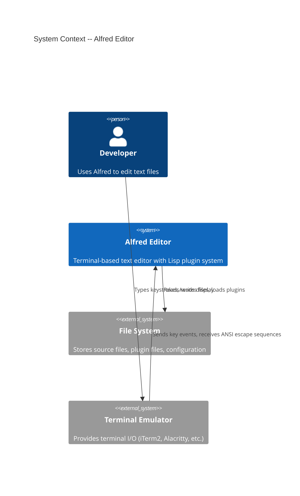
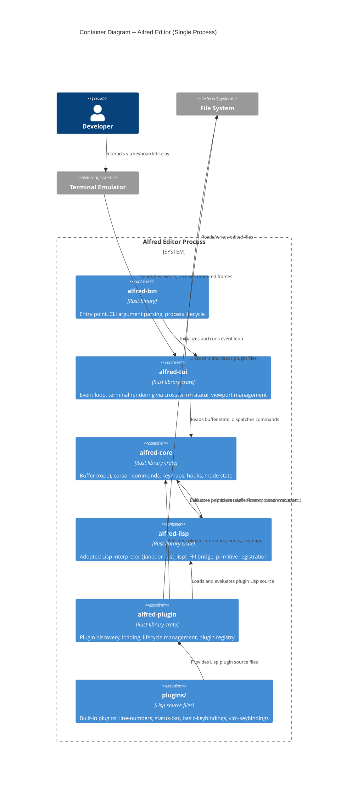
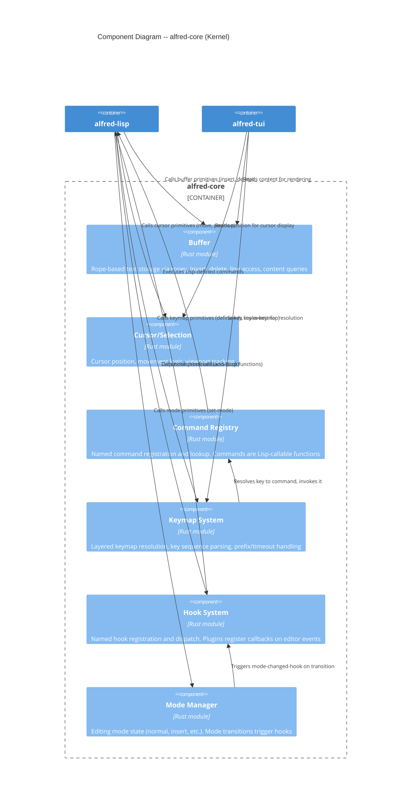

# Alfred Editor -- Architecture Document

**Feature**: alfred-core
**Date**: 2026-03-19
**Phase**: Architecture Design (DESIGN wave)
**Architect**: Morgan (Solution Architect)

---

## 1. System Overview and Philosophy

Alfred is a custom text editor built in Rust with a **thin kernel + Lisp extension** architecture, inspired by Emacs but informed by lessons from 7 editor case studies (Emacs, Neovim, Kakoune, Xi, Helix, Zed, Lem). The central thesis: **everything beyond core primitives is a Lisp plugin**.

### Core Principles

- **Plugin-first**: The kernel provides primitives. Features (keybindings, line numbers, status bar, modal editing) are Lisp plugins
- **Adopt, don't build**: Use proven crates (ropey, crossterm, ratatui) and an adopted Lisp interpreter. The innovation is in composition
- **Single-process, synchronous**: Xi editor's retrospective ("process separation was not a good idea") is the strongest evidence. Async deferred to post-skeleton
- **Lexical scoping only**: Emacs retrofitted lexical scoping in v24.1. Start with the right choice

### Development Paradigm: Hybrid (Functional Core, Imperative Shell)

**Recommendation**: Functional core with imperative shell.

**Rationale**:
- **Functional core**: Buffer operations, key resolution, and command dispatch are pure transformations. Rope operations naturally produce new values. This enables testability without mocking and aligns with Helix's functional primitives approach
- **Imperative shell**: The event loop, terminal I/O, mutable editor state, and Lisp interpreter state require imperative management. Rust's ownership model naturally enforces effect boundaries
- **Why not pure OOP**: Traits-as-interfaces are used for component boundaries (ports), but deep inheritance hierarchies are inappropriate for Rust and for this domain
- **Why not pure FP**: The editor has inherently mutable state (cursor position, buffer contents, mode). Fighting Rust's borrow checker for pure FP adds complexity without benefit

This aligns with the "functional core, imperative shell" pattern: pure functions for data transformation, imperative code only at boundaries (terminal I/O, file I/O, Lisp evaluation).

---

## 2. C4 System Context (Level 1)



---

## 3. C4 Container Diagram (Level 2)



---

## 4. C4 Component Diagram -- Kernel (Level 3)

The `alfred-core` crate is the most complex subsystem. It contains 6 internal components.



---

## 5. Component Architecture

### 5.1 Cargo Workspace -- Crate Structure

```
alfred/
  Cargo.toml                     # Workspace manifest
  crates/
    alfred-core/                 # Core editing primitives (no I/O, no terminal)
      src/
        lib.rs                   # Public API surface
        buffer.rs                # Rope wrapper, buffer operations
        cursor.rs                # Cursor position and movement
        command.rs               # Command registry
        keymap.rs                # Keymap data structure + resolution
        hook.rs                  # Hook system
        mode.rs                  # Mode state management
        types.rs                 # Shared types (KeyEvent, Position, etc.)
    alfred-lisp/                 # Lisp interpreter integration
      src/
        lib.rs                   # Public API: eval, register_primitive
        bridge.rs                # FFI bridge: registers core primitives into Lisp env
        value.rs                 # Lisp value type mappings
    alfred-plugin/               # Plugin system
      src/
        lib.rs                   # Public API: discover, load, init, unload
        discovery.rs             # Scan directories for plugins
        lifecycle.rs             # Plugin init/cleanup management
        registry.rs              # Track loaded plugins
    alfred-tui/                  # Terminal UI (the imperative shell)
      src/
        lib.rs
        app.rs                   # Application state, event loop
        renderer.rs              # Rendering logic using ratatui
        input.rs                 # Key event reading via crossterm
    alfred-bin/                  # Binary entry point
      src/
        main.rs                  # CLI parsing, initialization, run
  plugins/                       # Built-in Lisp plugins
    line-numbers/
      init.lisp
    status-bar/
      init.lisp
    basic-keybindings/
      init.lisp
    vim-keybindings/
      init.lisp
```

### 5.2 Crate Dependency Graph

```
alfred-bin
  depends on: alfred-tui, alfred-plugin, alfred-lisp, alfred-core

alfred-tui
  depends on: alfred-core, crossterm, ratatui

alfred-plugin
  depends on: alfred-core, alfred-lisp

alfred-lisp
  depends on: alfred-core (for types only), adopted-lisp-crate

alfred-core
  depends on: ropey (no other crate dependencies -- this is the pure core)
```

**Dependency rule**: `alfred-core` has ZERO dependencies on other Alfred crates. All dependencies point inward toward core. This is the dependency inversion boundary.

### 5.3 Kernel vs Plugin Boundary

| Capability | Kernel (Rust) | Plugin (Lisp) |
|-----------|---------------|---------------|
| Rope buffer operations | Provides primitives | Calls primitives |
| Cursor movement logic | Provides primitives | Calls primitives |
| Key event reading | Reads from terminal | - |
| Keymap resolution | Resolves key to command | Defines keymaps and bindings |
| Command dispatch | Dispatches by name | Defines commands |
| Hook dispatch | Invokes registered callbacks | Registers callbacks |
| Mode state | Stores current mode | Sets mode, reacts to changes |
| Rendering | Calls render hooks, composites | Provides render data (line numbers, status) |
| Line numbers | - | Renders gutter via hook |
| Status bar | - | Renders status via hook |
| Keybindings | - | Defines all bindings |
| Modal editing | - | Manages modes, key interception |

---

## 6. Data Flow

### 6.1 Main Event Loop (Read-Eval-Redisplay)

```
1. crossterm::event::read()     -- Block for terminal input
2. Key event received
3. Keymap resolver walks layers (overlay -> buffer-local -> mode -> global)
4. If match: execute command (may be Lisp function)
5. If no match in insert mode: insert character into buffer
6. Fire post-command-hook
7. Render: call render hooks, composite frame, draw via ratatui
8. Loop
```

### 6.2 Plugin Loading Sequence

```
1. alfred-plugin scans plugins/ directory
2. For each subdirectory containing init.lisp:
   a. Parse metadata (name, version, description) from Lisp source
   b. Resolve dependencies (topological sort)
3. For each plugin in load order:
   a. Evaluate init.lisp in the Lisp interpreter
   b. Call the plugin's (init) function
   c. Plugin registers commands, hooks, keymaps via core primitives
   d. Mark plugin as active in registry
```

### 6.3 Command Execution Flow

```
User presses 'dd' (in Vim normal mode)
  -> Keymap resolver matches 'dd' in vim-normal-map
  -> Resolves to command 'delete-line'
  -> Command registry looks up 'delete-line'
  -> It is a Lisp function registered by vim-keybindings plugin
  -> Lisp evaluator calls the function
  -> Function calls (buffer-delete-line) primitive
  -> Primitive operates on rope buffer
  -> Buffer fires after-change-hook
  -> Status bar plugin's hook callback updates modified flag
  -> Render cycle updates display
```

---

## 7. Plugin API Design

### 7.1 Core Primitives Exposed to Lisp

These are the Rust functions registered into the Lisp environment. The minimum set for the walking skeleton:

**Buffer operations**:
- `buffer-insert` -- Insert text at cursor position
- `buffer-delete` -- Delete N characters at cursor
- `buffer-delete-line` -- Delete the current line
- `buffer-get-line` -- Get text of line N
- `buffer-line-count` -- Get total number of lines
- `buffer-content` -- Get full buffer text (for small buffers)
- `buffer-modified?` -- Check if buffer has unsaved changes
- `buffer-filename` -- Get the filename of current buffer

**Cursor operations**:
- `cursor-move` -- Move cursor by direction and amount
- `cursor-position` -- Get current (line, column) position
- `cursor-set` -- Set cursor to specific (line, column)
- `cursor-line-start` -- Move cursor to start of line
- `cursor-line-end` -- Move cursor to end of line

**Keymap operations**:
- `make-keymap` -- Create a new empty keymap
- `define-key` -- Bind a key sequence to a command in a keymap
- `set-active-keymap` -- Push a keymap onto the active keymap stack
- `remove-active-keymap` -- Remove a keymap from the stack

**Command operations**:
- `define-command` -- Register a named command (Lisp function)
- `execute-command` -- Execute a command by name

**Hook operations**:
- `add-hook` -- Register a callback on a named hook
- `remove-hook` -- Remove a callback from a hook

**Mode operations**:
- `set-mode` -- Set the current editing mode (symbol)
- `current-mode` -- Get the current mode

**UI operations**:
- `message` -- Display text in the message/status area
- `set-status` -- Set a named status field (for status bar plugin)
- `get-status` -- Get a named status field

### 7.2 Hook Points

| Hook Name | When Fired | Arguments |
|-----------|-----------|-----------|
| `after-change-hook` | After buffer content changes | buffer, position, old-length, new-length |
| `pre-command-hook` | Before command execution | command-name |
| `post-command-hook` | After command execution | command-name |
| `mode-changed-hook` | After mode transition | old-mode, new-mode |
| `buffer-loaded-hook` | After file loaded into buffer | buffer, filename |
| `pre-render-hook` | Before each render cycle | - |
| `render-gutter-hook` | During render, for gutter content | line-number |
| `render-status-hook` | During render, for status bar | - |

---

## 8. Keymap and Command System Design

### 8.1 Keymap Resolution Order (highest to lowest priority)

1. **Overlay keymaps** -- Transient maps (e.g., completion popup, pending operator)
2. **Buffer-local keymaps** -- Keymaps scoped to the current buffer
3. **Mode-specific keymaps** -- Keymaps associated with the current mode (e.g., vim-normal-map)
4. **Global keymap** -- Default bindings

Resolution walks the stack top-to-bottom, returning the first match. Each keymap is a map from key sequence to command name.

### 8.2 Key Sequence Handling

For single keys, resolution is a direct HashMap lookup. For multi-key sequences (e.g., `dd`, `dw`):

- After first key, check for prefix matches in all active keymaps
- If prefix match exists: buffer the key, start timeout (default: 1000ms)
- If next key completes a match: execute the command, clear buffer
- If timeout expires: execute the single-key match if one exists, else discard
- If no match at all: in insert mode, insert the character; otherwise discard

### 8.3 Mode System

Modes are symbols (e.g., `:normal`, `:insert`). The mode manager:
- Stores the current mode
- On mode change: fires `mode-changed-hook`, updates the active keymap stack (replaces the mode-specific layer)
- Plugins define modes by creating keymaps and registering mode-change commands

The kernel does not know about "normal" or "insert" mode specifically. These are defined entirely by the vim-keybindings plugin. The kernel only knows that a mode is a symbol with an associated keymap.

---

## 9. Technology Stack

| Component | Technology | Version | License | Rationale |
|-----------|-----------|---------|---------|-----------|
| Language | Rust | stable (1.82+) | MIT/Apache-2.0 | Safety, performance, proven for editors (Helix, Zed). See ADR-005 |
| Text buffer | ropey | 1.x | MIT | O(log n) operations, used by Helix in production. See research doc |
| Terminal I/O | crossterm | 0.28+ | MIT | Cross-platform default backend for ratatui |
| TUI framework | ratatui | 0.29+ | MIT | Immediate-mode rendering, diff-based updates, active maintenance |
| Lisp interpreter | **See ADR-004** | - | - | Adopted (not built). Janet or rust_lisp |
| Build system | Cargo workspaces | - | - | Standard Rust multi-crate build |

All dependencies are MIT-licensed open source.

---

## 10. Integration Patterns

### 10.1 Lisp-to-Rust FFI Bridge

Pattern: **Registered native functions** (simplest, Emacs/MAL style).

The bridge module (`alfred-lisp/bridge.rs`) registers Rust functions into the Lisp interpreter's global environment at startup. Each registered function:
- Receives Lisp values as arguments
- Accesses editor state through a shared context reference
- Returns a Lisp value

This is the only integration pattern needed for the walking skeleton. Foreign type wrapping (Pattern 2 from research) is deferred.

### 10.2 Plugin-to-Kernel Communication

Plugins communicate with the kernel exclusively through registered primitives. There is no direct Rust API access from plugins. This is the **port boundary** -- primitives are the port interface, the Lisp bridge is the adapter.

### 10.3 Rendering Integration

Plugins participate in rendering through hooks, not by directly writing to the terminal:
- `render-gutter-hook`: Plugin returns gutter content per line (used by line-numbers)
- `render-status-hook`: Plugin returns status bar content (used by status-bar)
- The TUI crate calls these hooks during its render cycle and composites the results

---

## 11. Quality Attribute Strategies

### 11.1 Maintainability
- Cargo workspace enforces crate boundaries
- `alfred-core` has zero outward dependencies -- all dependencies point inward
- Plugin-first design means features are isolated in their own Lisp files
- Each crate has a clearly defined responsibility and public API surface

### 11.2 Testability
- `alfred-core` is pure logic -- testable without terminal, without Lisp, without filesystem
- Buffer operations tested with unit tests against ropey
- Keymap resolution tested with unit tests (construct keymaps, assert resolution)
- Command registry tested in isolation
- Lisp integration tested by evaluating expressions and asserting buffer state
- Plugin lifecycle tested by loading test plugins and verifying registration

### 11.3 Extensibility
- Plugin-first: every user-visible feature is a plugin
- Hook system provides extension points without modifying kernel
- Keymap system allows any key to be rebound by any plugin
- Mode system is generic -- plugins define arbitrary modes

### 11.4 Performance
- Rope provides O(log n) buffer operations regardless of file size
- Ratatui's diff-based rendering emits only changed terminal cells
- Synchronous event loop avoids async overhead
- Lisp evaluation latency target: <1ms per command dispatch (profile at M2)

### 11.5 Reliability
- Rust's ownership system prevents memory safety bugs in kernel
- Plugin errors caught at Lisp evaluation boundary -- do not crash the editor
- Single-process avoids distributed system failure modes

---

## 12. Deployment Architecture

Alfred is a single statically-linked Rust binary with embedded Lisp plugins.

```
Distribution:
  alfred                        # Single binary (~5-10MB)
  plugins/                      # Lisp plugin directory
    line-numbers/init.lisp
    status-bar/init.lisp
    basic-keybindings/init.lisp
    vim-keybindings/init.lisp

User configuration (post-skeleton):
  ~/.config/alfred/
    init.lisp                   # User config (deferred)
    plugins/                    # User plugins (deferred)
```

No external runtime dependencies beyond a terminal emulator. No network access. No database.
