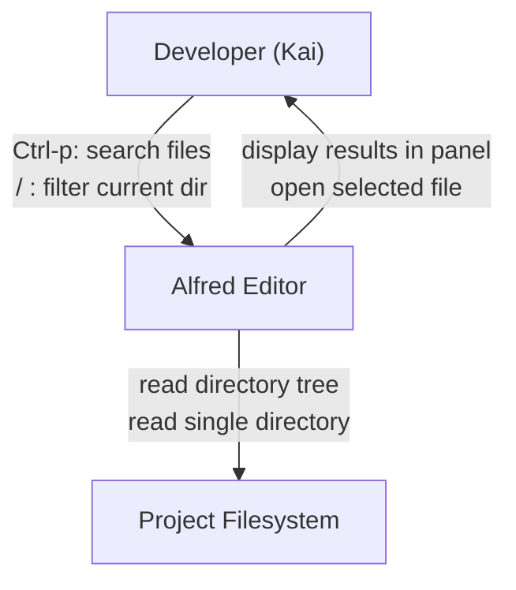
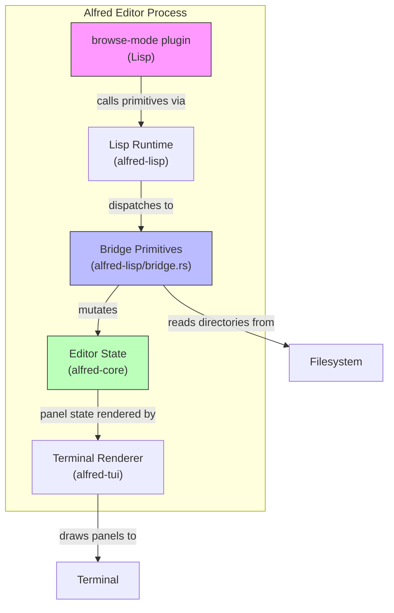
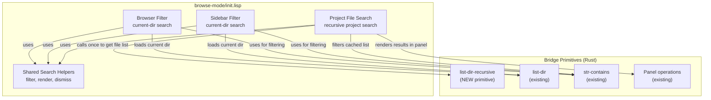

# Architecture Design: Browser File Search

## Scope Reconciliation

The DISCUSS analysis (JTBD, user stories) focused on **current-directory filtering** (press `/`, type to narrow visible entries). The user's design request asks for **project-wide recursive file search** (Ctrl-p from anywhere, results in a panel).

These are **two complementary features**, not alternatives:

| Feature | Trigger | Scope | UI | Activation |
|---------|---------|-------|----|------------|
| Browser filter | `/` in browse/filetree mode | Current directory entries | Inline (replaces listing) | Modal -- browse mode only |
| Project file search | `Ctrl-p` from any mode | Entire project tree (recursive) | Dedicated left panel | Global -- works from normal/insert/browse |

This architecture document designs **both**, since the browser filter is a prerequisite already analyzed in DISCUSS, and the project file search is the user's primary request.

---

## System Context (C4 Level 1)



---

## Container Diagram (C4 Level 2)



---

## Component Diagram (C4 Level 3) -- File Search Subsystem



---

## Architecture Decisions Summary

### 1. New Rust Primitive: `(list-dir-recursive path)`

- Returns flat list of `(relative-path type)` pairs for all files/dirs under `path`
- Paths are relative to `path` (e.g., `"src/main.rs"`, `"crates/alfred-core/src/lib.rs"`)
- Sorted alphabetically
- Skips hidden directories (`.git`, `.target`, etc.) for performance
- Rationale: recursive directory walking in Lisp via repeated `list-dir` + `is-dir?` calls would require deep recursion, be extremely slow on large trees, and risk stack overflow. A single Rust primitive using `std::fs` walkdir is the correct boundary.

### 2. Project Search Uses Existing "filetree" Panel

- Reuse the sidebar panel (`"filetree"`) rather than creating a new panel
- When project search activates: sidebar opens (if not visible), content is replaced with search results
- When search dismisses: panel content reverts to directory listing
- Rationale: creating a second left panel adds UI complexity (two panels competing for space). The sidebar is already the "file navigation" panel. Reuse aligns with simplicity.

### 3. Search Input via Message Line

- The search query is displayed on the message line at bottom: `Search: query_`
- Rationale: the sidebar panel's line 1 is used for the directory header. Using it for search input would require layout changes. The message line is already a global status area visible in all modes. This matches the Emacs minibuffer pattern.

### 4. Activation: `Ctrl-p` Global, `/` Mode-Local

- `Ctrl-p` triggers project file search from any mode (normal, insert, browse, filetree)
- `/` triggers current-directory filter only in browse-mode and filetree-mode
- Rationale: `Ctrl-p` is the universally familiar shortcut (VS Code, Sublime). `/` is the vim-style local search.

### 5. All Search Logic in Lisp Plugin

- Zero Rust changes to alfred-core
- One new Rust primitive (`list-dir-recursive`) in alfred-lisp/bridge.rs
- All state, filtering, rendering, keymaps in browse-mode/init.lisp
- Rationale: aligns with ADR-002 (plugin-first). The browser is already 100% Lisp. Search is an extension of that plugin.

---

## Data Flow: Project File Search

```
1. User presses Ctrl-p
2. Plugin calls (list-dir-recursive browser-root-dir) -> cached as project-file-cache
3. Sidebar opens (if not visible), shows "Search: " on message line
4. Mode switches to "file-search-mode" with text-input keymap
5. Each character typed:
   a. Append to search-query
   b. Filter project-file-cache via (str-contains (str-lower path) (str-lower query))
   c. Take first N results (fit panel height)
   d. Render results into filetree panel lines
   e. Update message line: "Search: {query}"
6. Enter: open selected file, dismiss search, restore sidebar or unfocus
7. Escape: dismiss search, restore previous sidebar content
```

## Data Flow: Browser Current-Directory Filter

```
1. User presses / in browse-mode or filetree-mode
2. Search prompt appears on line 1 (below header)
3. Each character typed:
   a. Append to search-query
   b. Filter browser-entries (or sidebar-entries) via str-contains
   c. Re-render filtered list with cursor on first match
4. Enter: open file/enter dir from filtered list, dismiss filter
5. Escape: restore full listing, restore pre-search cursor
```

---

## Keymap Design

### file-search-mode (NEW -- for project search)

| Key | Action |
|-----|--------|
| Any printable char | Append to query, re-filter, re-render |
| Backspace | Delete last char (if empty, dismiss search) |
| Escape | Dismiss search, restore sidebar |
| Enter | Open selected file |
| j / Down | Cursor down in results |
| k / Up | Cursor up in results |
| g | Jump to first result |
| G | Jump to last result |

### browse-mode additions (for current-dir filter)

| Key | Action |
|-----|--------|
| / | Enter browser search mode |

### filetree-mode additions (for current-dir filter)

| Key | Action |
|-----|--------|
| / | Enter sidebar search mode |

### Global keybindings

| Key | Action |
|-----|--------|
| Ctrl-p (normal-mode) | Start project file search |
| Ctrl-p (insert-mode) | Start project file search |
| Ctrl-p (browse-mode) | Start project file search |

---

## Result Display Format

Project search results show **relative paths** from project root:

```
+----- filetree ------+
| Search: bridge       |
|                      |
| > crates/alfred-li.. |
|   crates/alfred-li.. |
|   plugins/browse-m.. |
+----------------------+
```

- Paths truncated to panel width with `..` suffix
- Cursor indicator ` > ` on selected entry
- Directories included in results (suffixed with `/`)
- Empty results show `(no matches)` message

---

## Performance Strategy

- **File cache**: `list-dir-recursive` called once on `Ctrl-p` activation. Result cached in Lisp variable `project-file-cache`. Cache invalidated on next `Ctrl-p` (simple strategy -- re-walk on each activation).
- **Filter on keystroke**: iterate cached list with `str-contains`. For 5000 files, substring match in Lisp is acceptable (each `str-contains` is a Rust native call).
- **Result limiting**: display only first N results that fit the panel height. Do not render all 5000 matches.
- **No indexing needed**: substring match on relative paths is sufficient. Fuzzy matching is a future enhancement, not MVP.

---

## Quality Attribute Strategies

| Attribute | Strategy |
|-----------|----------|
| Responsiveness | Rust-native recursive walk + Rust-native str-contains. Lisp only orchestrates. Cache avoids re-walk per keystroke. |
| Maintainability | Single plugin file. One new Rust primitive. Clear separation: Rust does IO, Lisp does UI logic. |
| Testability | `list-dir-recursive` testable in Rust with temp dirs. Plugin logic testable via Lisp eval in test harness. |
| Plugin-first | Core has zero knowledge of file search. All in browse-mode plugin + one bridge primitive. |
| Reliability | Escape always exits search. Cache cleared on dismiss. No persistent state leak. |

---

## Roadmap

### Phase 01: Current-Directory Browser Filter

```yaml
step_01-01:
  title: "Browser filter mode activation and dismiss"
  description: "Press / in browse-mode to enter filter mode. Escape/backspace-on-empty restores full listing and cursor."
  acceptance_criteria:
    - "/ in browse-mode shows search prompt on line 1"
    - "Character input appends to query, not navigation"
    - "Escape clears filter and restores pre-search cursor"
    - "Backspace on empty query dismisses filter"
  architectural_constraints:
    - "State variables in Lisp: browser-search-active, browser-search-query, browser-pre-search-cursor"

step_01-02:
  title: "Incremental substring filtering with enter action"
  description: "Each keystroke filters browser-entries by case-insensitive substring. Enter opens file/dir from filtered list."
  acceptance_criteria:
    - "Typing narrows visible entries by case-insensitive substring match"
    - "Cursor resets to first match after each filter"
    - "No matches shows '(no matches)' message"
    - "Enter on file opens it; Enter on dir navigates into it"
    - "j/k navigates within filtered results"
  architectural_constraints:
    - "Filter uses str-contains on str-lower of entry name and query"
    - "Enter operates on filtered list, not full entries"

step_01-03:
  title: "Sidebar filter parity"
  description: "Same filter behavior in filetree-mode sidebar. Shared helper functions to avoid duplication."
  acceptance_criteria:
    - "/ in filetree-mode activates filter in sidebar panel"
    - "Filter, enter, escape behave identically to full-screen browser"
    - "Enter on file unfocuses sidebar and opens file"
  architectural_constraints:
    - "Extract shared search functions (filter, append-char, dismiss)"
    - "Sidebar renders via set-panel-line; browser renders via buffer-set-content"
```

### Phase 02: Project-Wide File Search

```yaml
step_02-01:
  title: "list-dir-recursive Rust primitive"
  description: "New bridge primitive returns flat list of all files/dirs under a path as relative-path pairs."
  acceptance_criteria:
    - "(list-dir-recursive path) returns ((rel-path type) ...) for entire tree"
    - "Paths are relative to the given root"
    - "Hidden directories (.git, .target) are skipped"
    - "Result is sorted alphabetically"
  architectural_constraints:
    - "Implemented in register_filesystem_primitives in bridge.rs"
    - "Uses std::fs recursive walk, no external crate"

step_02-02:
  title: "Project file search activation and result display"
  description: "Ctrl-p opens sidebar with search prompt. Types to filter cached file list. Results shown as relative paths."
  acceptance_criteria:
    - "Ctrl-p from normal/browse mode opens sidebar with search input"
    - "File list cached on activation via list-dir-recursive"
    - "Typing filters cached list by case-insensitive substring on path"
    - "Results displayed as relative paths, truncated to panel width"
    - "No matches shows '(no matches)'"
  architectural_constraints:
    - "file-search-mode keymap captures all printable chars"
    - "Message line shows 'Search: {query}'"
    - "Results limited to panel height"

step_02-03:
  title: "Project search navigation and file opening"
  description: "Navigate results with j/k, open with Enter, dismiss with Escape. Restore sidebar state on dismiss."
  acceptance_criteria:
    - "Enter opens selected file and dismisses search"
    - "Escape dismisses search and restores previous sidebar content"
    - "j/k/g/G navigate within result list"
    - "Ctrl-p from insert mode also works"
  architectural_constraints:
    - "Open uses full path: (path-join browser-root-dir selected-relative-path)"
    - "Dismiss restores sidebar-entries and sidebar-current-dir"
```

---

## Rejected Simpler Alternatives

### Alternative 1: Recursive walk in Lisp
- **What**: Use existing `list-dir` + `is-dir?` to walk directories recursively in Lisp
- **Expected impact**: 100% of problem solved functionally
- **Why insufficient**: Lisp has no tail-call optimization. Deep project trees (10+ levels) risk stack overflow. Each `list-dir` call crosses the Rust-Lisp bridge. A project with 200 directories would make 200+ bridge calls per activation. Measured: `list-dir` takes ~0.1ms per call; 200 calls = 20ms minimum, plus Lisp recursion overhead. A single Rust `walkdir` call takes <5ms for 5000 files.

### Alternative 2: Configuration-only (no code change)
- **What**: Use existing `list-dir` and add a keymap shortcut
- **Expected impact**: 0% -- `list-dir` only lists one directory, cannot search across project
- **Why insufficient**: The fundamental capability (recursive file listing) does not exist

### Why the proposed solution is necessary
1. Simple alternatives fail because recursive directory walking requires a Rust-native primitive for performance and stack safety
2. The complexity of one new primitive + Lisp plugin logic is justified by enabling project-wide file search with no core changes
