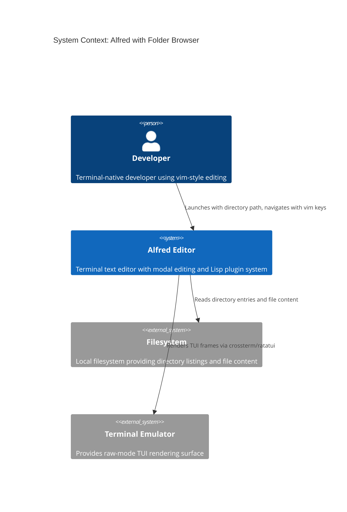
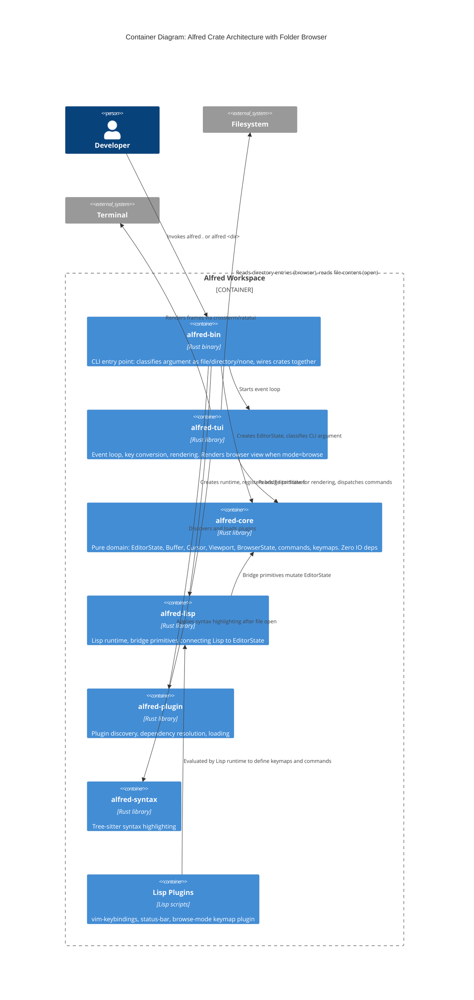
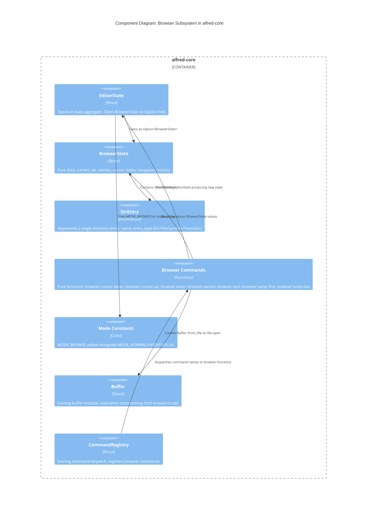

# Architecture Design: Folder Browser

## System Context

The folder browser adds directory-browsing capability to Alfred, activated when the CLI argument is a directory. It introduces a new `browse` mode alongside existing `normal`/`insert`/`visual` modes, enabling users to navigate directory trees and open files without leaving the editor.

### Traces to Requirements

| Requirement | Component |
|------------|-----------|
| US-FB-01: Detect directory argument | alfred-bin (CLI classification) |
| US-FB-02: Display directory contents | alfred-core (BrowserState), alfred-tui (browser rendering) |
| US-FB-03: Navigate with vim keys | alfred-core (browser commands), plugins (browse-mode keymap) |
| US-FB-04: Subdirectory navigation | alfred-core (browser navigation logic) |
| US-FB-05: Open file in buffer | alfred-core (browser-to-editor transition) |

---

## C4 System Context (L1)



## C4 Container (L2)



## C4 Component (L3): Browser Subsystem within alfred-core

The browser subsystem has 5+ logical components within alfred-core, warranting L3 detail.



---

## Component Architecture

### Approach: Core-Only (ADR-008)

Browser state and logic reside in `alfred-core`. No new crate. Rendering in `alfred-tui`. Keybindings in a Lisp plugin.

**Rationale**: The browser is a mode of the editor, not a separate application. It shares EditorState, keymaps, commands, panels, and the event loop. A separate crate would create artificial boundaries and cross-crate coupling for no benefit at this scale.

### Component Boundaries

| Component | Crate | Responsibility |
|-----------|-------|---------------|
| `BrowserState` | alfred-core | Pure data type: current directory, sorted entries, cursor index, navigation history stack |
| `DirEntry` / `EntryKind` | alfred-core | Algebraic data type representing a filesystem entry (directory, file, symlink, parent-dir marker) |
| Browser commands | alfred-core | Pure functions transforming EditorState for browse-mode actions |
| `MODE_BROWSE` constant | alfred-core | Mode string constant, same pattern as MODE_NORMAL/INSERT/VISUAL |
| CLI argument classification | alfred-bin | Detects file vs directory vs nonexistent before entering event loop |
| Browser rendering | alfred-tui | Renders BrowserState as directory listing in the main content area when mode=browse |
| Browse-mode keymap | plugins/ | Lisp plugin defining browse-mode keymap with j/k/Enter/h/q/gg/G bindings |
| Filesystem IO (read_dir) | alfred-tui (or alfred-bin) | Imperative shell reads filesystem, populates BrowserState entries |

### Dependency Flow

```
alfred-bin  -->  alfred-core  (pure domain, zero IO)
     |                ^
     v                |
alfred-tui  ----------+  (event loop, rendering, filesystem IO)
     |
     v
alfred-lisp  -->  alfred-core  (bridge primitives mutate EditorState)
     ^
     |
plugins/browse-mode/init.lisp  (keymap definitions)
```

Dependencies point inward to alfred-core. Filesystem IO lives at the shell boundary (alfred-tui for event loop directory reads, alfred-bin for initial argument classification).

---

## Integration with Existing Mode System

### Mode Lifecycle

1. **Activation**: `alfred-bin` detects directory argument -> sets `state.mode = MODE_BROWSE`, `state.active_keymaps = vec!["browse-mode"]`, initializes `state.browser` with directory entries
2. **Operation**: Event loop in `alfred-tui` renders browser view when `state.mode == MODE_BROWSE`; key dispatch resolves through `browse-mode` keymap to browser commands
3. **Transition to edit**: `browser-open` command detects file entry -> loads `Buffer::from_file()` -> sets `state.mode = MODE_NORMAL`, `state.active_keymaps = vec!["normal-mode"]`, clears `state.browser`
4. **Exit**: `browser-quit` command sets `state.running = false`

### Keymap Integration

The browse-mode keymap follows the existing pattern (see `plugins/vim-keybindings/init.lisp`):

```
(make-keymap "browse-mode")
(define-key "browse-mode" "Char:j"  "browser-cursor-down")
(define-key "browse-mode" "Down"    "browser-cursor-down")
(define-key "browse-mode" "Char:k"  "browser-cursor-up")
(define-key "browse-mode" "Up"      "browser-cursor-up")
(define-key "browse-mode" "Enter"   "browser-enter")
(define-key "browse-mode" "Char:l"  "browser-enter")
(define-key "browse-mode" "Char:h"  "browser-parent")
(define-key "browse-mode" "Backspace" "browser-parent")
(define-key "browse-mode" "Char:q"  "browser-quit")
(define-key "browse-mode" "Escape"  "browser-quit")
(define-key "browse-mode" "Char:g"  "browser-jump-first")
(define-key "browse-mode" "Char:G"  "browser-jump-last")
```

**Key conflict note**: In browse mode, `q` maps to `browser-quit` (not `enter-macro-record`), `g` maps to `browser-jump-first` (not `cursor-document-start`). No conflict because browse-mode is a separate keymap; normal-mode keymap is not active during browse.

### Status Bar Integration

The existing `status-bar` plugin uses `(current-mode)` and `(buffer-filename)`. In browse mode:
- `(current-mode)` returns `"browse"` -> status bar displays `BROWSE`
- `(buffer-filename)` returns the buffer filename (empty buffer) -- the browser renders its own directory path in the content area title
- The `mode-changed` hook fires when transitioning browse -> normal, updating the status bar automatically

### Rendering Integration

The renderer (`alfred-tui/src/renderer.rs`) currently renders buffer content in the main text area. When `state.mode == MODE_BROWSE`:
- Instead of `collect_visible_lines()` from the buffer, render `state.browser` entries
- Each entry is a line: directories with `/` suffix, files plain
- Cursor highlight on `state.browser.cursor_index`
- Title line at top shows current directory path
- Status bar panel continues to work via the existing panel system

---

## Quality Attribute Strategies

### Maintainability (HIGH)
- Browser state is a single `Option<BrowserState>` on EditorState -- minimal coupling
- Browser commands are pure functions in a new `browser` module in alfred-core
- Keymap defined in a Lisp plugin, following the existing plugin pattern
- No changes to existing modules beyond adding `BrowserState` field and `MODE_BROWSE` constant

### Testability (HIGH)
- BrowserState and all browser commands are pure functions -- unit testable without filesystem
- Browser rendering testable via existing renderer test pattern
- Filesystem IO confined to alfred-tui (imperative shell) -- test boundary is clear
- E2E scenarios testable via the existing acceptance test framework

### Performance (MEDIUM)
- `std::fs::read_dir()` is synchronous and fast for typical directories (<10k entries)
- Sorting is O(n log n) on entry count -- negligible for typical directories
- No lazy loading needed for initial scope
- If performance becomes an issue for huge directories, entries could be paginated (future enhancement)

### Reliability
- Error handling at every IO boundary: nonexistent path, permission denied, broken symlinks, binary files
- Cursor index always clamped to valid range
- Navigation history stack has no upper bound (stack depth = directory nesting depth, bounded by filesystem)

---

## Deployment Architecture

No change to deployment. Alfred remains a single binary compiled from the workspace. The browse-mode keymap plugin is a Lisp file in `plugins/browse-mode/init.lisp`, loaded at startup alongside existing plugins.
