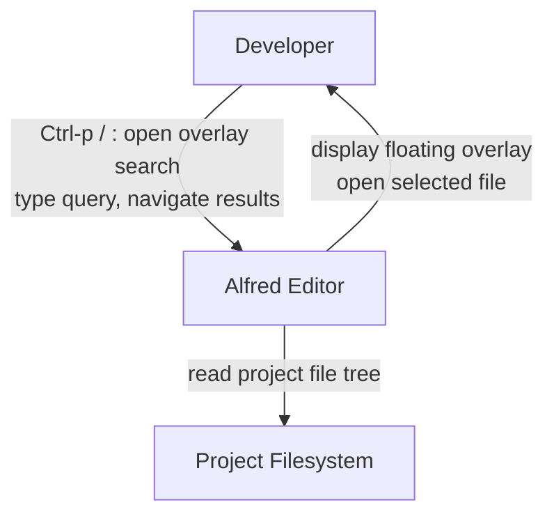
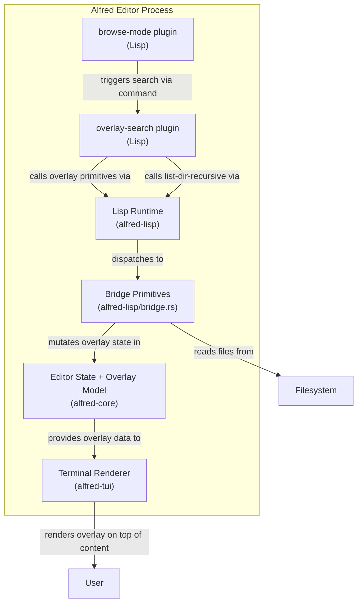
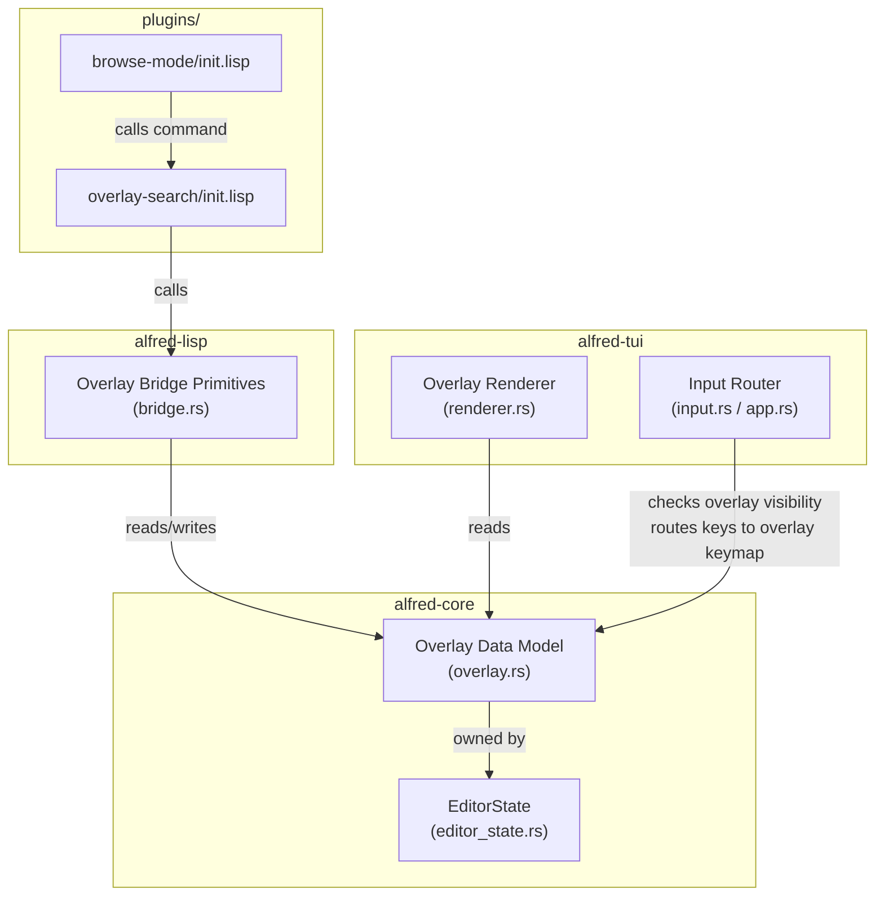

# Architecture Design: Floating Overlay Search Dialog

## Overview

A generic floating overlay system for the Alfred editor, with the first consumer being a file search dialog triggered from browse-mode. The overlay renders centered on top of existing editor content, captures input while open, and dismisses on Escape or selection.

**Key principle**: Rust provides a generic overlay rendering primitive. The overlay has ZERO knowledge of file search. All search behavior lives in Alfred Lisp.

---

## System Context (C4 Level 1)



---

## Container Diagram (C4 Level 2)



---

## Component Diagram (C4 Level 3) -- Overlay Subsystem



---

## Component Boundaries

### 1. alfred-core: Overlay Data Model (`overlay.rs`)

**Responsibility**: Define the overlay as pure data. No rendering, no IO.

**Data model** (conceptual -- crafter decides exact Rust types):

- **Overlay state** stored on `EditorState`:
  - `visible`: whether overlay is currently shown
  - `title`: header text displayed at top of overlay box
  - `input`: current text in the input field
  - `items`: list of result strings to display
  - `cursor`: index of currently highlighted item (0-based)
  - `width`: overlay width in columns (e.g., 60-70)
  - `max_visible_items`: maximum result rows to display before scrolling
  - `scroll_offset`: first visible item index when results exceed max_visible_items

- **Pure functions** (module-level, no `self`):
  - Create/reset overlay to default state
  - Set input text
  - Set items list
  - Move cursor up/down with clamping
  - Get the currently selected item text
  - Compute scroll window (which items are visible given cursor + scroll_offset)

**Integration**: `EditorState` gains one new field: the overlay data structure. When `visible` is false, renderer and input router ignore it.

### 2. alfred-tui: Overlay Rendering (addition to `renderer.rs`)

**Responsibility**: Render the overlay on top of existing content when visible.

**Rendering approach**:
- After all existing rendering (panels, buffer, status bar, message line), check if overlay is visible
- If visible, compute a centered `Rect` within `frame.area()`:
  - Horizontal: centered, width from overlay data (clamped to terminal width - 4)
  - Vertical: centered, height = 1 (title/input) + 1 (separator) + min(item_count, max_visible_items) + 2 (border)
- Render using ratatui `Block` widget with borders for the frame
- Render the input line: `"> " + input_text` with a distinct style
- Render visible items with cursor highlighting (reversed style on selected row)
- The overlay draws OVER whatever is beneath it -- ratatui's immediate-mode rendering handles this naturally (later widgets overwrite earlier pixels)

**Cursor position**: When overlay is visible, the terminal cursor is placed at the end of the overlay's input text (not at the editor buffer cursor).

### 3. alfred-tui: Input Routing (addition to `app.rs` / `input.rs`)

**Responsibility**: When overlay is visible, key events route to the overlay's keymap instead of the normal editor keymap.

**Approach**:
- Before normal key dispatch in the event loop, check if overlay is visible
- If visible, resolve the key against the active keymap (which will be the overlay's keymap, set by the Lisp plugin when it opens the overlay)
- The overlay keymap captures all relevant keys (typed characters, navigation, Enter, Escape)
- No special Rust-side input handling needed -- the existing keymap dispatch system already supports this via `set-active-keymap`

### 4. alfred-lisp: Overlay Bridge Primitives (addition to `bridge.rs`)

**Responsibility**: Expose generic overlay operations to Lisp. Zero knowledge of file search.

**Primitives**:

| Primitive | Signature | Effect |
|-----------|-----------|--------|
| `open-overlay` | `(open-overlay width max-items)` | Set overlay visible, clear input/items/cursor, set dimensions |
| `close-overlay` | `(close-overlay)` | Set overlay invisible |
| `overlay-set-title` | `(overlay-set-title "text")` | Set the title/header text |
| `overlay-set-input` | `(overlay-set-input "text")` | Set the input field text |
| `overlay-set-items` | `(overlay-set-items list)` | Set the results list (list of strings) |
| `overlay-get-input` | `(overlay-get-input)` | Return current input text |
| `overlay-get-selected` | `(overlay-get-selected)` | Return the currently highlighted item string |
| `overlay-cursor-down` | `(overlay-cursor-down)` | Move highlight down by 1 |
| `overlay-cursor-up` | `(overlay-cursor-up)` | Move highlight up by 1 |
| `overlay-visible?` | `(overlay-visible?)` | Return whether overlay is visible |

All primitives operate on the single overlay instance in `EditorState`. Single-overlay design is sufficient -- TUI editors do not need concurrent overlays.

### 5. plugins/overlay-search/init.lisp

**Responsibility**: Implement the file search overlay behavior entirely in Lisp.

**Behavior outline**:
- On activation (command `"overlay-file-search"`):
  - Call `(list-dir-recursive browser-root-dir)` to get file list
  - Cache result in a Lisp variable
  - Call `(open-overlay 65 15)` to show overlay
  - Call `(overlay-set-title "> ")` with prompt
  - Populate initial items (all files)
  - Switch to `"overlay-search-input"` keymap
- On character input:
  - Append to query string
  - Filter cached file list by substring match
  - Call `(overlay-set-input query)` and `(overlay-set-items filtered)`
- On cursor navigation (Down/Up arrows):
  - Call `(overlay-cursor-down)` / `(overlay-cursor-up)`
- On Enter:
  - Get selected item via `(overlay-get-selected)`
  - Call `(open-file (path-join root selected))`
  - Call `(close-overlay)`
  - Restore previous keymap and mode
  - Navigate browse panel to reflect the file's parent directory
- On Escape:
  - Call `(close-overlay)`
  - Restore previous keymap and mode
  - No file opened

### 6. plugins/browse-mode/init.lisp (modification)

**Responsibility**: Add Ctrl-p binding to trigger the overlay search.

**Changes**:
- Register `Ctrl:p` in `browser-panel-mode` keymap -> `"overlay-file-search"` command
- Register `Ctrl:p` in `normal-mode` keymap -> `"overlay-file-search"` command
- On search completion (file opened), update `browser-current-dir` to the parent of the opened file

---

## Integration Patterns

### Data Flow: Open Overlay

```
User presses Ctrl-p
  -> keymap resolves to "overlay-file-search" command
  -> Lisp plugin calls (list-dir-recursive root)  [Rust bridge -> filesystem]
  -> Lisp plugin calls (open-overlay 65 15)        [Rust bridge -> EditorState.overlay]
  -> Lisp plugin calls (overlay-set-items files)   [Rust bridge -> EditorState.overlay]
  -> Lisp plugin calls (set-active-keymap "overlay-search-input")
  -> next render cycle: renderer sees overlay.visible = true
  -> renderer draws overlay centered on screen
```

### Data Flow: Type Character

```
User types 'b'
  -> keymap "overlay-search-input" resolves to "overlay-search-char-b" command
  -> Lisp plugin appends 'b' to query variable
  -> Lisp plugin filters cached file list
  -> Lisp calls (overlay-set-input query) and (overlay-set-items filtered)
  -> next render cycle: overlay shows updated input and filtered results
```

### Data Flow: Select File

```
User presses Enter
  -> keymap resolves to "overlay-search-enter" command
  -> Lisp plugin calls (overlay-get-selected) -> "crates/alfred-core/src/buffer.rs"
  -> Lisp plugin calls (open-file (path-join root selected))
  -> Lisp plugin calls (close-overlay)
  -> Lisp plugin restores mode and keymap
  -> Lisp plugin updates browser-current-dir to parent of opened file
  -> next render cycle: overlay gone, file loaded in buffer
```

---

## Technology Stack

| Component | Technology | License | Rationale |
|-----------|-----------|---------|-----------|
| Overlay data model | Rust (alfred-core) | MIT (project) | Pure data struct, no dependencies |
| Overlay rendering | ratatui `Block` + `Paragraph` | MIT | Already used for all rendering |
| Overlay border | ratatui `Borders` | MIT | Built-in widget border support |
| Plugin logic | Alfred Lisp | MIT (project) | Plugin-first architecture mandate |
| File listing | `list-dir-recursive` | MIT (project) | Already implemented |

---

## Quality Attribute Strategies

### Responsiveness
- `list-dir-recursive` walks filesystem in Rust (<5ms for ~5000 files)
- Filtering happens in Lisp on cached list (pure string matching)
- Overlay rendering is a single ratatui widget pass on each frame -- negligible cost

### Maintainability
- Overlay is a generic primitive: any future plugin can use it (command palette, goto-line, etc.)
- All file-search-specific logic is in Lisp, changeable without recompilation
- Single overlay instance keeps the data model simple

### Testability
- Overlay data model functions are pure -- unit testable
- Overlay rendering can be tested via ratatui's `TestBackend`
- Lisp plugin logic tested via E2E tests (existing pattern)

### Extensibility
- The same overlay system supports future use cases: command palette, goto-line dialog, find-and-replace, symbol search
- Plugins only need to call generic overlay primitives -- no Rust changes needed for new overlay-based features

---

## Deployment Architecture

No deployment changes. The overlay system is compiled into the existing Alfred binary. The Lisp plugin is loaded at startup like all other plugins.

---

## Rejected Simpler Alternatives

### Alternative 1: Reuse the Sidebar Panel for Search

- **What**: Render search results in the existing `"filetree"` left panel (30 chars wide). This is the approach from ADR-009.
- **Expected Impact**: 80% of the feature (search works, results visible)
- **Why Insufficient**: 30-char panel truncates file paths (`crates/alfred-core/src/buffer.rs` = 35 chars). User explicitly requested a centered floating overlay with 60-70 char width. Sidebar approach also loses browse context while searching.

### Alternative 2: Extend PanelPosition with a Floating Variant

- **What**: Add `PanelPosition::Floating { x, y, width, height }` to the existing panel system.
- **Expected Impact**: 95% of the feature
- **Why Insufficient**: Panels are edge-docked regions with line-based content. A floating overlay needs: centered layout relative to terminal, input field + results list (two rendering modes in one widget), cursor position override, border/frame rendering. Forcing these into the panel model adds complexity without reuse benefit -- panels and overlays have different rendering, positioning, and input semantics. See ADR-010 for full analysis.

---

## File Impact Summary

| File | Change |
|------|--------|
| `crates/alfred-core/src/overlay.rs` | **NEW** -- Overlay data model and pure functions |
| `crates/alfred-core/src/lib.rs` | Add `pub mod overlay;` |
| `crates/alfred-core/src/editor_state.rs` | Add overlay field to EditorState |
| `crates/alfred-tui/src/renderer.rs` | Add overlay rendering after existing content |
| `crates/alfred-lisp/src/bridge.rs` | Add overlay primitive registrations |
| `plugins/overlay-search/init.lisp` | **NEW** -- File search overlay plugin |
| `plugins/browse-mode/init.lisp` | Add Ctrl-p binding to trigger overlay search |
