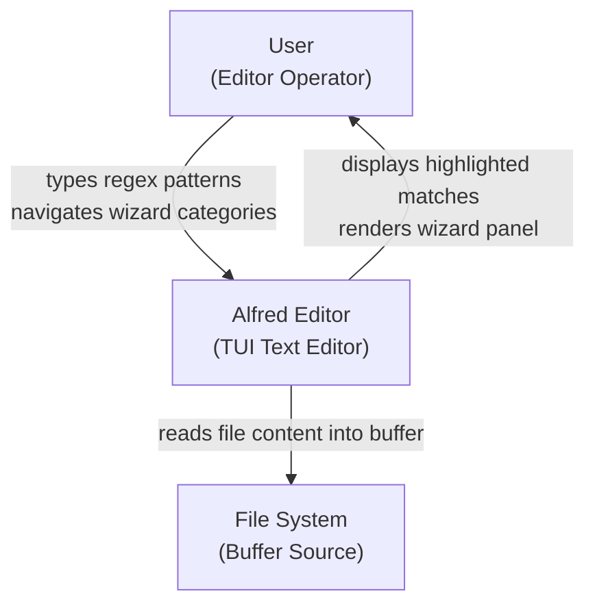
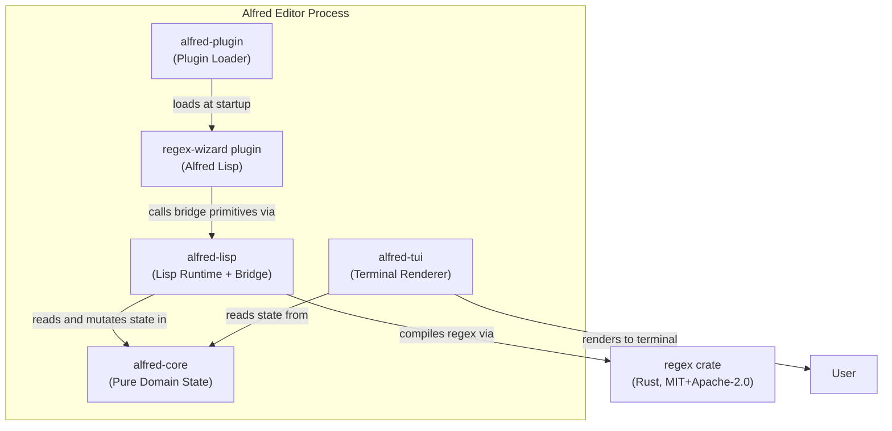
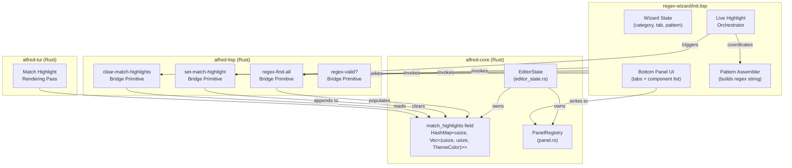

# Regex Builder Wizard -- Architecture Design

## 1. System Context

The regex wizard is a plugin-driven feature providing an interactive regex construction panel within the Alfred editor. Users navigate categorized regex components (character classes, assertions, groups, quantifiers), assemble patterns visually, and see all matches highlighted live in the buffer.

### Quality Attributes (Priority Order)

1. **Maintainability** -- Plugin-first: all wizard behavior in Lisp, zero wizard-specific Rust code
2. **Responsiveness** -- Live highlighting must feel instant (<16ms for typical buffers)
3. **Extensibility** -- Adding new regex categories requires only Lisp changes
4. **Correctness** -- Regex compilation and matching delegated to Rust `regex` crate

### Constraints

- Core must never reference plugin names or plugin-specific types (ADR-002)
- Functional-core / imperative-shell (ADR-005)
- Single-process synchronous event loop (ADR-003)
- rust_lisp limitations: no empty strings, no `#f`, no `define` inside `begin` inside lambdas

---

## 2. C4 System Context (L1)



---

## 3. C4 Container Diagram (L2)



---

## 4. C4 Component Diagram (L3) -- Regex Wizard Internals



---

## 5. Component Boundaries

### 5.1 alfred-core (Rust) -- Pure State Extension

**New data model**: `match_highlights` field on `EditorState`

- Type: `HashMap<usize, Vec<(usize, usize, ThemeColor)>>` -- maps line number to list of (start_col, end_col, color) segments
- Semantics: transient overlay highlights, independent of `line_styles` (syntax) and `line_backgrounds` (cursor bar)
- Lifecycle: cleared explicitly by plugin, not persisted across buffer changes
- See ADR-012 for rationale

**No new modules.** Single field addition to the existing `EditorState` struct.

### 5.2 alfred-lisp (Rust) -- Bridge Primitives

Four new generic bridge primitives. None reference "regex wizard" -- reusable by any plugin.

| Primitive | Signature (Lisp) | Behavior |
|-----------|-------------------|----------|
| `(regex-find-all pattern)` | pattern: string | Compiles regex against current buffer. Populates `match_highlights` on EditorState. Returns match count as integer. On compile error, sets message and returns 0. |
| `(regex-valid? pattern)` | pattern: string | Returns 1 if pattern compiles, nil otherwise. No side effects. |
| `(set-match-highlight line start end r g b)` | 6 integers | Adds a single highlight range to `match_highlights` for manual control. |
| `(clear-match-highlights)` | no args | Clears all entries from `match_highlights`. |

**Regex engine**: Rust `regex` crate (see ADR-011). Added as dependency to `alfred-lisp`.

**`regex-find-all` behavior detail**:
1. Clear existing `match_highlights`
2. Compile pattern with `regex::Regex::new(pattern)` -- on compile error, set message and return 0
3. For each line in buffer: find all non-overlapping matches, record `(line, start_col, end_col)` with highlight color (theme `"match-highlight"` color, fallback yellow)
4. Store results in `match_highlights`
5. Return match count

### 5.3 alfred-tui (Rust) -- Renderer Extension

**Change to `collect_visible_lines`**: After resolving `line_backgrounds` and `line_styles`, merge `match_highlights` on top. Match highlights render as background-color spans overlaid on existing foreground styling.

**Rendering priority** (lowest to highest):
1. Default text (no styling)
2. `line_styles` -- syntax highlighting foreground colors
3. `line_backgrounds` -- full-line background (cursor bar, visual selection)
4. `match_highlights` -- per-range background highlight (match overlay)

Match highlights set background color only, preserving existing foreground from `line_styles`. Syntax colors remain visible within highlighted matches.

### 5.4 regex-wizard Plugin (Lisp) -- All Behavior

Lives at `plugins/regex-wizard/init.lisp`. Owns:

- **Wizard state**: current category tab index, selected component index, assembled pattern string, wizard open/closed flag
- **Panel UI**: bottom panel (3-4 rows) showing tab bar + component picker
- **Category data**: static lists of regex components per category
- **Live highlighting**: on each pattern change, calls `regex-find-all` and displays match count in panel
- **Pattern assembly**: builds regex string from selected components
- **Keymaps**: wizard-mode keymap for tab navigation, component selection, pattern editing

**The core and bridge have zero knowledge of categories, tabs, or wizard behavior.**

---

## 6. Data Models

### 6.1 Match Highlights (Rust, on EditorState)

```
match_highlights: HashMap<usize, Vec<(usize, usize, ThemeColor)>>
```

Same type signature as `line_styles`. Kept separate because:
- `line_styles` is owned by syntax highlighting, cleared/rebuilt on buffer change
- `match_highlights` is owned by search/wizard features, cleared/rebuilt on pattern change
- Mixing them creates ownership conflicts between independent subsystems
- See ADR-012

### 6.2 Regex Wizard State (Lisp, in plugin)

All wizard state lives as Lisp `define` variables in the plugin:
- `regex-wizard-open` -- boolean (nil or 1)
- `regex-wizard-pattern` -- assembled regex string
- `regex-wizard-tab-index` -- current category (0-3)
- `regex-wizard-component-index` -- selected item within current tab
- `regex-wizard-match-count` -- last match count from `regex-find-all`
- `regex-wizard-input-mode` -- whether user is typing manual regex or using component picker

### 6.3 Category Data (Lisp, in plugin)

Four categories, each a list of `(label pattern-fragment description)` triples:

- **Character Classes** (tab 0): `\d`, `\w`, `\s`, `[a-z]`, `[A-Z]`, `[0-9]`, `.`, `[^...]`
- **Assertions** (tab 1): `^`, `$`, `\b`, `\B`
- **Groups** (tab 2): `(...)`, `(?:...)`, `(?=...)`, `(?!...)`
- **Quantifiers** (tab 3): `*`, `+`, `?`, `{n}`, `{n,}`, `{n,m}`

---

## 7. Integration Patterns

### 7.1 Event Flow: Pattern Change -> Live Highlight

```
User types/selects component
  -> Lisp command handler updates regex-wizard-pattern
  -> Lisp calls (regex-find-all regex-wizard-pattern)
  -> Bridge compiles regex, scans buffer, populates match_highlights
  -> Bridge returns match count
  -> Lisp updates panel content with match count + pattern display
  -> Next render cycle: renderer reads match_highlights, draws highlighted ranges
```

Synchronous within the single-process event loop (ADR-003). No async coordination needed.

### 7.2 Panel Layout

The wizard uses the existing panel system:
- `(define-panel "regex-wizard" "bottom" 4)` -- 4-row bottom panel
- Row 0: tab bar showing categories with active tab highlighted
- Row 1: separator / pattern display with match count
- Row 2-3: scrollable component list for active category

Panel focus, cursor navigation, and line styling all use existing bridge primitives (`focus-panel`, `panel-cursor-down`, `set-panel-line`, `set-panel-line-style`).

### 7.3 Mode / Keymap Integration

- `regex-wizard-mode` keymap: Tab/Shift-Tab for category switching, Up/Down for component navigation, Enter to append component to pattern, Backspace to remove last component, Escape to close wizard, `i` to enter manual input sub-mode
- `regex-wizard-input` keymap: per-character input (same pattern as overlay-search), Escape to return to component picker
- Normal mode binding: configurable key (e.g., `Ctrl-r` or leader sequence) opens the wizard

### 7.4 Event Flow: Apply Matches

```
User presses Apply key (e.g., Enter in manual input mode, or 'y' in wizard mode)
  -> Lisp reads match_highlights data via regex-find-all return value
  -> Lisp extracts matched text from buffer using buffer-substring
  -> Lisp copies matches to register or displays in overlay for selection
  -> Lisp calls clear-match-highlights
  -> Wizard closes, panel removed
```

---

## 8. Technology Stack

| Component | Technology | License | Rationale |
|-----------|-----------|---------|-----------|
| Regex engine | `regex` crate (Rust) | MIT + Apache-2.0 | Safe, fast, no backtracking DoS. See ADR-011 |
| Buffer data | `ropey` (existing) | MIT | Already in use for buffer |
| TUI rendering | `ratatui` + `crossterm` (existing) | MIT | Already in use |
| Plugin runtime | `rust_lisp` (existing) | MIT | Already in use |
| Panel system | alfred-core panels (existing) | -- | Reuse, no new infrastructure |

**No new external dependencies beyond `regex`.**

---

## 9. Walking Skeleton (Phase 1)

Minimal vertical slice: manual regex input with live buffer highlighting.

**Scope**:
- `match_highlights` field on EditorState (core)
- `regex-find-all`, `regex-valid?`, and `clear-match-highlights` bridge primitives (lisp)
- Match highlight rendering in `collect_visible_lines` (tui)
- Minimal Lisp plugin: single bottom panel with text input, calls `regex-find-all` on each keystroke, displays match count

**Acceptance criteria**:
- Typing a valid regex in the wizard panel highlights all buffer matches with a distinct background color
- Invalid regex shows error in message line, produces zero highlights
- Closing the wizard clears all match highlights from the buffer
- Match highlight backgrounds do not replace syntax highlighting foreground colors
- Match count displayed in wizard panel equals actual number of highlighted ranges

---

## 10. Full Wizard (Phase 2)

Builds on walking skeleton to add category-based component picker.

**Scope**:
- Tab bar rendering with category switching
- Component lists per category
- Pattern assembly from component selections
- Hybrid mode: switch between manual input and component picker
- Pattern display showing assembled regex with component boundaries

**Acceptance criteria**:
- Four category tabs navigable with Tab/Shift-Tab
- Each category displays its regex components as a scrollable list
- Selecting a component appends its pattern fragment to the assembled regex
- Assembled pattern triggers live highlighting identical to manual input
- Backspace removes the last appended component (not character-level)

---

## 11. Lisp Primitives Summary

### New Bridge Primitives (Rust -> Lisp)

| Primitive | Args | Returns | Side Effects |
|-----------|------|---------|-------------|
| `regex-find-all` | pattern (string) | match count (int) | Clears then populates `match_highlights` on EditorState |
| `regex-valid?` | pattern (string) | 1 or nil | None -- pure validation |
| `set-match-highlight` | line, start, end, r, g, b (ints) | nil | Appends one highlight range to `match_highlights` |
| `clear-match-highlights` | none | nil | Clears all `match_highlights` |

### Existing Primitives Reused by Plugin

| Primitive | Purpose in Wizard |
|-----------|-------------------|
| `define-panel` | Create wizard bottom panel |
| `set-panel-line` | Write tab bar, component list rows |
| `set-panel-line-style` | Color active tab, selected component |
| `clear-panel-lines` | Reset panel content on tab switch |
| `focus-panel` / `unfocus-panel` | Route keys to wizard panel |
| `panel-cursor-down` / `panel-cursor-up` | Navigate component list |
| `set-mode` / `set-active-keymap` | Switch to wizard keymap |
| `message` | Display regex errors |
| `buffer-line-count` | Inform user of buffer context |

---

## 12. Risks and Mitigations

| Risk | Impact | Mitigation |
|------|--------|------------|
| Regex compilation on every keystroke slow for large buffers | Degraded UX | `regex` compiles typical patterns in <1ms. For very large buffers (>100K lines), consider Lisp-side debounce or skip recompilation if pattern unchanged. |
| Catastrophic regex patterns (e.g., `.*.*.*`) | UI freeze | `regex` crate guarantees linear-time matching (no backtracking). Safe by design. |
| `match_highlights` and `line_styles` rendering interaction | Visual artifacts | Render match highlights as background-only, preserving `line_styles` foreground. Clear separation in renderer. |
| rust_lisp string limitations affect pattern building | Broken patterns | Use `str-concat` for assembly. Avoid empty string literals. `regex-valid?` enables pre-flight check. |
| Panel height insufficient for category + components | Truncated display | 4-row panel provides tab bar + 2-3 visible components. Scrollable list handles overflow. |

---

## 13. Rejected Simpler Alternatives

### Alternative 1: Extend Existing `/` Search Command

- **What**: Add regex support to the existing `/` incremental search, reusing `find_forward` with a regex flag
- **Expected Impact**: 40% of the feature (regex matching, single-match highlight)
- **Why Insufficient**: `/` finds one match at a time and navigates to it. The wizard requires ALL matches highlighted simultaneously, plus a category-based component builder UI. Fundamentally different interaction model.

### Alternative 2: Overlay-Based Wizard (Reuse Overlay System)

- **What**: Use the existing overlay system (from overlay-search) to display the wizard as a floating dialog instead of a bottom panel
- **Expected Impact**: 70% of the feature
- **Why Insufficient**: The overlay is designed for single-column item selection (list of strings). The wizard needs a multi-region layout: tab bar + component list + pattern display + match count. The overlay has no concept of tabs or multi-row structured content. The panel system's line-based content model with `set-panel-line` and `set-panel-line-style` is the correct fit.

---

## 14. File Impact Summary

| File | Change Type | Description |
|------|-------------|-------------|
| `crates/alfred-core/src/editor_state.rs` | Modify | Add `match_highlights` field |
| `crates/alfred-lisp/Cargo.toml` | Modify | Add `regex` dependency |
| `crates/alfred-lisp/src/bridge.rs` | Modify | Add 4 new bridge primitives |
| `crates/alfred-tui/src/renderer.rs` | Modify | Merge `match_highlights` into visible line rendering |
| `plugins/regex-wizard/init.lisp` | New | Full wizard plugin |
| `plugins/default-theme/init.lisp` | Modify | Add `match-highlight` theme color |
