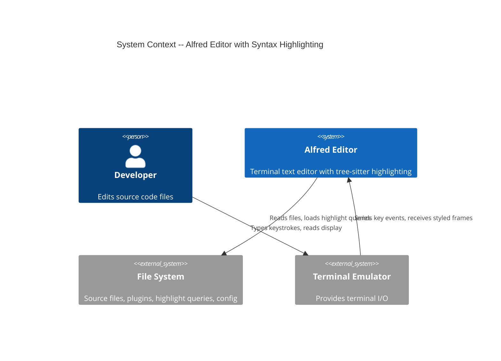
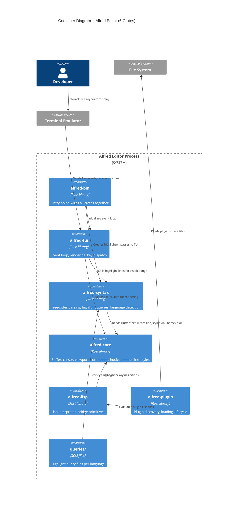
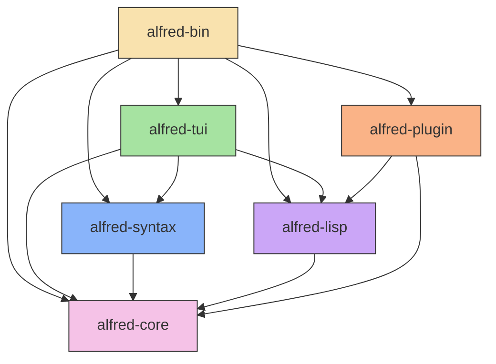
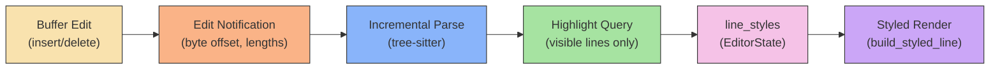

# Syntax Highlighting -- Architecture Document

**Feature**: syntax-highlighting
**Date**: 2026-03-24
**Phase**: Architecture Design (DESIGN wave)
**Architect**: Morgan (Solution Architect)
**ADR**: [ADR-007](../../../adrs/adr-007-tree-sitter-syntax-highlighting.md)

---

## 1. System Overview

Tree-sitter-based syntax highlighting for Alfred. A new `alfred-syntax` crate owns all tree-sitter interaction: parsing buffers, managing grammars, running highlight queries, and producing `(line, start_col, end_col, ThemeColor)` segments that feed into `EditorState.line_styles`. The existing renderer already consumes `line_styles` to produce styled `Span`s -- no renderer changes needed for basic highlighting.

**Key constraint**: `alfred-core` remains pure. It has no tree-sitter dependency. The `alfred-syntax` crate depends on `alfred-core` (for `Buffer`, `ThemeColor` types) and on tree-sitter.

---

## 2. C4 System Context (Level 1)



---

## 3. C4 Container Diagram (Level 2) -- Updated for 6 Crates



---

## 4. Crate Dependency Graph (Updated)



**Dependency rule**: `alfred-core` has ZERO dependencies on other Alfred crates. `alfred-syntax` depends inward on `alfred-core` only. `alfred-tui` gains a new dependency on `alfred-syntax`.

---

## 5. Component Boundaries

### 5.1 alfred-syntax (NEW)

**Responsibility**: All tree-sitter interaction. Language detection, grammar management, incremental parsing, highlight query execution, and production of styled segments.

**Contains**:
- `SyntaxHighlighter` -- top-level struct holding parser state and grammar configs
- Language registry -- maps file extensions to (grammar, highlight query) pairs
- Incremental parsing logic -- receives edit notifications, updates parse tree
- Highlight query runner -- queries visible line range, produces `(line, start_col, end_col, highlight_group)` results
- Highlight group to theme color resolution -- maps capture names like `@keyword` to theme color slot names like `"syntax-keyword"`

**Dependencies**:
- `alfred-core` -- for `Buffer` text access, `ThemeColor` type
- `tree-sitter` (MIT) -- parser runtime
- `tree-sitter-rust` (MIT) -- Rust grammar
- `tree-sitter-python` (MIT) -- Python grammar
- `tree-sitter-javascript` (MIT) -- JavaScript grammar

**Does NOT contain**: rendering logic, terminal I/O, Lisp bridge code.

### 5.2 alfred-core (NO CHANGES to dependencies)

`alfred-core` already provides everything the highlighter needs:
- `Buffer` struct with `get_line()`, `line_count()`, `content()`, `version()` for text access
- `ThemeColor` for color representation
- `EditorState.line_styles: HashMap<usize, Vec<(usize, usize, ThemeColor)>>` for styled segments
- `add_line_style()` and `clear_line_styles()` functions

**One addition needed**: A `Buffer::text_callback()` or similar method that provides efficient chunk-by-chunk text access for tree-sitter's parse callback. Tree-sitter does not require the entire text as a contiguous string -- it accepts a callback that returns text chunks by byte offset. This aligns naturally with ropey's chunk iterator. This addition is purely a data-access method on Buffer (no I/O, no tree-sitter types) and does not violate core purity.

### 5.3 alfred-tui (Integration point)

The TUI crate gains a dependency on `alfred-syntax`. The integration is minimal:
- On file open: notify highlighter of new buffer (triggers initial parse)
- On buffer edit: notify highlighter of edit region (triggers incremental re-parse)
- Before rendering visible lines: ask highlighter for styled segments for the visible range, write them into `EditorState.line_styles`
- The existing `collect_visible_lines()` / `build_styled_line()` already renders from `line_styles` -- no rendering changes needed

### 5.4 alfred-lisp (Theme integration)

New Lisp primitives for controlling highlight colors through the theme system:
- Plugins can call `(set-theme-color "syntax-keyword" "#c678dd")` to set highlight group colors
- The default-theme plugin gains syntax highlight color definitions
- No new bridge infrastructure needed -- the existing `set-theme-color` primitive already writes to `EditorState.theme`

### 5.5 alfred-bin (Wiring)

The binary entry point creates a `SyntaxHighlighter` and passes it to the TUI event loop. This is the composition root where `alfred-syntax` is wired in.

---

## 6. Data Models

### 6.1 SyntaxHighlighter

Top-level struct managing all tree-sitter state. One per editor instance.

**Fields** (conceptual, crafter decides actual structure):
- A tree-sitter `Parser` instance
- The current parsed `Tree` (if any)
- Language configurations: mapping from file extension to grammar + highlight query
- The last-known buffer version (to detect stale trees)

### 6.2 Language Configuration

Mapping from file metadata to tree-sitter resources.

**Data**:
- File extension(s) -> language identifier (e.g., `.rs` -> "rust", `.py` -> "python")
- Language identifier -> tree-sitter `Language` (from compiled grammar crate)
- Language identifier -> highlight query string (loaded from `queries/{lang}/highlights.scm`)

### 6.3 Highlight Group Mapping

Tree-sitter highlight queries produce named captures like `@keyword`, `@function`, `@string`, `@comment`, `@type`, `@variable`, `@operator`, `@number`, `@punctuation`.

These map to theme color slot names following the convention `syntax-{group}`:
- `@keyword` -> `"syntax-keyword"`
- `@function` -> `"syntax-function"`
- `@string` -> `"syntax-string"`
- `@comment` -> `"syntax-comment"`
- `@type` -> `"syntax-type"`
- `@variable` -> `"syntax-variable"`
- `@operator` -> `"syntax-operator"`
- `@number` -> `"syntax-number"`
- `@punctuation` -> `"syntax-punctuation"`

Theme color lookup uses the existing `EditorState.theme` HashMap. If a slot is not set, the text renders with default color (no styling applied for that capture).

### 6.4 Edit-to-Parse Synchronization

When the buffer is edited (insert/delete), tree-sitter needs an `InputEdit` describing:
- `start_byte`, `old_end_byte`, `new_end_byte`
- `start_position`, `old_end_position`, `new_end_position` (row/column)

These must be computed from the ropey edit operation. The `Buffer.version()` counter can detect whether the tree is stale. The crafter determines the exact synchronization mechanism (e.g., edit notification struct, callback, or polling version).

---

## 7. Event Flows

### 7.1 File Open -> Initial Parse

```
1. User opens file (`:e main.rs` or CLI arg)
2. Buffer loaded into EditorState
3. alfred-bin/alfred-tui detects new buffer with filename
4. SyntaxHighlighter receives buffer text + filename
5. Language detected from file extension (.rs -> Rust)
6. Parser set to Rust grammar
7. Full parse produces initial Tree
8. Render cycle: highlighter queries tree for visible lines
9. Highlight results written to EditorState.line_styles
10. Renderer draws styled lines (existing code path)
```

### 7.2 Buffer Edit -> Incremental Re-parse

```
1. User types a character (insert mode)
2. Buffer modified: insert_at() produces new Buffer
3. Edit notification sent to SyntaxHighlighter:
   - byte offset of edit start
   - old/new byte lengths
   - old/new row/column positions
4. tree.edit() called with InputEdit
5. Parser re-parses incrementally (only changed region)
6. New Tree replaces old Tree
7. Render cycle: re-query highlights for visible range
8. line_styles updated for affected lines
9. Renderer draws updated frame
```

### 7.3 Render Cycle -> Query Highlights

```
1. Render cycle begins (after any state change)
2. Determine visible line range: top_line .. top_line + viewport_height
3. SyntaxHighlighter.highlight_lines(visible_range, theme) called
4. For each highlight capture in visible range:
   a. Map capture name to theme color slot
   b. Look up color in EditorState.theme
   c. Produce (line, start_col, end_col, ThemeColor) segment
5. Clear old line_styles for visible range
6. Write new segments into EditorState.line_styles
7. Existing collect_visible_lines() / build_styled_line() renders them
```

---

## 8. Data Flow Diagram



---

## 9. Technology Stack (Additions)

| Component | Technology | Version | License | Rationale |
|-----------|-----------|---------|---------|-----------|
| Parser runtime | tree-sitter | 0.24+ | MIT | Industry-standard incremental parser. Used by Helix, Neovim, Zed |
| Rust grammar | tree-sitter-rust | 0.23+ | MIT | Official tree-sitter grammar for Rust |
| Python grammar | tree-sitter-python | 0.23+ | MIT | Official tree-sitter grammar for Python |
| JavaScript grammar | tree-sitter-javascript | 0.23+ | MIT | Official tree-sitter grammar for JavaScript |

All additions are MIT-licensed. No proprietary dependencies.

**Binary size impact**: ~200-500KB per grammar. With 3 grammars: ~0.6-1.5MB additional. Acceptable for a desktop application.

---

## 10. Integration Patterns

### 10.1 Text Access: Buffer -> tree-sitter

Tree-sitter's `Parser::parse()` accepts either a string slice or a callback `FnMut(byte_offset, Point) -> &[u8]`. The callback form avoids materializing the entire buffer as a contiguous string, which is expensive for large files stored as ropes.

`alfred-core` will expose a method on `Buffer` that provides chunk-based byte access by offset. This is a pure data accessor -- no I/O, no tree-sitter types. `alfred-syntax` wraps this into the closure tree-sitter expects.

### 10.2 Highlight Group -> Theme Color

The mapping from tree-sitter capture names to `ThemeColor` values goes through the existing theme system:
1. Capture `@keyword` maps to theme slot `"syntax-keyword"`
2. `EditorState.theme.get("syntax-keyword")` returns `Option<ThemeColor>`
3. If `Some`, the segment gets that color. If `None`, no styling (default terminal color)

This means Lisp plugins control all highlight colors via `(set-theme-color "syntax-keyword" "#c678dd")`. No hardcoded colors in `alfred-syntax`.

### 10.3 Ownership: Who Holds the Highlighter?

The `SyntaxHighlighter` lives in the TUI event loop scope (or is passed through from `alfred-bin`). It is NOT on `EditorState` (that would require `alfred-core` to know about tree-sitter types). The TUI orchestrates: on edit, notify highlighter; before render, query highlights and write to `line_styles`.

---

## 11. Quality Attribute Strategies

### 11.1 Performance

- **Initial parse**: <5ms for 10K-line files (tree-sitter benchmark: typically <2ms)
- **Incremental re-parse**: <1ms for single-character edits (tree-sitter reuses most of the tree)
- **Highlight query**: <1ms for visible lines (~50 lines). Query scoped to visible byte range, not full file
- **No per-keystroke full parse**: Edit notification + incremental re-parse is O(edit size), not O(file size)

### 11.2 Maintainability

- `alfred-syntax` is isolated: all tree-sitter complexity contained in one crate
- Adding a language = add grammar crate to Cargo.toml + add `highlights.scm` file
- Theme colors controlled by Lisp plugins, not hardcoded
- Highlight queries are declarative SCM files, not Rust code

### 11.3 Testability

- `SyntaxHighlighter` testable in isolation: give it a buffer string, assert highlight output
- No terminal needed for testing -- highlight output is data (line/col/color tuples)
- Grammar correctness tested by parsing known code and asserting node types
- Integration tested by round-trip: edit buffer, re-parse, query highlights, verify segments

### 11.4 Reliability

- Tree-sitter is error-tolerant: broken/partial code still gets best-effort highlighting
- If language is unrecognized, no highlighting applied (graceful degradation)
- If highlight query has no matches for a node, that text is unstyled (not an error)

---

## 12. Highlight Query File Location

```
queries/
  rust/
    highlights.scm
  python/
    highlights.scm
  javascript/
    highlights.scm
```

Queries are included at compile time via `include_str!()` or loaded from a known path. Compile-time inclusion (like Helix does) avoids runtime file I/O and missing-file errors. The crafter decides the exact mechanism.

---

## 13. Rejected Simple Alternatives

### Alternative 1: Line-by-line regex in the renderer

- **What**: Apply simple regex patterns (`r"\bfn\b"`, `r"\"[^\"]*\""`) per line during rendering
- **Expected impact**: Would cover ~50% of highlighting cases for Rust/Python
- **Why insufficient**: Cannot handle multi-line strings, nested constructs, or context-dependent tokens. No incremental parsing -- full regex scan on every render. Maintenance cost per language is high. This is a dead-end approach that would need replacement later

### Alternative 2: Use only Lisp plugins for highlighting

- **What**: A Lisp plugin calls `(set-line-style ...)` for each token, using Lisp-level regex or pattern matching
- **Expected impact**: Would work for very simple patterns, uses existing infrastructure
- **Why insufficient**: Lisp evaluation is ~10-100x slower than tree-sitter's C-based parser. For a 1000-line visible range, iterating in Lisp would exceed frame time budget. No incremental parsing. This approach is architecturally elegant but fails the performance requirement

### Why tree-sitter is necessary

1. Both simple alternatives fail the <5ms performance target for files >1000 lines
2. Both produce inaccurate highlighting for real-world code (multi-line strings, nested brackets, context-dependent tokens)
3. Tree-sitter is the only approach that provides both accuracy AND incremental parsing, justified by the performance and correctness requirements
