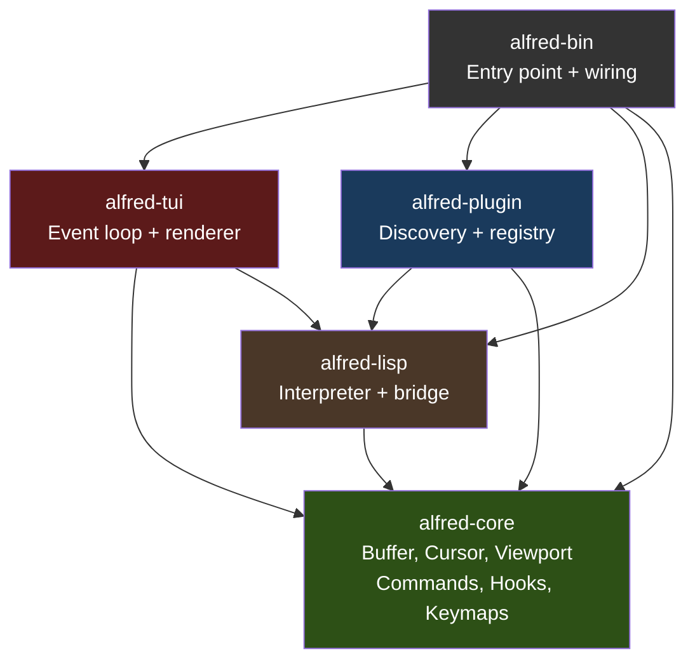
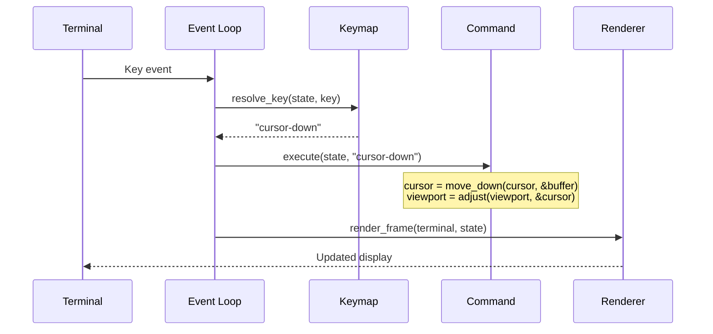

<!-- _class: lead -->

# Alfred Editor
## Quick Overview -- Walking Skeleton Complete

An Emacs-inspired text editor where **everything is a Lisp plugin**
5-crate Cargo workspace | Rust | Functional core / Imperative shell

2026-03-23

---

# What is Alfred?

A **plugin-first text editor** written in Rust with an embedded Lisp interpreter.

**Thesis**: Even complex features (modal editing) should work entirely as plugins, not hardcoded kernel behavior.

**Proof**: Vim-style modal editing (hjkl, modes, insert, delete) is implemented in **27 lines of Lisp**. Zero hardcoded keybindings remain in the Rust event loop.

| Metric | Value |
|---|---|
| Rust source lines | 8,730 |
| Lisp plugin lines | 72 |
| Tests | 209 |
| External runtime deps | 5 |
| ADRs | 6 |

---

# Architecture at a Glance



**Dependencies point inward**. `alfred-core` has zero dependencies on other Alfred crates. Cargo enforces this at compile time.

---

# Core Design Decisions

| Decision | Rationale | ADR |
|---|---|---|
| Adopt existing Lisp interpreter | Building a Lisp is project-sized; prove architecture instead | ADR-001 |
| Plugin-first architecture | Strongest architecture proof: complex features as plugins | ADR-002 |
| Single-process synchronous | No async complexity for a walking skeleton | ADR-003 |
| rust_lisp over Janet | Zero FFI friction, pure Rust build chain | ADR-004 |
| Functional core / imperative shell | Pure domain logic, I/O at boundaries | ADR-005 |
| 5-crate workspace | Compile-time architectural boundary enforcement | ADR-006 |

---

# The Plugin-First Proof

```lisp
;; vim-keybindings/init.lisp -- 27 lines total

(make-keymap "normal-mode")
(define-key "normal-mode" "Char:h" "cursor-left")
(define-key "normal-mode" "Char:j" "cursor-down")
(define-key "normal-mode" "Char:k" "cursor-up")
(define-key "normal-mode" "Char:l" "cursor-right")
(define-key "normal-mode" "Char:i" "enter-insert-mode")
(define-key "normal-mode" "Char:x" "delete-char-at-cursor")
(define-key "normal-mode" "Char:d" "delete-line")
(define-key "normal-mode" "Char::" "enter-command-mode")

(make-keymap "insert-mode")
(define-key "insert-mode" "Escape" "enter-normal-mode")
(define-key "insert-mode" "Backspace" "delete-backward")

(define-command "enter-insert-mode" (lambda () (set-mode "insert")))
(define-command "enter-normal-mode" (lambda () (set-mode "normal")))

(set-active-keymap "normal-mode")
(set-mode "normal")
```

The kernel provides primitives. The plugin composes them into a full editing paradigm.

---

# Shipped Plugins

| Plugin | Lines | What It Does |
|---|---|---|
| `basic-keybindings` | 22 | Arrow keys, colon command mode, backspace |
| `vim-keybindings` | 27 | hjkl, modes (normal/insert), x, d, i |
| `line-numbers` | 9 | Gutter line numbers via render-gutter hook |
| `status-bar` | 9 | Filename, position, mode via render-status hook |
| `test-plugin` | 5 | Demo: registers a "hello" command |

All features beyond cursor movement and buffer ops are plugins. Line numbers, status bar, keybindings -- all removable without touching the kernel.

---

# Data Flow: Key Press to Screen Update



For Lisp commands, `execute` calls the Lisp closure via the bridge.

---

# Crate Responsibilities

| Crate | Lines | Core Types | I/O? |
|---|---|---|---|
| `alfred-core` | 2,044 | Buffer, Cursor, Viewport, EditorState, CommandRegistry, HookRegistry, KeyEvent | No |
| `alfred-lisp` | 2,162 | LispRuntime, LispValue, LispError, Bridge | No (bridge borrows state) |
| `alfred-plugin` | 1,153 | PluginMetadata, PluginRegistry, LoadedPlugin | Reads plugins/ dir |
| `alfred-tui` | 3,442 | InputState, DeferredAction, RawModeGuard | Yes (terminal I/O) |
| `alfred-bin` | 109 | -- (wiring only) | Yes (CLI, fs) |

---

# Test Distribution

| Crate | Tests | Notable Tests |
|---|---|---|
| alfred-core | 67 | Pure function tests for buffer, cursor, viewport, keymap resolution |
| alfred-lisp | 25 | Eval, bridge primitives, performance baselines (1ms kill signal) |
| alfred-plugin | 56 | Discovery, toposort, cleanup isolation, define-command round-trip |
| alfred-tui | 61 | Rendering (TestBackend), key dispatch, modal editing capstone |
| **Total** | **209** | Farley Index 8.3/10 |

**Test style**: Given/When/Then acceptance tests first, then unit tests. Test budget: behaviors x 2. Zero tautology theatre.

---

# Key Risks and Next Steps

**Top risks**:
- `app.rs` at 2721 lines is the hotspot -- needs decomposition
- `Rc<RefCell>` borrow discipline requires care (2 bugs fixed during M3)
- rust_lisp is a smaller project -- migration path to Janet is documented

**Next steps** (all should be plugins):
- File save (`:w`)
- Multiple buffers
- Syntax highlighting
- Search and replace
- LSP integration

The kernel should not need to change. That is the real test of the architecture.

---

<!-- _class: lead -->

# Summary

**5 crates. 209 tests. 6 ADRs. Zero hardcoded keybindings.**

Vim-style modal editing in 27 lines of Lisp.

The walking skeleton is complete. The architecture is proven.
