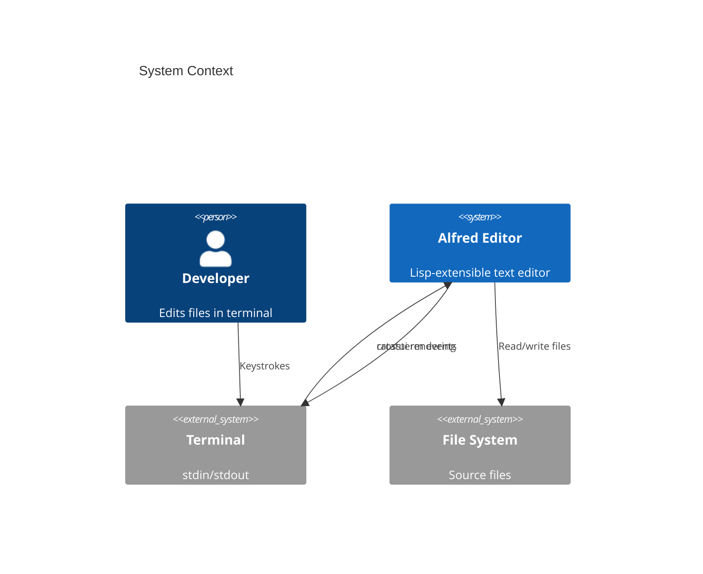
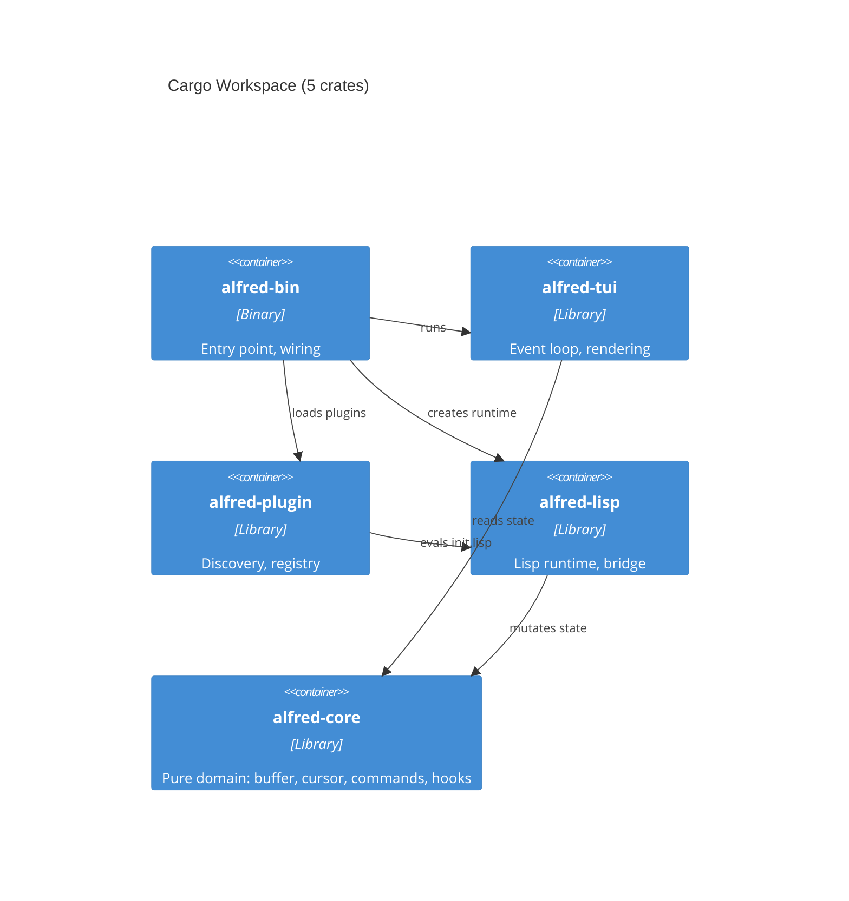

# Alfred Editor -- Quick Overview

**An Emacs-inspired text editor proving plugin-first architecture**

Rust | 5 crates | 11,071 lines | 254 tests | Vim modal editing as 52 lines of Lisp

<!--
Tier 1 overview deck: ~12 slides covering purpose, architecture,
key components, design decisions, and getting started.
-->

---

# The Problem

> Can complex features like modal editing work entirely as plugins in an extension language?

**Evidence informing the design**:
- Emacs: ~70% Lisp proves plugin-first works at scale
- Helix: no plugin system is its most-cited limitation
- Xi editor: multi-process architecture was "not a good idea" (author's post-mortem)

**Alfred's answer**: Yes. Vim modal editing (36 keybindings, 2 modes) is 52 lines of Lisp.

---

# System Context



---

# 5-Crate Architecture



**Key rule**: `alfred-core` has ZERO dependencies on other Alfred crates (Cargo-enforced).

---

# Functional Core / Imperative Shell

| Layer | Crate | Character |
|-------|-------|-----------|
| **Pure core** | alfred-core | Buffer, cursor, viewport as pure functions. No I/O. |
| **Bridge** | alfred-lisp | Connects Lisp to Rust via 14 native closures |
| **Plugin system** | alfred-plugin | Discovery, topological sort, lifecycle |
| **Imperative shell** | alfred-tui | Event loop, terminal I/O, rendering |
| **Composition root** | alfred-bin | Wires everything together |

All domain logic is testable without a terminal, Lisp runtime, or file system.

---

# The Plugin Proof

## Vim modal editing in 52 lines of Lisp

```lisp
(make-keymap "normal-mode")
(define-key "normal-mode" "Char:h" "cursor-left")
(define-key "normal-mode" "Char:j" "cursor-down")
;; ... 33 more bindings (w/b/e, J/y/p, undo/redo, etc.)

(make-keymap "insert-mode")
(define-key "insert-mode" "Escape" "enter-normal-mode")
(define-key "insert-mode" "Backspace" "delete-backward")

(define-command "enter-insert-mode" (lambda () (set-mode "insert")))
(define-command "enter-normal-mode" (lambda () (set-mode "normal")))

(set-active-keymap "normal-mode")
(set-mode "normal")
```

5 plugins total: vim-keybindings, basic-keybindings, line-numbers, status-bar, test-plugin.

---

# Key Capabilities (M9)

| Feature | Implementation |
|---------|---------------|
| Modal editing (normal/insert) | Lisp plugin (vim-keybindings) |
| Extended vim motions (w b e 0 $ ^ gg G H M L) | 32 built-in commands + Lisp bindings |
| Editing commands (J yy p cc C u Ctrl-r) | Built-in commands with undo/redo |
| Half-page scroll (Ctrl-d, Ctrl-u) | Built-in commands |
| File save (:w :wq :q!) | Colon command system |
| File open (:e path) | Colon command system |
| Line numbers | Lisp plugin (hook-based) |
| Status bar | Lisp plugin (hook-based) |
| Undo/redo | Rope snapshots (O(1) clone) |
| Lisp REPL | `:eval expression` |

---

# 6 Architectural Decisions (Documented)

| ADR | Decision | One-line rationale |
|-----|----------|--------------------|
| 001 | Adopt existing Lisp | Interpreter is means, not end |
| 002 | Plugin-first architecture | Strongest proof of extensibility |
| 003 | Single-process synchronous | Xi post-mortem lesson |
| 004 | rust_lisp over Janet | Integration quality > language features |
| 005 | Functional core / imperative shell | Pure core is testable without mocking |
| 006 | 5-crate Cargo workspace | Compile-time boundary enforcement |

---

# Test Architecture

**254 tests across 4 crates** (Farley Index 8.3)

| Crate | Tests | Strategy |
|-------|-------|---------|
| alfred-core | 94 | Table-driven parametrization, pure function testing |
| alfred-lisp | 59 | Runtime eval, bridge primitives, performance baselines |
| alfred-plugin | 25 | Discovery integration, topological sort, lifecycle |
| alfred-tui | 76 | Key dispatch, ratatui TestBackend rendering |

- Given/When/Then naming convention
- Test budget discipline (behaviors x 2 maximum)
- No mocking in core tests
- Performance baseline tests (1ms kill signal threshold)

---

# Hotspot Analysis

| File | Lines | Changes | Risk |
|------|-------|---------|------|
| app.rs | 3,301 | 24 | High (but ~2,700 are tests) |
| editor_state.rs | 1,203 | 14 | High (aggregation root + 32 commands) |
| bridge.rs | 1,813 | 13 | Medium |
| cursor.rs | 727 | 7 | Medium |
| buffer.rs | 672 | 6 | Low (stable) |

**Top recommendation**: Consider extracting command dispatch from app.rs into a dedicated module.

---

# Getting Started

```bash
# Build and test
cargo build --workspace
cargo test --workspace

# Run the editor
cargo run --bin alfred              # Empty buffer
cargo run --bin alfred myfile.txt   # Open a file
```

**Read first**:
1. `CLAUDE.md` -- Project conventions
2. `docs/adrs/` -- Architectural decisions (6 ADRs)
3. `crates/alfred-core/src/editor_state.rs` -- Domain root
4. `plugins/vim-keybindings/init.lisp` -- Architecture proof

---

# Summary

**Alfred** = Emacs-inspired editor proving plugin-first architecture

- 5-crate Rust workspace, functional core / imperative shell
- Vim modal editing as 52 lines of Lisp (the architectural proof)
- 254 tests, 6 ADRs, Farley Index 8.3
- 69 commits, 11,071 lines of Rust, 97 lines of Lisp
- Walking skeleton complete (M1-M7) + file ops (M8) + extended vim (M9)
