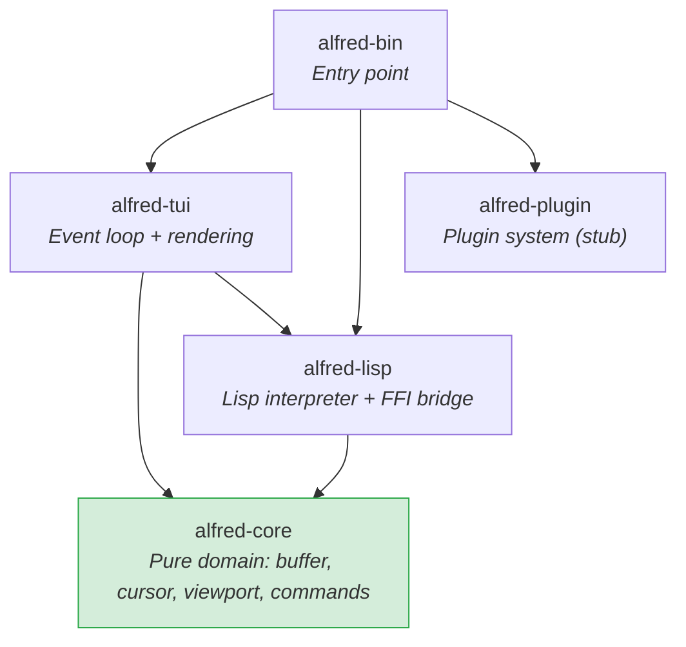

<!-- Slide 1 -->
# Alfred Editor: Quick Overview

**Emacs-inspired text editor in Rust with Lisp plugin architecture**

5-crate workspace | Functional core / Imperative shell | M2 of 7 complete

<!--
Presenter notes:
Quick 10-minute overview for anyone needing context on the Alfred project.
For deep-dives into specific areas, see the full walkthrough deck.
-->

---

<!-- Slide 2 -->
# The Thesis

> Everything beyond core primitives is a Lisp plugin.

**Walking skeleton goal**: Modal editing (Vim-style) works entirely as a Lisp plugin on a thin Rust kernel.

**Milestones**: M1 Kernel (done) -> M2 Lisp (done) -> M3 Plugin System -> M4 Line Numbers -> M5 Status Bar -> M6 Keybindings -> **M7 Vim Mode**

---

<!-- Slide 3 -->
# Architecture at a Glance



**Key rule**: All dependencies point inward toward alfred-core. Enforced by Cargo at compile time.

---

<!-- Slide 4 -->
# Functional Core / Imperative Shell

| Layer | Crates | Characteristics |
|-------|--------|----------------|
| **Pure core** | alfred-core | No I/O; free functions; `(input) -> output`; testable without mocking |
| **Imperative shell** | alfred-tui, alfred-bin | Event loop, terminal I/O, `Rc<RefCell<EditorState>>` |
| **Bridge** | alfred-lisp | Connects Lisp interpreter to core via registered closures |

Documented in ADR-005.

---

<!-- Slide 5 -->
# The Lisp Bridge

**7 primitives** registered at startup as Rust closures in the Lisp environment:

| Primitive | Does |
|-----------|------|
| `(buffer-insert text)` | Insert text at cursor |
| `(buffer-delete)` | Delete char at cursor |
| `(buffer-content)` | Return buffer as string |
| `(cursor-position)` | Return `(line column)` |
| `(cursor-move dir [n])` | Move cursor |
| `(message text)` | Set status message |
| `(current-mode)` | Return mode name |

All eval under 1ms. Documented kill signal: if >1ms, switch to Janet.

---

<!-- Slide 6 -->
# Key Design Decisions (6 ADRs)

| Decision | Chosen | Over |
|----------|--------|------|
| Adopt Lisp interpreter | rust_lisp | Build custom, Janet, Lua |
| Plugin-first architecture | Thin kernel + Lisp plugins | Full-featured kernel, balanced split |
| Execution model | Single-process synchronous | Multi-process, async, thread pool |
| Lisp interpreter | rust_lisp (native Rust) | Janet (C FFI) |
| Development paradigm | Functional core / imperative shell | Pure FP, Pure OOP |
| Code organization | 5-crate Cargo workspace | Single crate, 6+ crates |

---

<!-- Slide 7 -->
# Codebase by the Numbers

| Metric | Value |
|--------|-------|
| Source files | 16 (.rs) |
| Total lines (Rust) | ~3,700 |
| Tests | 131 |
| Assertions | 225 |
| ADRs | 6 |
| Design documents | 5 |
| External dependencies | ropey, rust_lisp, crossterm, ratatui, thiserror |

---

<!-- Slide 8 -->
# What Works Today (M1 + M2)

- Open a file from CLI, render in terminal
- Navigate with arrow keys (cursor movement, viewport scrolling)
- Quit with `:q` or `:quit`
- Evaluate Lisp expressions with `:eval (expression)`
- Lisp can insert/delete text, move cursor, set messages
- Errors display as messages, never crash the editor

---

<!-- Slide 9 -->
# What Comes Next (M3-M7)

```
M3: Plugin discovery, loading, lifecycle    (2 weeks)
M4: Line numbers as first real Lisp plugin  (1 week)
M5: Status bar plugin with dynamic state    (1 week)
M6: Keybindings as plugin -- removes ALL    (2 weeks)
    hardcoded keys from Rust
M7: Vim modal editing as a Lisp plugin      (2-3 weeks)
```

**M6 is the inflection point**: after M6, no key handling in Rust.

**M7 is the proof**: modal editing as a plugin validates the architecture.

---

<!-- Slide 10 -->
# Top Risks

| Risk | Impact | Notes |
|------|--------|-------|
| Plugin API insufficient for modal editing | High | M7 is the test |
| app.rs (861 lines) grows into god-file | Medium | Needs extraction before M6 |
| rust_lisp maintenance stalls | Medium | Simple enough to fork |
| `Rc<RefCell>` panics at runtime | Low | Confined to event loop |

---

<!-- Slide 11 -->
# Getting Started

```bash
# Build
cargo build

# Run
cargo run --bin alfred -- some_file.txt

# Inside Alfred
# Arrow keys: navigate
# :q Enter:   quit
# :eval (+ 1 2) Enter: Lisp eval

# Test
cargo test                  # all
cargo test -p alfred-core   # just core
```

---

<!-- Slide 12 -->
# Summary

**Alfred is a well-documented, cleanly-separated proof-of-concept at M2.**

The architecture is sound. The decisions are recorded. The test suite is thorough.

The remaining 5 milestones will determine if the plugin-first thesis holds when faced with real features.

**Read more**: `docs/adrs/`, `docs/feature/alfred-core/design/`, `docs/walkthrough/alfred-walkthrough.md`
