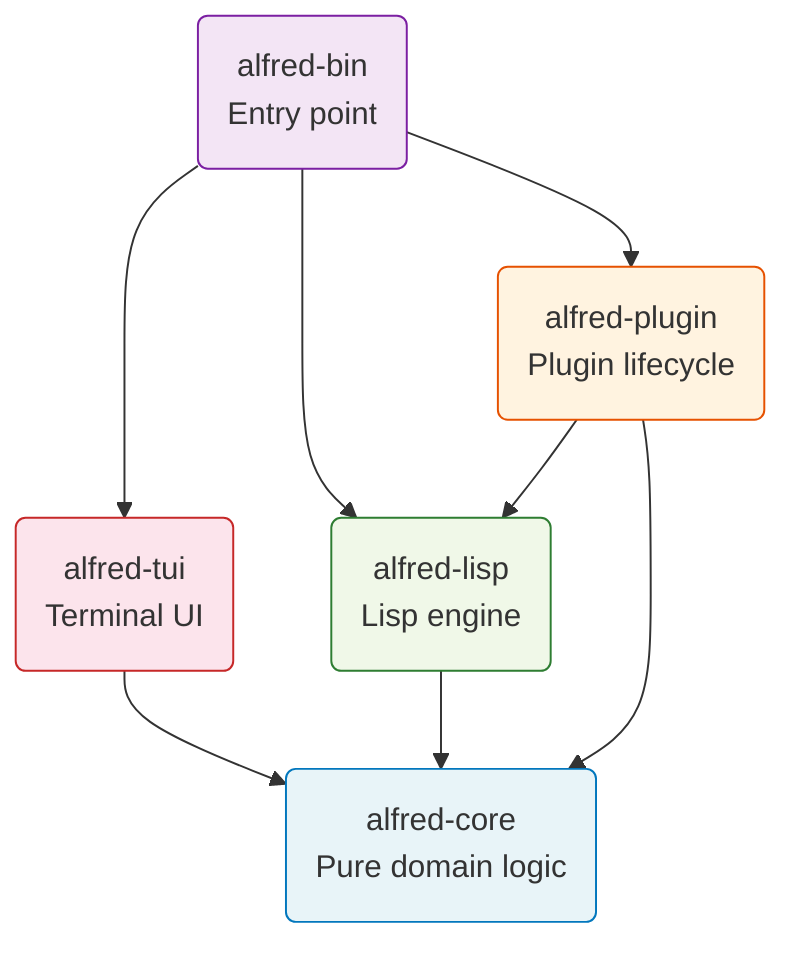
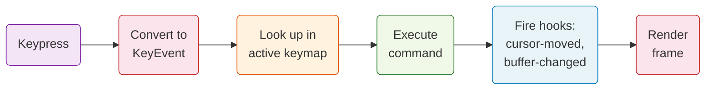

# Alfred

### A plugin-first terminal text editor built in Rust

Everything beyond core text editing is a Lisp plugin --
keybindings, line numbers, status bar, themes, even Vim-style modal editing.

**~566 unit tests | ~66 E2E tests | ~110 Vim commands | 7 plugins**

<!--
Presenter notes:
Alfred is a personal project that proves AI agents can build architecturally
sound software. It is an Emacs-inspired editor where the extension language
is Lisp and the architecture enforces clear boundaries at compile time.
-->

---

# Why Alfred Exists

**The problem:** Most editors either hardcode everything (fast but rigid) or bolt on plugins as an afterthought (flexible but messy).

**The question:** Can you build a real text editor where the core is tiny and *everything else* is a plugin?

**The answer:** Alfred proves you can. Vim-style modal editing -- one of the most complex editor features -- runs entirely as a Lisp plugin. The Rust kernel does not know what "normal mode" or "insert mode" means.

**Why this matters to you:** The architecture is clean enough that a new developer can understand *where* any feature lives just by knowing one rule: "Is it a core primitive, or is it a plugin?"

<!--
Presenter notes:
This is not a production editor competing with Neovim. It is a demonstration
of plugin-first architecture. The walking skeleton approach means every
feature validates the plugin API.
-->

---

# What Alfred Is

A terminal text editor with three layers:

| Layer | What it does | Technology |
|-------|-------------|------------|
| **Rust kernel** | Buffer, cursor, viewport, hooks, commands, panels | Rust + ropey (rope data structure) |
| **Lisp bridge** | Connects plugins to the kernel via ~50 primitives | rust_lisp interpreter |
| **Lisp plugins** | All user-visible features: keys, themes, status bar | Alfred Lisp (.lisp files) |

Think of it like a restaurant. The kernel is the kitchen (raw ingredients and tools). The bridge is the serving window (how orders get in and meals get out). The plugins are the menu (what you actually experience as a customer).

<!--
Presenter notes:
The rope data structure (ropey) is used for efficient text editing -- it
handles insertions and deletions in large files without copying the entire
buffer. Think of it as a balanced tree of text chunks.
-->

---

# Plugin-First Philosophy

The kernel provides **only primitives**. Plugins compose them into features.

| Feature | Plugin? | What the kernel provides |
|---------|---------|------------------------|
| Vim keybindings | Yes | Keymap resolution, mode switching |
| Line numbers | Yes | Panel system, viewport info |
| Status bar | Yes | Panel system, hooks |
| Color themes | Yes | Theme color storage |
| Rainbow CSV | Yes | Line style segments |
| Word count | Yes | Buffer content access |

**The test:** You can delete the `vim-keybindings` plugin and Alfred still starts. It just has no keybindings. The kernel does not care.

<!--
Presenter notes:
This matches the Emacs philosophy where ~70% of the editor is written in
Lisp. ADR-002 documents this decision. The strongest proof of the
architecture is that modal editing (a complex, stateful feature) works
entirely as a plugin.
-->

---

# Five Crate Architecture



**The rule:** All arrows point inward toward `alfred-core`. The core never depends on anything else. This is enforced by the Rust compiler -- not just convention.

<!--
Presenter notes:
Cargo workspace boundaries enforce the dependency rule at compile time.
If someone adds an import of crossterm in alfred-core, the build fails.
ADR-006 documents this decision.
-->

---

# Event-Driven Plugin Model

When you press a key, here is what happens:



Plugins participate at two points: they **define keybindings** (what command does `j` run?) and they **listen to hooks** (update the status bar after cursor moves).

<!--
Presenter notes:
The event loop runs synchronously on the main thread (ADR-003).
No async, no threads, no message passing. This matches Emacs's
40-year-old proven model. Hooks are the pub-sub mechanism.
-->

---

# Panel System

Panels are named screen regions that plugins create and own.

| Panel | Position | Created by | What it shows |
|-------|----------|-----------|---------------|
| `gutter` | Left | line-numbers plugin | Line numbers |
| `status` | Bottom | status-bar plugin | Filename, cursor, mode |

The kernel only knows: "there are named rectangles at screen edges." It does not know what a "status bar" is. The plugin creates a bottom panel called "status", sets its content on every cursor move, and the renderer draws it.

**Adding a new panel is just Lisp code.** No Rust changes needed.

<!--
Presenter notes:
Panels support top, bottom, left, and right positions. They have size,
content, per-line content (for gutters), foreground/background colors,
and visibility. The renderer iterates panels and draws them generically.
-->

---

# Vim's Composable Grammar

If you have never used Vim, here is the key idea: commands are built from parts, like words in a sentence.

| Part | Role | Examples |
|------|------|---------|
| **Operator** | The *verb* (what to do) | `d` = delete, `c` = change, `y` = copy |
| **Motion** | The *noun* (how far) | `w` = word, `$` = end of line, `j` = down |
| **Text object** | The *noun* (what thing) | `iw` = inner word, `a"` = around quotes |

You combine them: `dw` = delete a word. `ci"` = change inside quotes. `y$` = copy to end of line.

Alfred implements this grammar. The `vim-keybindings` plugin defines the keys, and the Rust event handler implements the operator-pending state machine.

<!--
Presenter notes:
Alfred supports three modes: Normal (navigate and operate), Insert (type text),
and Visual (select then operate). Modes are implemented via keymap switching --
each mode has its own keymap registered by the plugin.
-->

---

# What Is Implemented

Alfred currently supports ~110 Vim commands across three modes:

| Category | Examples | Count |
|----------|---------|-------|
| Movement | `h j k l w b e 0 $ ^ gg G H M L f t` | ~20 |
| Operators | `d c y` with motions and text objects | ~15 combinations |
| Editing | `x dd cc yy p P J u Ctrl-r . r s S ~ > <` | ~20 |
| Text objects | `iw aw i" a" i( a( i{ a{ i[ a[` | 10 |
| Search | `/pattern n N f F t T ; ,` | ~10 |
| Ex commands | `:w :wq :q :q! :e :s :%s :g :v :eval` | ~10 |
| Visual mode | `v V d y c` | ~5 |
| Registers, marks, macros | `"a m' q @` | ~20 |

<!--
Presenter notes:
The comprehensive Vim research document in docs/research/ identifies
~150+ normal mode commands. Alfred implements the most frequently used
subset. The priority was depth over breadth -- text objects and operator
composition work correctly, not just basic motions.
-->

---

# Lisp Extension Language

Alfred Lisp is a small Lisp dialect. Here is a complete plugin in 8 lines:

```lisp
;;; name: word-count
;;; version: 1.0.0
;;; description: Displays word count in the message bar

(define-command "word-count"
  (lambda ()
    (message
      (str-concat
        (list "Words: " (to-string (count-words)))))))
```

Run `:word-count` and you see the count in the message bar. That is it. No Rust code, no compilation, no restart.

The bridge provides ~50 primitives across 7 categories: buffer, cursor, mode, commands, hooks, keymaps, themes, panels, strings, and lists.

<!--
Presenter notes:
rust_lisp was chosen over Janet (a C-based Lisp) because it provides
native Rust integration without C FFI overhead. ADR-004 documents
the tradeoff: Janet is the better language, but rust_lisp provides
better integration for this use case.
-->

---

# Quality and Testing

| Layer | Strategy | Count |
|-------|----------|-------|
| Unit tests | Pure function tests in each module. No mocks needed because the core has no I/O | ~566 |
| E2E tests | Docker container runs Alfred with pexpect (Python). Sends real keystrokes, checks file output | ~66 |
| Pre-commit | Format + lint + tests run before every commit | 3 checks |
| CI | GitHub Actions: check, test, format, lint on every push | 4 jobs |

**Why no mocks?** The functional-core architecture means domain logic is pure functions. You pass inputs and assert outputs. The imperative shell (terminal I/O) is tested via E2E tests in Docker.

**Test Quality Index: 8.4/10** (Farley scale). Zero mock tautology.

<!--
Presenter notes:
Property-based testing is the default testing strategy per CLAUDE.md.
The E2E tests use a real terminal (PTY) to avoid coupling to rendering
internals. They verify outcomes (file content after :wq) not screen pixels.
-->

---

# How To Get Started

**Install and run:**
```bash
git clone git@github.com:andrealaforgia/alfred.git
cd alfred
make install        # builds release binary
alfred myfile.txt   # open a file
```

**Develop:**
```bash
make dev_install    # installs + sets up pre-commit hooks
make test           # run unit tests
make e2e            # run E2E tests (needs Docker)
make lint           # clippy warnings = errors
```

**Customize:** Create `~/.config/alfred/init.lisp`:
```lisp
(set-tab-width 2)
(set-cursor-shape "insert" "blinking-bar")
```

<!--
Presenter notes:
The project requires only Rust stable toolchain and Git. Docker is
needed only for E2E tests. The Makefile wraps all common operations.
-->

---

# What Is Next

Features not yet implemented, ordered by likely priority:

| Feature | Complexity | Why it matters |
|---------|-----------|----------------|
| Syntax highlighting | High | Most-requested editor feature |
| LSP support | High | Code intelligence (autocomplete, go-to-definition) |
| Multiple buffers/splits | Medium | Edit multiple files simultaneously |
| Clipboard integration | Low | Copy/paste with system clipboard |
| Count prefix (`3dw`) | Medium | Vim power-user feature |
| Block visual mode (`Ctrl-V`) | Medium | Column editing |
| Jump list navigation | Low | `Ctrl-o` / `Ctrl-i` between files |

The architecture is ready for these. Syntax highlighting would be a plugin using `set-line-style`. LSP would be a new crate (`alfred-lsp`) that registers commands and hooks.

<!--
Presenter notes:
The plugin-first architecture means new features follow a predictable
pattern: add bridge primitives if needed, then write the feature as a
Lisp plugin. The 5-crate structure can grow (e.g., alfred-lsp) without
disrupting existing crates.
-->

---

# Summary

**One sentence:** Alfred is a terminal text editor where the Rust kernel provides primitives and Lisp plugins compose them into every user-facing feature.

**Five things to remember:**

1. Five crates, one rule: dependencies point inward toward `alfred-core`
2. Everything is a plugin -- even Vim keybindings
3. Hooks are the glue -- plugins react to `cursor-moved`, `buffer-changed`, `mode-changed`
4. Panels are the UI -- plugins own named screen regions
5. Lisp primitives are the API -- ~50 functions bridge Rust and Lisp

**Where to go deeper:** Read `plugins/status-bar/init.lisp` (33 lines) to see a complete plugin. Then read `plugins/vim-keybindings/init.lisp` to see how 128 lines define the entire modal editing experience.

<!--
Presenter notes:
For the full walkthrough, see alfred-walkthrough.md which covers
architecture details, the Lisp engine, Vim grammar, testing strategy,
and all six ADRs in depth.
-->
