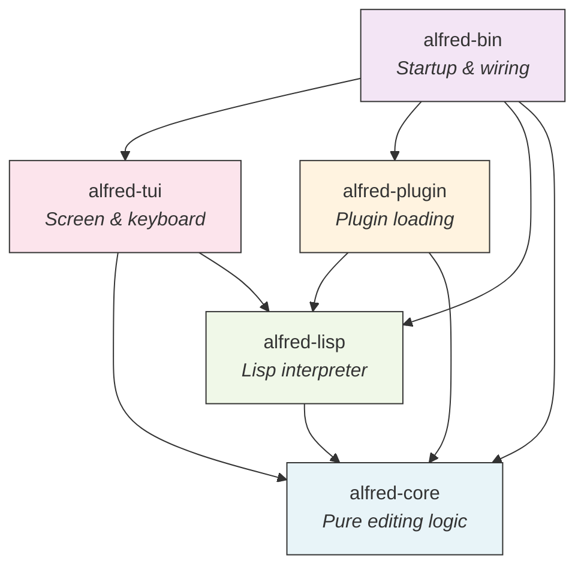

# Alfred: A Terminal Text Editor Built by AI

**What you will learn in this deck:**
- Why Alfred exists and what problem it solves
- What Alfred is and what it can do today
- How it is organized (five building blocks, explained simply)
- How the plugin system works (with a real example)
- Key design decisions and the reasoning behind each one
- How to install, run, and quit

<!--
Audience: new team members with no assumed knowledge of Rust, Lisp, or terminal editors.
Type: Explanation
-->

---

# Why Does Alfred Exist?

**The question:** Can an AI agent build architecturally sound software, not just working code?

Alfred is a proof-of-concept. It was built almost entirely by AI agents to demonstrate that:

1. **AI can produce clean architecture** -- not just code that compiles, but code with clear boundaries, documented decisions, and tested behavior
2. **Emacs-style extensibility works in a modern Rust codebase** -- every feature is a plugin, not a hardcoded behavior
3. **Plugin-first design is viable** -- even complex features like vim keybindings can live entirely outside the core engine

Alfred is a terminal text editor. You run it in your terminal, like vim or nano. It opens files, lets you edit them, and saves them.

<!--
Type: Explanation
This slide answers "why should I care about this project?"
-->

---

# What Is Alfred?

A terminal text editor with vim-style keybindings and a Lisp plugin system.

**Think of it like this:** Alfred is a tiny engine (written in Rust) that knows how to store text and move a cursor. Everything else -- keybindings, line numbers, the status bar, even the color theme -- is a plugin written in Lisp.

**Current capabilities:**
- Open, edit, and save files
- Vim-style modal editing (normal, insert, visual modes)
- Operator + motion composition (`dw`, `ci"`, `yy`, etc.)
- Search (`/pattern`), substitute (`:s/old/new/g`), global delete (`:g/pattern/d`)
- Undo/redo, marks, macros, registers, jump lists
- Line numbers, status bar, customizable color theme

**Scale:** ~20,000 lines of Rust across 5 crates, 5 Lisp plugins, 183 unit tests, 123 commits

<!--
Type: Explanation
-->

---

# How Is It Organized?

Alfred is split into five building blocks called **crates** (Rust's name for a library or package).



All arrows point downward toward **alfred-core**. This is the key rule: the core never depends on anything else.

<!--
Type: Explanation
-->

---

# The Five Crates in Plain English

| Crate | What It Does | Analogy |
|-------|-------------|---------|
| **alfred-core** | Stores text, moves the cursor, manages commands, keymaps, hooks, and themes. Has zero knowledge of the terminal or Lisp. | The engine of a car |
| **alfred-lisp** | Wraps the `rust_lisp` interpreter. Provides a "bridge" so Lisp code can call Rust functions like `buffer-insert` or `cursor-move`. | The translator between two languages |
| **alfred-plugin** | Discovers plugin folders, reads their metadata, loads them in dependency order. | The app store installer |
| **alfred-tui** | Reads keyboard input, draws the screen, runs the main loop. This is where side effects live. | The dashboard and steering wheel |
| **alfred-bin** | The startup script. Wires everything together and runs the editor. | The ignition key |

**Why this matters:** If you need to change how text is stored, you only touch `alfred-core`. If you need to change how the screen looks, you only touch `alfred-tui`. Each piece has one job.

<!--
Type: Explanation
-->

---

# The "Functional Core / Imperative Shell" Pattern

This is the most important architectural idea in Alfred. Here it is in simple terms:

**Pure logic (the "core"):**
- Given a cursor at position (3, 5) and a "move right" command, the new cursor is at (3, 6).
- Given a buffer with "hello", inserting "X" at column 2 produces "heXllo".
- No reading from disk. No drawing to screen. Just math on data.
- Easy to test: pass inputs, check outputs. No mocking needed.

**Side effects (the "shell"):**
- Reading which key the user pressed
- Drawing text on the terminal screen
- Reading and writing files to disk
- Running the Lisp interpreter

**Where the boundary is:** `alfred-core` = pure logic. `alfred-tui` and `alfred-bin` = side effects.

This matters because pure logic is easy to test, easy to reason about, and easy to change without breaking things.

<!--
Type: Explanation
-->

---

# The Plugin System: How It Works

Alfred discovers plugins automatically from the `plugins/` directory at startup.

**Each plugin is a folder** containing one file: `init.lisp`.

```
plugins/
  vim-keybindings/
    init.lisp          <-- defines all vim keybindings
  line-numbers/
    init.lisp          <-- enables line number display
  status-bar/
    init.lisp          <-- enables the status bar
  default-theme/
    init.lisp          <-- sets colors
```

**Startup sequence:**
1. Scan `plugins/` for subdirectories with `init.lisp`
2. Read metadata from header comments (`;;; name:`, `;;; version:`, etc.)
3. Sort by dependencies (topological sort -- if plugin B depends on plugin A, load A first)
4. Evaluate each `init.lisp` in the Lisp runtime
5. Errors are collected as messages, not crashes

<!--
Type: Explanation
-->

---

# Plugin Example: The Default Theme

Here is a complete, real plugin. This is `plugins/default-theme/init.lisp`:

```lisp
;;; name: default-theme
;;; version: 0.1.0
;;; description: Default color theme for Alfred

(set-theme-color "text-fg" "default")
(set-theme-color "text-bg" "default")
(set-theme-color "gutter-fg" "#6c7086")
(set-theme-color "gutter-bg" "default")
(set-theme-color "status-bar-fg" "#cdd6f4")
(set-theme-color "status-bar-bg" "#313244")
(set-theme-color "message-fg" "default")
(set-theme-color "message-bg" "default")
```

**That is the entire plugin.** Eight lines of Lisp. Each line calls `set-theme-color` with a slot name and a color value (hex or named). Want a different theme? Copy this plugin, change the colors, and restart.

<!--
Type: Explanation
-->

---

# Plugin Example: Vim Keybindings (Excerpt)

The vim keybindings are also a plugin. Here is how `h` maps to "move cursor left":

```lisp
;; Create a keymap (a lookup table of key -> command)
(make-keymap "normal-mode")

;; Bind the 'h' key to the "cursor-left" command
(define-key "normal-mode" "Char:h" "cursor-left")
(define-key "normal-mode" "Char:j" "cursor-down")
(define-key "normal-mode" "Char:k" "cursor-up")
(define-key "normal-mode" "Char:l" "cursor-right")

;; Define a command that switches to insert mode
(define-command "enter-insert-mode"
  (lambda () (set-mode "insert")))

;; Bind 'i' to that command
(define-key "normal-mode" "Char:i" "enter-insert-mode")

;; Activate the keymap
(set-active-keymap "normal-mode")
```

**Key insight:** The Rust core has no hardcoded keybindings. All 70+ vim commands are defined in this single Lisp file. You can change any keybinding without recompiling.

<!--
Type: Explanation
-->

---

# Key Design Decisions

| Decision | Choice | Why |
|----------|--------|-----|
| **Language** | Rust | Memory safety without garbage collector. Fast enough for per-keystroke evaluation. |
| **Text storage** | ropey (rope data structure) | Efficient for large files. Insertions in the middle are O(log n), not O(n). |
| **Lisp interpreter** | rust_lisp (native Rust) | No C compiler needed. Closures register directly in Rust. Easy debugging. |
| **Architecture** | Plugin-first | Proves the plugin API works for real features. Every feature is removable. |
| **Execution model** | Single-process, synchronous | Simplest possible model. No threading bugs. Same model Emacs has used for 40+ years. |
| **Crate structure** | 5 crates in a Cargo workspace | Architectural boundaries enforced by the compiler. Core cannot import terminal code. |

Each of these decisions is documented in an ADR (Architecture Decision Record) in `docs/adrs/`.

<!--
Type: Explanation
-->

---

# The Lisp Bridge: Connecting Rust and Lisp

Lisp plugins need to talk to the Rust core. The **bridge** makes this possible.

**How it works:**
1. At startup, Rust registers "native closures" into the Lisp runtime
2. Each closure captures a reference to the editor state
3. When Lisp code calls `(buffer-insert "hello")`, the bridge closure executes `buffer::insert_at()` in Rust

**Available Lisp primitives (the bridge API):**

| Category | Functions |
|----------|-----------|
| Buffer | `buffer-insert`, `buffer-delete`, `buffer-content`, `buffer-filename`, `buffer-modified?`, `save-buffer` |
| Cursor | `cursor-position`, `cursor-move` |
| Mode | `current-mode`, `set-mode` |
| UI | `message` |
| Commands | `define-command` |
| Keymaps | `make-keymap`, `define-key`, `set-active-keymap` |
| Hooks | `add-hook`, `dispatch-hook`, `remove-hook` |
| Theme | `set-theme-color`, `set-cursor-shape`, `get-cursor-shape` |

<!--
Type: Reference
-->

---

# How to Get Started

**Install:**
```bash
# Requires Rust (install from https://rustup.rs)
git clone <repo-url>
cd alfred
make install
```

**Run:**
```bash
alfred myfile.txt     # open a file
alfred                # open with empty buffer
```

**Essential commands (once inside Alfred):**

| What you want | Keys to press |
|--------------|---------------|
| Move around | `h` `j` `k` `l` (or arrow keys) |
| Start typing | `i` (enter insert mode) |
| Stop typing | `Escape` (back to normal mode) |
| Save | `:w` then `Enter` |
| Quit | `:q` then `Enter` |
| Save and quit | `:wq` then `Enter` |
| Force quit (no save) | `:q!` then `Enter` |
| Undo | `u` |
| Redo | `Ctrl+r` |

<!--
Type: How-To
-->

---

# Testing and Quality

**183 unit tests** pass across all crates. All tests run in under 1 second.

**Test strategy:**
- Unit tests live next to the code they test (Rust convention)
- Tests follow the pattern: `given_X_when_Y_then_Z`
- Property: pure functions get table-driven tests with many input cases
- E2E tests use `pexpect` to drive the real binary in a PTY (terminal emulator)

**CI pipeline** (GitHub Actions, 4 parallel jobs):

| Job | What it checks |
|-----|---------------|
| Check | Does it compile? (`cargo check`) |
| Test | Do all 183 tests pass? (`cargo test`) |
| Format | Is the code formatted? (`cargo fmt --check`) |
| Lint | Are there any warnings? (`cargo clippy`) |

**Pre-commit hook** runs format + lint + tests before every commit.

<!--
Type: Explanation
-->

---

# What Is Not Yet Implemented

Alfred implements a solid subset of vim. Here is what is missing, in order of priority:

**High priority (daily editing):**
- `W`/`B`/`E` (WORD motions -- treat punctuation as part of word)
- `:` line number jumps (`:42` to go to line 42)
- `Ctrl-f`/`Ctrl-b` (full page scrolling)
- `?` (backward search)
- `.` repeat with insert text memory

**Medium priority (power user):**
- `g_`, `g~`, `gu`, `gU` (g-prefix commands)
- `zt`, `zz`, `zb` (scroll current line to top/middle/bottom)
- `]c`, `[c` (bracket commands)
- Multiple windows / splits

**Low priority (advanced):**
- All `Ctrl-W` window commands
- Tab page commands
- Completion (`Ctrl-n`, `Ctrl-p`)
- Syntax highlighting

<!--
Type: Reference
-->

---

# Summary

**Alfred is a terminal text editor** written in Rust with a Lisp plugin system.

**Five crates** with clear boundaries: core (pure logic), lisp (interpreter bridge), plugin (discovery and loading), tui (screen and keyboard), bin (startup).

**Everything is a plugin:** keybindings, line numbers, status bar, and theme are all Lisp files. The core engine has no hardcoded features.

**Proven by testing:** 183 unit tests, E2E tests in Docker, CI pipeline with 4 quality gates, pre-commit hooks.

**Built by AI agents** across 123 commits, demonstrating that AI can produce architecturally sound, well-documented software.

**To learn more:** Read the full walkthrough at `docs/walkthrough/alfred-walkthrough.md`, or browse the ADRs at `docs/adrs/`.

<!--
Type: Explanation
-->
