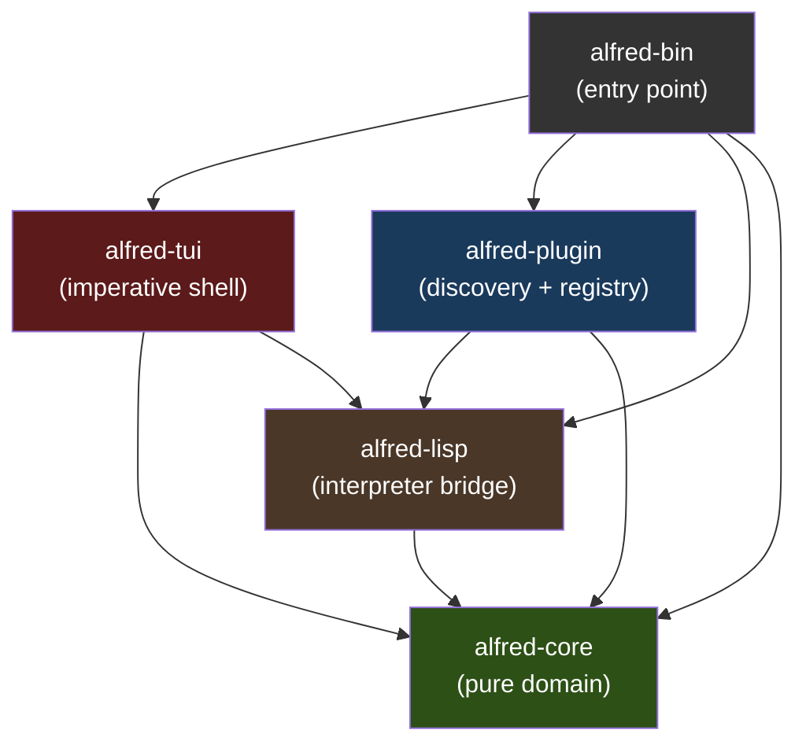
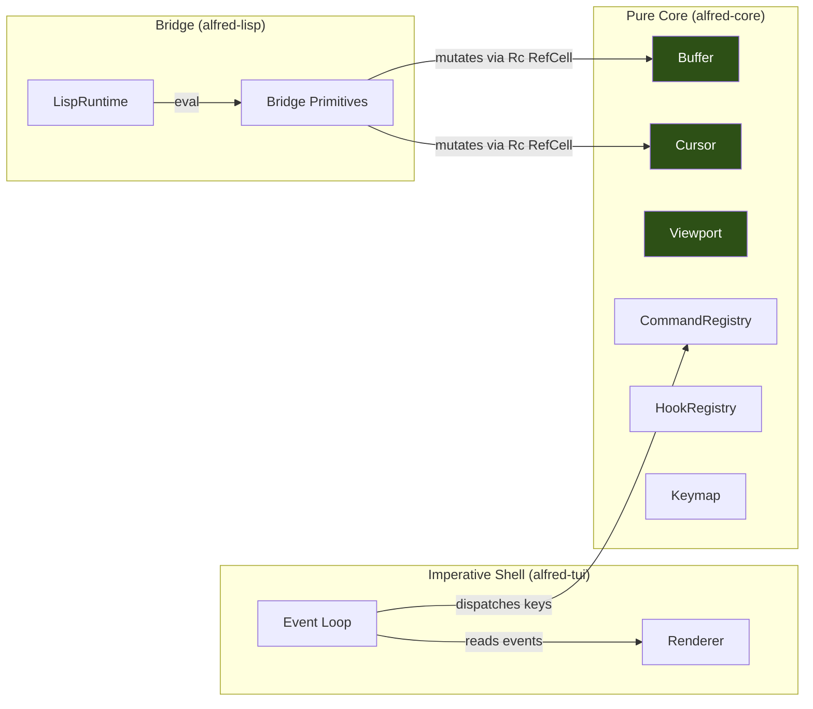
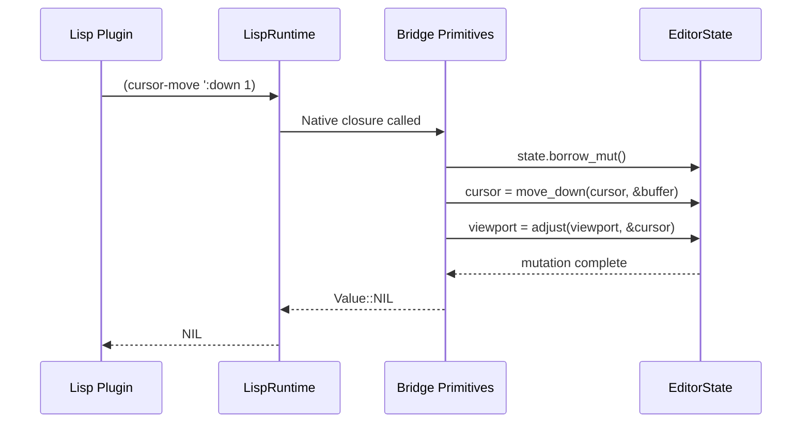
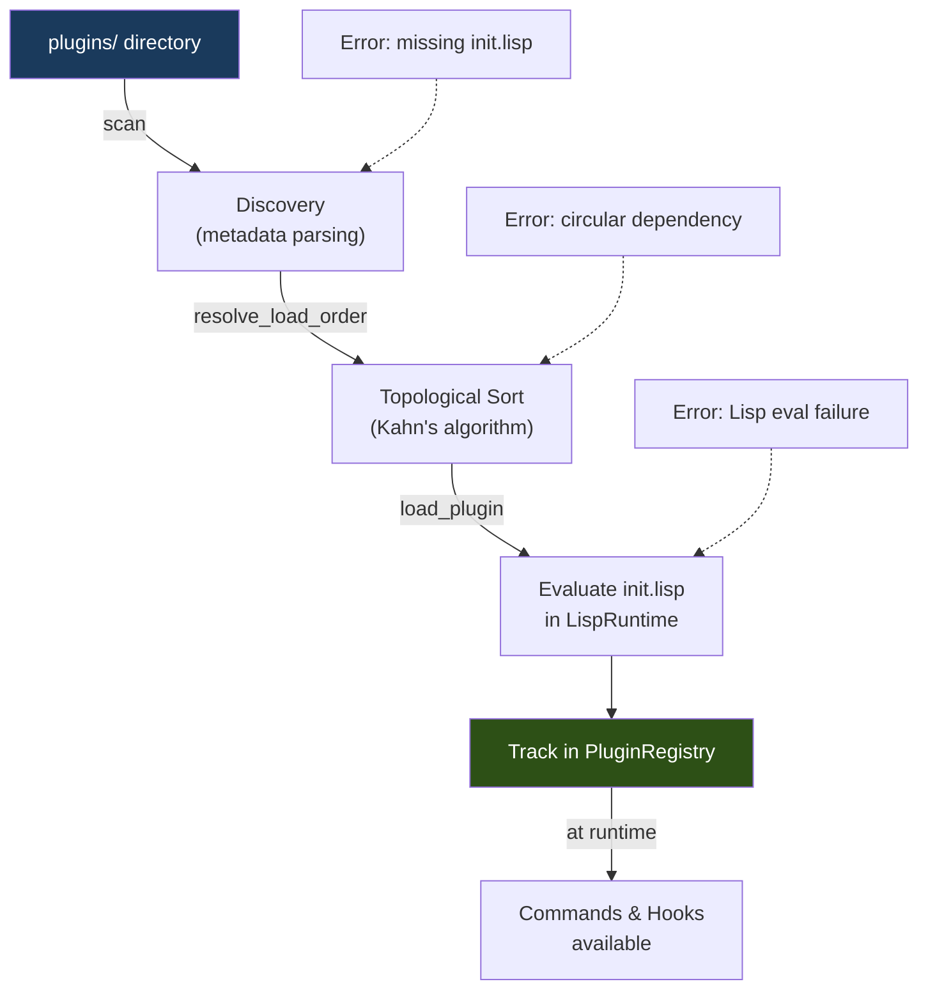
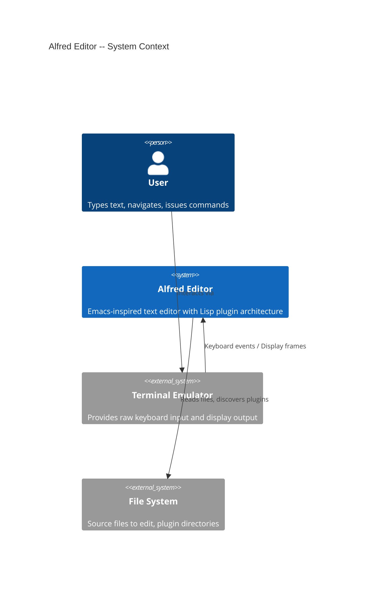
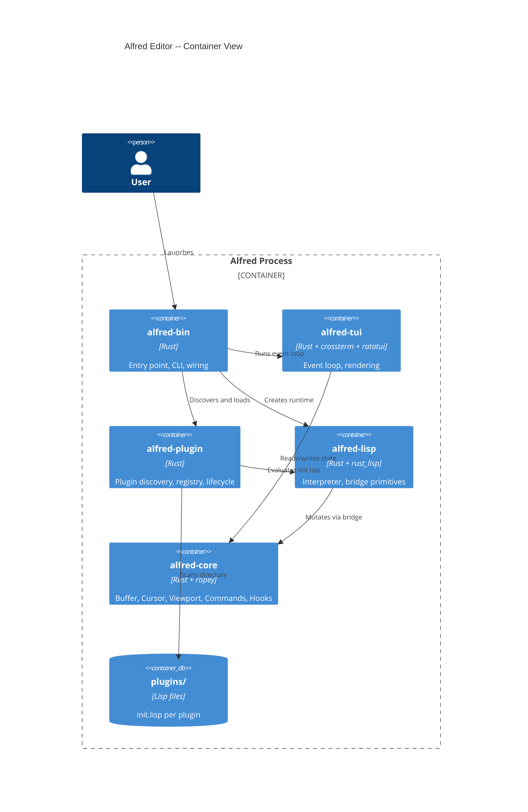

<!-- _class: lead -->

# Alfred Editor
## System Walkthrough -- Walking Skeleton Complete (M1-M7)

An Emacs-inspired text editor where **everything is a Lisp plugin**
5-crate Cargo workspace -- Functional core / Imperative shell

2026-03-23

<!--
Presenter notes:
This walkthrough covers the completed walking skeleton for Alfred, an Emacs-like
text editor written in Rust with a plugin-first architecture. The skeleton was
built incrementally across milestones M1 through M7, culminating in Vim-style
modal editing implemented entirely in 27 lines of Lisp.
-->

---

# Agenda

1. **Setting** -- What is Alfred and why does it exist?
2. **Architecture** -- 5-crate structure and dependency flow
3. **Characters** -- Core domain types and their responsibilities
4. **The Bridge** -- How Rust meets Lisp
5. **Plugin System** -- Discovery, loading, lifecycle
6. **The Proof** -- Vim modal editing in 27 lines of Lisp
7. **Quality & Risks** -- 209 tests, mutation testing, open risks

<!-- Type: Reference. Tier 1. -->

---

# Section 1: Setting

<!-- Type: Explanation. Tier 1. -->

---

# The Problem

Text editors occupy a spectrum between two failure modes:

| Failure Mode | Example | Consequence |
|---|---|---|
| No extensibility | Helix | Most-cited community complaint |
| Complexity explosion | Emacs (30% C, 70% Lisp) | Decades of accumulated complexity |

**Alfred's thesis**: A thin Rust kernel + Lisp plugin architecture can prove that even complex features (modal editing) work as plugins, with compile-time boundary enforcement.

<!--
Presenter notes:
Alfred is not trying to compete with Vim or Emacs as a production editor.
It is an architecture proof: can an AI agent build a modular, extensible
editor where the plugin system is validated by the walking skeleton itself?
-->

---

# Walking Skeleton: M1 through M7

| Milestone | Scope | Commits | Date |
|---|---|---|---|
| M1 | Buffer, Cursor, Viewport, Event loop | 8 | 2026-03-20 |
| M2 | Lisp runtime, Bridge primitives, :eval | 6 | 2026-03-21 |
| M3 | Plugin discovery, Registry, Lifecycle | 7 | 2026-03-22 |
| M4 | Hook system, Line numbers plugin | 4 | 2026-03-22 |
| M5 | Status bar plugin, buffer-filename | 3 | 2026-03-23 |
| M6 | Keymap primitives, Plugin-driven keybindings | 4 | 2026-03-23 |
| M7 | Vim modal editing plugin, Capstone test | 5 | 2026-03-23 |

**Total**: 50+ commits across 3 days, building bottom-up from types to full modal editing.

<!-- Type: Explanation. Tier 1. -->

---

# Section 2: Architecture

<!-- Type: Explanation. Tier 1. -->

---

# Crate Dependency Graph



**Documented (ADR-006)**: Dependencies point inward. `alfred-core` has zero dependencies on other Alfred crates. Cargo enforces this at compile time.

<!-- Type: Reference. Tier 1. -->

---

# Functional Core / Imperative Shell



**Documented (ADR-005)**: Domain logic is pure functions. I/O lives at the shell boundary (event loop, renderer). The bridge crosses the boundary via `Rc<RefCell<EditorState>>`.

<!-- Type: Explanation. Tier 1. -->

---

# External Dependencies

| Crate | Dependency | Purpose | Version |
|---|---|---|---|
| alfred-core | `ropey` | Rope data structure for text buffer | 1.x |
| alfred-core | `thiserror` | Error derive macros | 1.x |
| alfred-lisp | `rust_lisp` | Embeddable Lisp interpreter | 0.18 |
| alfred-tui | `crossterm` | Terminal I/O, raw mode, events | 0.28 |
| alfred-tui | `ratatui` | Immediate-mode TUI rendering | 0.29 |

**5 external runtime dependencies**. No async runtime. No serde. No logging framework.

**Documented (ADR-003)**: Single-process synchronous execution. No green threads, no async.

<!-- Type: Reference. Tier 2. -->

---

# Section 3: Characters -- Core Domain Types

<!-- Type: Explanation. Tier 1. -->

---

# Buffer: Immutable Text Container

```
alfred-core/src/buffer.rs (358 lines)
```

- Wraps `ropey::Rope` with metadata (id, filename, modified, version)
- **All operations are pure**: `insert_at`, `delete_at`, `delete_line` return new `Buffer` instances
- Version counter increments on each mutation
- Free functions: `line_count`, `get_line`, `content`, `insert_at`, `delete_at`, `delete_line`

```rust
// Pure: returns a NEW buffer, original is unchanged
pub fn insert_at(buffer: &Buffer, line: usize, column: usize, text: &str) -> Buffer {
    let mut rope = buffer.rope.clone();
    let char_index = line_column_to_char_index(&rope, line, column);
    rope.insert(char_index, text);
    Buffer { id: buffer.id, rope, filename: buffer.filename.clone(),
             modified: true, version: buffer.version + 1 }
}
```

<!-- Type: Reference. Tier 2. -->

---

# Cursor & Viewport: Pure Position Logic

```
alfred-core/src/cursor.rs (245 lines)
alfred-core/src/viewport.rs (230 lines)
```

**Cursor**: (line, column) position with pure movement functions
- `move_up`, `move_down`, `move_left`, `move_right` -- all take `(Cursor, &Buffer)`, return new `Cursor`
- Column clamping on vertical movement, line wrapping on horizontal

**Viewport**: Visible window with pure scroll adjustment
- `adjust(viewport, &cursor)` -- returns new `Viewport` ensuring cursor visibility
- Carries `gutter_width` (set by line-numbers plugin at render time)

**Key insight**: No mutation. Cursor and Viewport are `Copy` types. Movement is a pure transformation chain:
`key -> command -> cursor::move_* -> viewport::adjust`

<!-- Type: Explanation. Tier 2. -->

---

# EditorState: The Aggregate Root

```
alfred-core/src/editor_state.rs (383 lines)
```

```rust
pub struct EditorState {
    pub buffer: Buffer,
    pub cursor: Cursor,
    pub viewport: Viewport,
    pub commands: CommandRegistry,
    pub mode: String,               // "normal" | "insert"
    pub keymaps: HashMap<String, Keymap>,
    pub active_keymaps: Vec<String>,
    pub hooks: HookRegistry,
    pub message: Option<String>,
    pub running: bool,
}
```

- Single mutable container passed through the event loop
- Pure state -- no I/O dependencies
- `resolve_key(state, key)` iterates active keymaps in priority order
- `register_builtin_commands` adds cursor movement, delete, line-delete

<!-- Type: Reference. Tier 2. -->

---

# CommandRegistry: Named Command Dispatch

```
alfred-core/src/command.rs (224 lines)
```

Two handler variants:
- `Native(fn(&mut EditorState) -> Result<()>)` -- Rust function pointers
- `Dynamic(Rc<DynCommandFn>)` -- Lisp-defined closures via `define-command`

**Borrow discipline**: `execute()` copies the `fn` pointer or clones the `Rc` before calling, releasing the borrow on `state.commands`. This prevents `RefCell` double-borrow panics.

```rust
// ClonedHandler pattern avoids holding registry borrow during execution
pub enum ClonedHandler {
    Native(fn(&mut EditorState) -> Result<()>),
    Dynamic(Rc<DynCommandFn>),
}
```

<!-- Type: Explanation. Tier 2. -->

---

# HookRegistry: Plugin Extension Points

```
alfred-core/src/hook.rs (234 lines)
```

- Named hooks with callback registration: `register_hook(registry, name, callback) -> HookId`
- Dispatch: `dispatch_hook(registry, name, args) -> Vec<Vec<String>>`
- Unregister by HookId for clean plugin teardown
- Callbacks are `Rc<dyn Fn(&[String]) -> Vec<String>>`

**Current hooks**:
| Hook Name | Registered By | Effect |
|---|---|---|
| `render-gutter` | line-numbers plugin | Enables line number display |
| `render-status` | status-bar plugin | Enables status bar display |

<!-- Type: Reference. Tier 2. -->

---

# KeyEvent: Domain-Independent Input

```
alfred-core/src/key_event.rs (122 lines)
```

- `KeyCode` enum: `Char(char)`, arrow keys, Enter, Escape, Backspace, Tab, etc.
- `Modifiers`: ctrl, alt, shift booleans
- `KeyEvent { code, modifiers }` -- implements `Hash + Eq` for use as `HashMap` key

**Conversion boundary**: `alfred-tui/src/app.rs` contains a pure `convert_crossterm_key` function that maps crossterm's `KeyEvent` to alfred-core's `KeyEvent`. The core never sees crossterm types.

<!-- Type: Reference. Tier 3. -->

---

# Section 4: The Bridge -- Rust Meets Lisp

<!-- Type: Explanation. Tier 1. -->

---

# Bridge Architecture



The bridge registers Rust closures as Lisp native functions. Each closure captures `Rc<RefCell<EditorState>>` and borrows mutably during execution.

<!-- Type: Explanation. Tier 1. -->

---

# Registered Lisp Primitives

```
alfred-lisp/src/bridge.rs (1675 lines -- highest complexity)
```

| Primitive | Arguments | Effect |
|---|---|---|
| `buffer-insert` | `text` | Insert at cursor, advance cursor |
| `buffer-delete` | -- | Delete char at cursor |
| `buffer-content` | -- | Return buffer text as string |
| `cursor-position` | -- | Return `(line column)` list |
| `cursor-move` | `direction [count]` | Move cursor in direction |
| `message` | `text` | Set status message |
| `current-mode` | -- | Return mode name |
| `set-mode` | `name` | Switch mode + active keymap |
| `buffer-filename` | -- | Return filename or "" |
| `buffer-modified?` | -- | Return T/F |
| `define-command` | `name callback` | Register Lisp command |
| `add-hook` | `name callback` | Register hook callback |
| `make-keymap` | `name` | Create named keymap |
| `define-key` | `keymap key command` | Bind key to command |
| `set-active-keymap` | `name` | Set active keymap |

<!-- Type: Reference. Tier 2. -->

---

# Performance Validation

**Documented (ADR-004)**: rust_lisp was chosen over Janet with a "kill signal" threshold of 1ms per primitive eval.

Performance baseline tests (M2, Step 02-05) measure median latency over 100 iterations after 10 warmup calls:

| Primitive | Threshold | Status |
|---|---|---|
| Arithmetic `(+ 1 2)` | < 1ms | PASS |
| `buffer-insert` | < 1ms | PASS |
| `cursor-move` | < 1ms | PASS |
| `message` | < 1ms | PASS |
| `buffer-content` | < 1ms | PASS |
| `cursor-position` | < 1ms | PASS |
| `current-mode` | < 1ms | PASS |

If any primitive exceeds 1ms, the codebase documents: "Evaluate Janet as an alternative interpreter."

<!-- Type: Explanation. Tier 2. -->

---

# Section 5: Plugin System

<!-- Type: Explanation. Tier 1. -->

---

# Plugin Lifecycle



**Error handling**: Every failure mode produces an error message, not a crash. Failed plugins are skipped; other plugins continue loading.

<!-- Type: Explanation. Tier 1. -->

---

# Plugin Metadata Format

```lisp
;;; name: vim-keybindings
;;; version: 0.1.0
;;; description: Vim-style modal keybindings
;;; depends: dep1, dep2

;; Lisp code below...
```

- Parsed from `;;; key: value` header comments in `init.lisp`
- Required: `name`. Optional: `version`, `description`, `depends`
- Dependencies resolved via topological sort before loading

**5 shipped plugins**:
| Plugin | Lines | Purpose |
|---|---|---|
| `basic-keybindings` | 22 | Arrow keys, colon, backspace |
| `vim-keybindings` | 27 | hjkl, modes, x, d, i |
| `line-numbers` | 9 | Gutter line numbers |
| `status-bar` | 9 | Filename, position, mode |
| `test-plugin` | 5 | Hello command (demo) |

<!-- Type: Reference. Tier 2. -->

---

# Plugin Registry & Cleanup

```
alfred-plugin/src/registry.rs (229 lines)
```

- `PluginRegistry` tracks loaded plugins by name
- Each `LoadedPlugin` records `registered_commands` and `registered_hooks`
- `track_command` / `track_hook` associate resources with their plugin
- `unload_plugin_with_cleanup` removes all plugin commands from `CommandRegistry`

**Design principle**: Plugin isolation. Unloading plugin A does not affect plugin B's commands or hooks. Tested with a dedicated acceptance test.

<!-- Type: Reference. Tier 3. -->

---

# Section 6: The Architecture Proof

<!-- Type: Explanation. Tier 1. -->

---

# Vim Modal Editing in 27 Lines of Lisp

```lisp
;;; name: vim-keybindings
;;; version: 0.1.0
;;; description: Vim-style modal keybindings

;; Normal mode: hjkl navigation + editing
(make-keymap "normal-mode")
(define-key "normal-mode" "Char:h" "cursor-left")
(define-key "normal-mode" "Char:j" "cursor-down")
(define-key "normal-mode" "Char:k" "cursor-up")
(define-key "normal-mode" "Char:l" "cursor-right")
(define-key "normal-mode" "Char:i" "enter-insert-mode")
(define-key "normal-mode" "Char:x" "delete-char-at-cursor")
(define-key "normal-mode" "Char:d" "delete-line")
(define-key "normal-mode" "Char::" "enter-command-mode")

;; Insert mode: Escape to normal, Backspace
(make-keymap "insert-mode")
(define-key "insert-mode" "Escape" "enter-normal-mode")
(define-key "insert-mode" "Backspace" "delete-backward")

;; Mode-switching commands
(define-command "enter-insert-mode" (lambda () (set-mode "insert")))
(define-command "enter-normal-mode" (lambda () (set-mode "normal")))

;; Start in normal mode
(set-active-keymap "normal-mode")
(set-mode "normal")
```

<!-- Type: Explanation. Tier 1. -->

---

# Why This Matters

The vim-keybindings plugin proves:

1. **Keymaps are plugin-defined** -- `make-keymap`, `define-key`, `set-active-keymap` are Lisp calls
2. **Commands are plugin-defined** -- `define-command` registers Lisp lambdas in the Rust `CommandRegistry`
3. **Mode switching is plugin-defined** -- `set-mode` changes the mode AND swaps the active keymap
4. **Self-insert is implicit** -- Unbound printable characters in insert mode auto-insert (event loop handles this)
5. **No hardcoded keybindings remain** -- Verified by a dedicated test (step 06-04)

The kernel provides primitives. The plugin composes them into a complete editing paradigm.

**Compare**: Emacs needs ~200 lines of Elisp for basic Vi emulation. Alfred achieves the core in 27 lines because the primitives were designed for this use case.

<!-- Type: Explanation. Tier 1. -->

---

# Event Flow: Key Press to State Change

```mermaid
sequenceDiagram
    participant Term as Terminal (crossterm)
    participant Loop as Event Loop
    participant KM as Keymap Resolution
    participant CMD as CommandRegistry
    participant Lisp as LispRuntime

    Term->>Loop: crossterm KeyEvent
    Loop->>Loop: convert_crossterm_key (pure)
    Loop->>KM: resolve_key(state, key)
    KM-->>Loop: Some("cursor-down")
    Loop->>CMD: extract_handler("cursor-down")
    CMD-->>Loop: ClonedHandler::Native(fn)
    Loop->>Loop: handler(&mut state)
    Note over Loop: cursor = move_down(cursor, &buffer)<br/>viewport = adjust(viewport, &cursor)
```

For Lisp-defined commands (like "enter-insert-mode"):

```mermaid
sequenceDiagram
    participant Loop as Event Loop
    participant CMD as CommandRegistry
    participant Lisp as LispRuntime
    participant Bridge as Bridge

    Loop->>CMD: extract_handler("enter-insert-mode")
    CMD-->>Loop: ClonedHandler::Dynamic(Rc)
    Loop->>Lisp: eval (lambda () (set-mode "insert"))
    Lisp->>Bridge: set-mode closure
    Bridge->>Bridge: state.borrow_mut().mode = "insert"
    Bridge->>Bridge: swap active keymap to "insert-mode"
```

<!-- Type: Explanation. Tier 2. -->

---

# The DeferredAction Pattern

**Problem**: `handle_key_event` borrows `EditorState`. Lisp commands also borrow `EditorState` via `Rc<RefCell>`. Nested borrows panic at runtime.

**Solution**: `handle_key_event` returns a `DeferredAction` instead of executing immediately:

```rust
pub(crate) enum DeferredAction {
    None,
    Eval(String),           // :eval expression
    ExecCommand(String),    // keymap-resolved command
}
```

The event loop drops the `EditorState` borrow, THEN executes the deferred action. This is the same pattern used by the `ClonedHandler` -- copy the fn pointer or clone the `Rc` before calling.

**Two RefCell bugs were fixed** during M3 (commits `765f95f`, `06847bf`). Both were double-borrow panics from executing commands while holding a borrow on the registry.

<!-- Type: Explanation. Tier 2. -->

---

# Section 7: Quality and Risks

<!-- Type: Explanation. Tier 1. -->

---

# Test Suite Summary

| Crate | Tests | Focus |
|---|---|---|
| alfred-core | 67 | Buffer ops, cursor movement, viewport scroll, commands, hooks, keymaps |
| alfred-lisp | 25 | Eval, bridge primitives, performance baselines |
| alfred-plugin | 56 | Discovery, registry, lifecycle, toposort, cleanup |
| alfred-tui | 61 | Rendering, key conversion, event dispatch, modal editing |
| **Total** | **209** | |

**Testing approach**:
- Acceptance tests first (Given/When/Then format)
- Unit tests for individual behaviors
- Test budget per feature: `behaviors x 2`
- Property: Farley Index 8.3/10 (zero tautology theatre)

<!-- Type: Reference. Tier 1. -->

---

# Hotspot Analysis

Files ranked by `complexity x change_frequency`:

| File | Lines | Changes | Role |
|---|---|---|---|
| `alfred-tui/src/app.rs` | 2721 | 22 | Event loop, key dispatch, gutter/status |
| `alfred-lisp/src/bridge.rs` | 1675 | 11 | All Lisp-Rust bridge primitives |
| `alfred-core/src/editor_state.rs` | 383 | 8 | State aggregate, builtin commands |
| `alfred-plugin/src/lib.rs` | 763 | 7 | Plugin tests (bulk of plugin testing) |
| `alfred-tui/src/renderer.rs` | 708 | 4 | Terminal rendering |

**Observation**: `app.rs` is the largest file (2721 lines) and the most frequently changed (22 commits). It contains both the event loop (I/O) and substantial test code. This is the primary candidate for decomposition post-skeleton.

<!-- Type: Reference. Tier 2. -->

---

# Design Decisions Summary

| # | Decision | Status | ADR |
|---|---|---|---|
| 1 | Adopt existing Lisp (not custom) | Documented | ADR-001 |
| 2 | Plugin-first architecture | Documented | ADR-002 |
| 3 | Single-process synchronous | Documented | ADR-003 |
| 4 | rust_lisp over Janet | Documented | ADR-004 |
| 5 | Functional core / imperative shell | Documented | ADR-005 |
| 6 | 5-crate Cargo workspace | Documented | ADR-006 |
| 7 | DeferredAction for borrow safety | Inferred | -- |
| 8 | Hook presence as feature flag | Inferred | -- |
| 9 | Self-insert in event loop (not plugin) | Inferred | -- |

**6 documented ADRs**. 3 additional decisions inferred from code structure.

<!-- Type: Reference. Tier 2. -->

---

# Inferred Decision: Hook Presence as Feature Flag

**Context**: Line numbers and status bar are optional features. The TUI needs to know whether to reserve gutter/status space.

**Decision (Inferred)**: The hook's presence IS the feature flag. `compute_gutter_content` dispatches `"render-gutter"` -- if no callbacks are registered, it returns `(0, [])` and no gutter is rendered. No boolean config, no feature flags.

**Consequences**:
- Adding line numbers = loading the line-numbers plugin (1 line of Lisp)
- Removing line numbers = not loading the plugin
- The rendering code has zero knowledge of what "line numbers" are

<!-- Type: Explanation. Tier 3. -->

---

# Inferred Decision: Self-Insert in Event Loop

**Context**: In insert mode, unbound printable characters should be inserted into the buffer. This could be a plugin behavior or an event loop behavior.

**Decision (Inferred)**: Self-insert lives in the event loop, not in a plugin. When `resolve_key` returns `None` for a printable character in insert mode, `handle_key_event` inserts it directly.

**Consequences**:
- Positive: No Lisp eval overhead for every keystroke in insert mode
- Positive: No need to bind every printable character in the keymap
- Negative: This is the one behavior that is NOT plugin-defined
- Negative: Cannot override self-insert behavior from a plugin

<!-- Type: Explanation. Tier 3. -->

---

# Codebase Metrics

| Metric | Value |
|---|---|
| Rust source lines | 8,730 |
| Lisp plugin lines | 72 |
| Test count | 209 (214 `#[test]` annotations) |
| External runtime deps | 5 |
| ADRs | 6 |
| Plugins shipped | 5 |
| Crates | 5 |
| Circular dependencies | 0 |
| `unsafe` blocks | 0 |

<!-- Type: Reference. Tier 1. -->

---

# Risk Register

| Risk | Severity | Mitigation |
|---|---|---|
| `app.rs` is 2721 lines (god file) | Medium | Decompose into event_loop.rs, key_dispatch.rs, gutter.rs, status.rs |
| `bridge.rs` grows with each primitive | Medium | Group primitives into sub-modules by domain |
| rust_lisp maintenance risk | Low | Isolated in `alfred-lisp` crate; Janet migration path documented |
| `Rc<RefCell>` borrow panics | Medium | DeferredAction pattern; 2 bugs already fixed |
| No async support | Low | ADR-003 accepted trade-off; single-process synchronous |
| Plugin registry not persisted on EditorState | Low | Noted in `main.rs` comment; needed for runtime reload |

<!-- Type: Reference. Tier 2. -->

---

# Composition Root: main.rs

```
alfred-bin/src/main.rs (109 lines)
```

The wiring sequence:

1. Query terminal size
2. Create `EditorState` wrapped in `Rc<RefCell<>>`
3. Load file into buffer (if CLI arg provided)
4. Register builtin native commands (cursor, delete)
5. Create `LispRuntime`
6. Register bridge primitives (core, define-command, hooks, keymaps)
7. Discover plugins from `plugins/` directory
8. Resolve load order (topological sort)
9. Load each plugin (eval init.lisp), collect errors
10. Run event loop

**Single composition root**. All wiring happens in one place. No global state, no lazy initialization.

<!-- Type: Explanation. Tier 2. -->

---

# C4 Context Diagram



<!-- Type: Reference. Tier 1. -->

---

# C4 Container Diagram



<!-- Type: Reference. Tier 2. -->

---

# Getting Started

```bash
# Clone and build
git clone <repo-url> && cd alfred
cargo build --release

# Run with a file
./target/release/alfred myfile.txt

# Run without file (empty buffer)
./target/release/alfred

# Key commands (with vim-keybindings plugin)
# h/j/k/l    -- Navigate
# i          -- Enter insert mode
# Escape     -- Return to normal mode
# x          -- Delete character
# d          -- Delete line
# :q Enter   -- Quit
# :eval (+ 1 2) Enter -- Evaluate Lisp
```

<!-- Type: How-To. Tier 1. -->

---

# Capstone Test: Full Modal Editing via Plugin

The capstone integration test (step 07-04) proves the complete round-trip:

1. Load vim-keybindings plugin into LispRuntime
2. Verify keymap "normal-mode" exists with hjkl bindings
3. Simulate `j` key -- cursor moves down (via keymap -> command -> cursor::move_down)
4. Simulate `i` key -- mode switches to "insert", keymap switches to "insert-mode"
5. Type characters -- self-insert works
6. Simulate `Escape` -- mode switches back to "normal", keymap switches to "normal-mode"
7. Simulate `x` -- deletes character at cursor

All of this with **zero hardcoded keybindings in the Rust event loop**. The plugin defines everything.

<!-- Type: Explanation. Tier 1. -->

---

# Architecture Invariants

These properties hold across the entire codebase:

1. `alfred-core` has zero imports from other Alfred crates (Cargo-enforced)
2. All Buffer, Cursor, and Viewport operations are pure functions
3. No `unsafe` code anywhere
4. Every plugin failure produces an error message, never a crash
5. No hardcoded keybindings in the event loop (test-verified)
6. Dependencies flow inward only (no circular crate dependencies)
7. Domain types (`KeyEvent`, `Cursor`, `Buffer`) are I/O-independent

<!-- Type: Reference. Tier 1. -->

---

<!-- _class: lead -->

# Summary

**Alfred** is a 5-crate, 8730-line Rust text editor that proves a plugin-first architecture works.

The walking skeleton (M1-M7) achieved its goal: **Vim-style modal editing in 27 lines of Lisp**, running on a thin Rust kernel with compile-time boundary enforcement.

209 tests. 6 ADRs. Zero circular dependencies. Zero unsafe blocks.

The skeleton is complete. The architecture is proven.

<!--
Presenter notes:
Next steps would be: file save, multiple buffers, syntax highlighting,
LSP integration -- all as plugins. The kernel should not need to change.
That is the real test of the architecture.
-->
