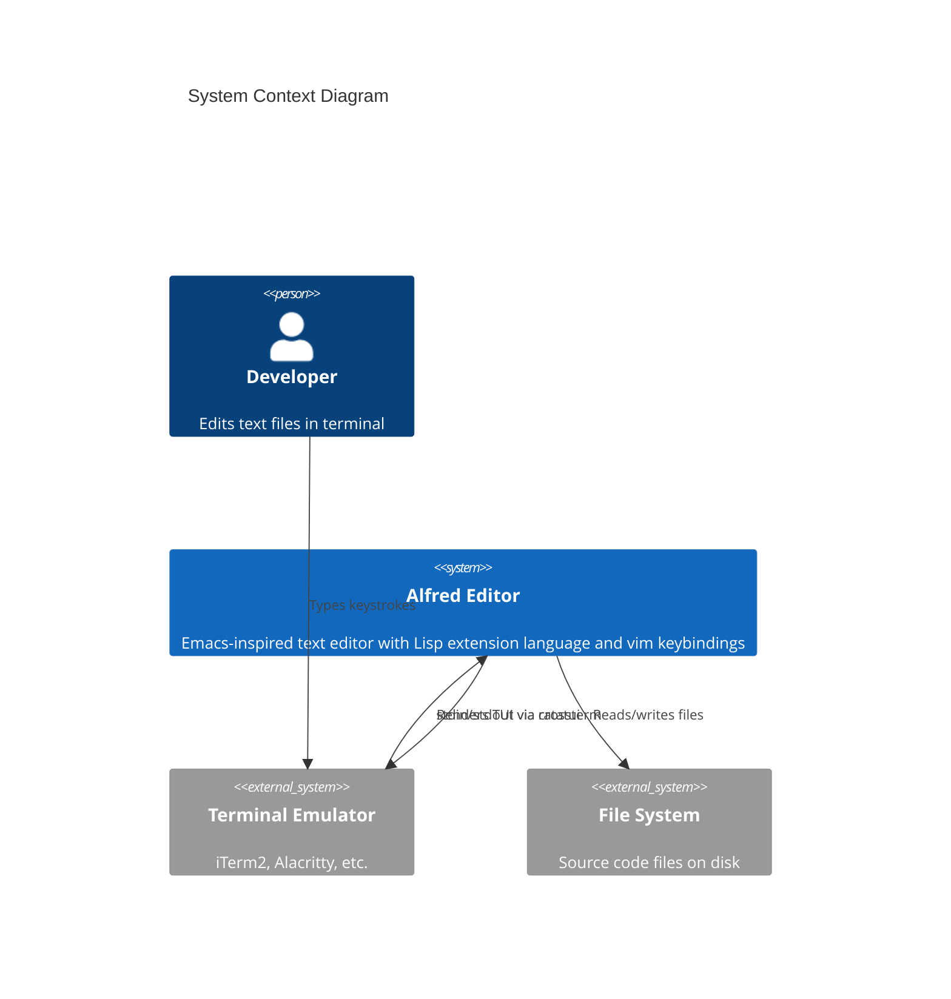
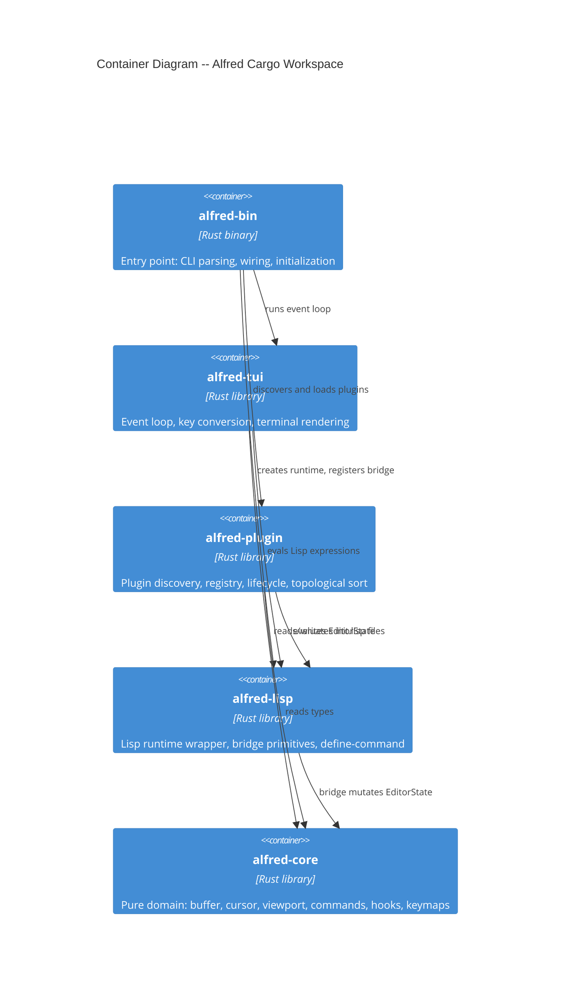
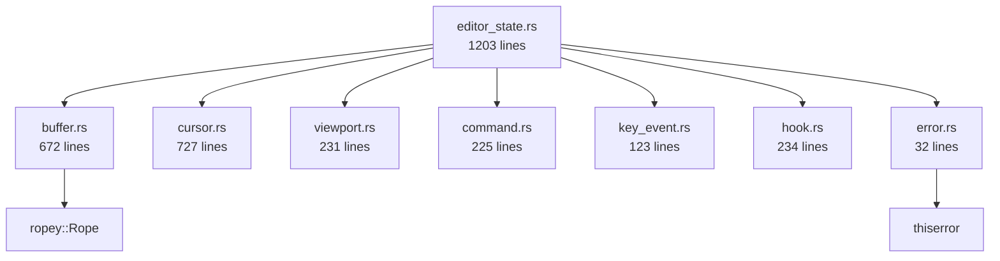
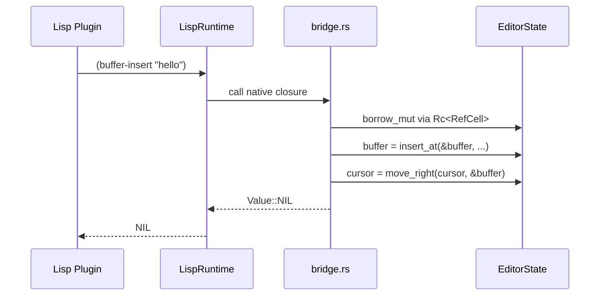
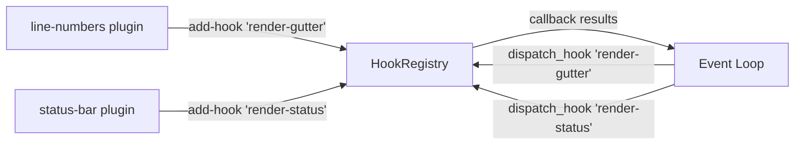
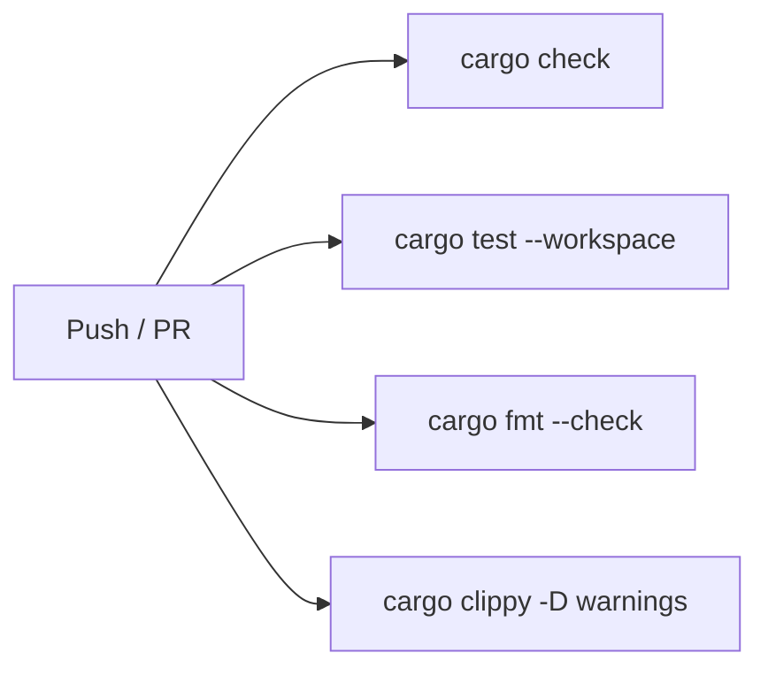

# Alfred Editor -- System Walkthrough

**An Emacs-inspired text editor with plugin-first architecture**

- **Language**: Rust (11,071 lines across 21 source files)
- **Architecture**: Functional core / imperative shell, 5-crate workspace
- **Key proof**: Vim modal editing in 52 lines of Lisp
- **Tests**: 254 passing (94 core, 59 lisp, 25 plugin, 76 TUI)
- **Milestones**: M1-M7 walking skeleton + M8 file save/open + M9 extended vim

<!--
Presenter notes:
This walkthrough covers the complete Alfred system as of M9.
The project demonstrates that an AI agent framework can produce
architecturally sound, modular software. The strongest proof is
that vim modal editing -- a complex, stateful feature -- works
entirely as a 52-line Lisp plugin.
Content type: Explanation | Tier: 1
-->

---

# Section 1: The Problem Space

## What is Alfred trying to solve?

Alfred is a **proof-of-concept text editor** that answers a specific question:

> Can a plugin-first architecture deliver a functional editor where complex features like modal editing are entirely defined in the extension language?

**Target users**: Developers who want an extensible, Emacs-inspired editor with Lisp as the extension language and vim-style modal editing.

**Evidence base**: Emacs (~70% Lisp), Neovim (Lua plugins for LSP), Xi editor post-mortem.

<!--
Content type: Explanation | Tier: 1
The problem is not "build a text editor" -- many exist.
The problem is "prove that plugin-first architecture works for non-trivial features."
-->

---

# Section 1: The Problem Space (cont.)

## Quality Attributes Driving Design

| Attribute | How Alfred addresses it |
|-----------|----------------------|
| **Extensibility** | Everything beyond core primitives is a Lisp plugin |
| **Testability** | Pure core functions -- no mocking needed (254 tests) |
| **Maintainability** | 5 crates enforce boundaries at compile time |
| **Reliability** | Single-process synchronous (no async failure modes) |
| **Simplicity** | Functional core / imperative shell separation |

All five are documented in ADRs (6 architectural decision records).

<!--
Content type: Reference | Tier: 1
-->

---

# Section 2: System Context

## Where Alfred sits in its environment



<!--
Content type: Explanation | Tier: 1
Alfred is a terminal application. It reads keystrokes from stdin,
processes them through its event loop, and renders to stdout via ratatui.
File I/O happens through standard Rust fs operations.
-->

---

# Section 2: Container Diagram

## The 5-crate architecture



<!--
Content type: Explanation | Tier: 1
Dependencies flow inward: bin -> tui/plugin/lisp -> core.
alfred-core has ZERO dependencies on other Alfred crates --
this is enforced by Cargo at compile time (ADR-006).
-->

---

# Section 2: Dependency Rules

## Compile-time enforced boundaries

```
alfred-core  -->  [ropey, thiserror]          (ZERO Alfred deps)
alfred-lisp  -->  [alfred-core, rust_lisp]
alfred-plugin --> [alfred-core, alfred-lisp]
alfred-tui   -->  [alfred-core, alfred-lisp, crossterm, ratatui]
alfred-bin   -->  [all four crates above]
```

**Key invariant**: `alfred-core` never imports `crossterm`, `ratatui`, `rust_lisp`, or any other Alfred crate. This is not a convention -- Cargo enforces it at compile time.

**Consequence**: The pure domain core can be tested without any I/O framework. All 94 core tests run without a terminal, without a Lisp runtime, without file system access (except buffer file loading tests that use tempfile).

<!--
Content type: Reference | Tier: 2
Documented: ADR-006 explicitly states "alfred-core must have zero
dependencies on other Alfred crates."
-->

---

# Section 3: The Pure Core (alfred-core)

## 8 modules, zero I/O dependencies



Every module exports **free functions** (not methods) that take data and return data. This is the functional core pattern.

<!--
Content type: Explanation | Tier: 1
EditorState is the aggregation root -- it owns buffer, cursor,
viewport, commands, hooks, keymaps, mode, and undo stacks.
All other modules are pure data + pure functions.
-->

---

# Section 3: Buffer -- Immutable Text Container

## Key design: modifications return new Buffer instances

```rust
pub fn insert_at(buffer: &Buffer, line: usize, col: usize, text: &str) -> Buffer
pub fn delete_at(buffer: &Buffer, line: usize, col: usize) -> Buffer
pub fn delete_line(buffer: &Buffer, line: usize) -> Buffer
pub fn join_lines(buffer: &Buffer, line: usize) -> Buffer
pub fn replace_line(buffer: &Buffer, line: usize, text: &str) -> Buffer
pub fn save_to_file(buffer: &Buffer, path: &Path) -> Result<Buffer>
```

- Wraps `ropey::Rope` for O(log n) text operations
- Rope cloning is O(1) due to structural sharing (enables cheap undo snapshots)
- Carries metadata: id, filename, file_path, modified flag, version counter

<!--
Content type: Explanation | Tier: 2
The immutable pattern means every buffer operation returns a NEW buffer.
The old buffer survives for undo. Rope structural sharing makes this cheap.
-->

---

# Section 3: Cursor -- Pure Movement Functions

## 15 movement functions, all pure

| Function | Vim equivalent | Behavior |
|----------|---------------|----------|
| `move_up/down/left/right` | h/j/k/l | Basic navigation with wrapping |
| `move_to_line_start/end` | 0 / $ | Line boundaries |
| `move_to_first_non_blank` | ^ | Skip leading whitespace |
| `move_to_document_start/end` | gg / G | Document boundaries |
| `move_word_forward/backward/end` | w / b / e | Word-class transitions |
| `ensure_within_bounds` | (internal) | Clamp after deletions |

All functions have the same signature: `fn(cursor: Cursor, buf: &Buffer) -> Cursor`

Tests use **table-driven parametrization** (multiple cases per test function).

<!--
Content type: Reference | Tier: 2
-->

---

# Section 3: EditorState -- The Aggregation Root

## Single mutable container for the event loop

```rust
pub struct EditorState {
    pub buffer: Buffer,
    pub cursor: Cursor,
    pub viewport: Viewport,
    pub commands: CommandRegistry,
    pub mode: String,                    // "normal" | "insert"
    pub keymaps: HashMap<String, Keymap>,
    pub active_keymaps: Vec<String>,
    pub hooks: HookRegistry,
    pub message: Option<String>,
    pub running: bool,
    pub yank_register: Option<String>,
    pub undo_stack: Vec<UndoSnapshot>,
    pub redo_stack: Vec<UndoSnapshot>,
}
```

EditorState also registers **32 built-in commands** (cursor movement, delete, insert-mode variants, undo/redo, join, yank, paste, change, screen-relative cursors, half-page scroll).

<!--
Content type: Reference | Tier: 2
EditorState is the one mutable container. The event loop borrows it,
dispatches keys, and passes it to the renderer. Lisp bridge closures
access it through Rc<RefCell<EditorState>>.
-->

---

# Section 4: The Lisp Bridge (alfred-lisp)

## Connecting Rust primitives to Lisp



<!--
Content type: Explanation | Tier: 1
The bridge registers Rust closures into the Lisp environment.
Each closure captures an Rc<RefCell<EditorState>> for shared access.
This is the critical integration point: Lisp code can read and mutate
editor state through well-defined primitive operations.
-->

---

# Section 4: Bridge Primitives

## 14 primitives expose the editor to Lisp

| Primitive | Purpose |
|-----------|---------|
| `(buffer-insert text)` | Insert text at cursor |
| `(buffer-delete)` | Delete character at cursor |
| `(buffer-content)` | Return full buffer text |
| `(cursor-position)` | Return (line column) list |
| `(cursor-move dir count)` | Move cursor by direction |
| `(message text)` | Set status message |
| `(current-mode)` | Return current mode name |
| `(set-mode name)` | Switch mode and keymap |
| `(define-command name fn)` | Register a Lisp command |
| `(add-hook name fn)` | Register a hook callback |
| `(dispatch-hook name args)` | Fire all hook callbacks |
| `(make-keymap name)` | Create a named keymap |
| `(define-key map key cmd)` | Bind key to command |
| `(set-active-keymap name)` | Activate a keymap |

<!--
Content type: Reference | Tier: 2
These 14 primitives are the complete API surface that plugins use
to interact with the editor. Everything else is pure Lisp.
-->

---

# Section 5: The Plugin System (alfred-plugin)

## Discovery, metadata, registry, and dependency ordering


**Discovery protocol**: Each plugin is a subdirectory under `plugins/` containing `init.lisp` with metadata header comments:

```lisp
;;; name: vim-keybindings
;;; version: 0.1.0
;;; description: Vim-style modal keybindings
;;; depends: dep1, dep2
```

<!--
Content type: Explanation | Tier: 1
Kahn's algorithm for topological sort ensures dependencies load first.
Circular dependencies and missing dependencies produce clear errors
(not crashes). Error reporting is graceful -- broken plugins are skipped.
-->

---

# Section 5: The Five Plugins

## Everything visible to the user is a plugin

| Plugin | Lines | What it does |
|--------|-------|-------------|
| **vim-keybindings** | 52 | Full modal editing: normal/insert modes, 36 keybindings |
| **basic-keybindings** | 22 | Arrow keys, colon command, backspace |
| **line-numbers** | 9 | Enables gutter line numbers via render-gutter hook |
| **status-bar** | 9 | Enables status bar via render-status hook |
| **test-plugin** | 5 | Demo: registers a "hello" command |

**The key proof**: `vim-keybindings/init.lisp` is 52 lines of Lisp that implements:
- Normal mode: h/j/k/l, i/I/a/A/o/O, x/d, 0/$, ^, gg/G, w/b/e, J/y/p/c/C, u/Ctrl-r, H/M/L, Ctrl-d/Ctrl-u, :
- Insert mode: Escape to normal, Backspace
- Mode switching between normal and insert

<!--
Content type: Explanation | Tier: 1
-->

---

# Section 5: Vim Plugin Deep-Dive

## 52 lines of Lisp replaces what would be hundreds of lines of Rust

```lisp
;; Create normal-mode keymap with hjkl navigation
(make-keymap "normal-mode")
(define-key "normal-mode" "Char:h" "cursor-left")
(define-key "normal-mode" "Char:j" "cursor-down")
(define-key "normal-mode" "Char:k" "cursor-up")
(define-key "normal-mode" "Char:l" "cursor-right")
(define-key "normal-mode" "Char:i" "enter-insert-mode")
;; ... 30 more bindings including w/b/e, J/y/p, undo/redo ...

;; Create insert-mode keymap
(make-keymap "insert-mode")
(define-key "insert-mode" "Escape" "enter-normal-mode")
(define-key "insert-mode" "Backspace" "delete-backward")

;; Define mode-switching commands
(define-command "enter-insert-mode" (lambda () (set-mode "insert")))
(define-command "enter-normal-mode" (lambda () (set-mode "normal")))

;; Start in normal mode
(set-active-keymap "normal-mode")
(set-mode "normal")
```

<!--
Content type: Explanation | Tier: 2
This is the architecture validation. The vim plugin uses 3 bridge
primitives (make-keymap, define-key, define-command) and 2 mode
primitives (set-mode, set-active-keymap) to implement full modal editing.
-->

---

# Section 6: The Imperative Shell (alfred-tui)

## Event loop architecture

```mermaid
sequenceDiagram
    participant Loop as Event Loop
    participant State as EditorState
    participant Hooks as Hook Dispatch
    participant Render as Renderer
    participant Term as Terminal

    loop while state.running
        Loop->>Hooks: compute_gutter_content()
        Loop->>Hooks: compute_status_content()
        Loop->>Render: render_frame(state, gutter, status)
        Render->>Term: draw via ratatui
        Loop->>Term: read key event (blocking)
        Term-->>Loop: crossterm KeyEvent
        Loop->>Loop: convert_crossterm_key (pure)
        Loop->>State: handle_key_event (pure)
        State-->>Loop: (InputState, DeferredAction)
        alt DeferredAction::ExecCommand
            Loop->>State: command::execute()
        else DeferredAction::Eval
            Loop->>State: eval_and_display()
        else DeferredAction::SaveBuffer
            Loop->>State: save_to_file()
        end
    end
```

<!--
Content type: Explanation | Tier: 1
The event loop has a clean separation: pure conversion (crossterm -> KeyEvent),
pure handling (key -> deferred action), then impure execution (deferred action).
This avoids RefCell double-borrow panics.
-->

---

# Section 6: Key Dispatch Pipeline

## From keystroke to command execution

```
Terminal keystroke
    |
    v
crossterm::event::read()          -- I/O: reads raw key
    |
    v
convert_crossterm_key()           -- Pure: maps to alfred-core KeyEvent
    |
    v
handle_key_event(state, key)      -- Pure: resolves via keymaps
    |                                returns DeferredAction
    v
resolve_key(state, key)           -- Pure: iterates active_keymaps
    |
    v
DeferredAction::ExecCommand(name) -- Deferred: executed after borrow drops
    |
    v
command::execute(state, name)     -- Looks up handler, calls it
```

**Why deferred execution?** Lisp commands capture `Rc<RefCell<EditorState>>` and call `borrow_mut()` internally. If the event loop already holds a borrow on the RefCell, this would panic. Deferring the command execution until after the event loop drops its borrow avoids this.

<!--
Content type: Explanation | Tier: 2
Documented: Several commits explicitly reference RefCell double-borrow
fixes (06847bf, 765f95f). This is a well-understood constraint.
-->

---

# Section 6: Colon Command System

## Vim-style ex commands

| Command | Action |
|---------|--------|
| `:q` | Quit (warns on unsaved changes) |
| `:q!` | Force quit (discards changes) |
| `:w` | Save to buffer's file path |
| `:w path` | Save to explicit path |
| `:wq` | Save and quit |
| `:e path` | Open a file |
| `:eval expr` | Evaluate Lisp expression |
| `:cmd-name` | Execute any registered command |

The colon command system uses `InputState::Command(String)` to accumulate keystrokes until Enter or Escape.

<!--
Content type: Reference | Tier: 2
-->

---

# Section 6: Renderer

## Terminal rendering via ratatui

The renderer (`renderer.rs`, 708 lines) handles:

1. **Layout computation**: text area, gutter area, status bar area, message area
2. **Visible line collection**: maps viewport scroll to buffer lines
3. **Gutter rendering**: line numbers in left column (when plugin active)
4. **Cursor positioning**: accounts for gutter width offset
5. **Raw mode management**: RAII guard ensures terminal cleanup

```
+-------+---------------------------+
| 1     | fn main() {               |  <- text area
| 2     |     println!("hello");    |
| 3     | }                         |
+-------+---------------------------+
| sample.rs  Ln 1, Col 0  NORMAL   |  <- status bar
+-----------------------------------+
| :w                                |  <- message line
+-----------------------------------+
```

<!--
Content type: Explanation | Tier: 2
-->

---

# Section 7: Design Decisions

## 6 documented ADRs

| ADR | Decision | Key rationale |
|-----|----------|---------------|
| ADR-001 | Adopt existing Lisp (not build custom) | Interpreter is means to end, not the end |
| ADR-002 | Plugin-first architecture | Strongest proof of extensibility |
| ADR-003 | Single-process synchronous | Xi post-mortem warns against multi-process |
| ADR-004 | rust_lisp over Janet | Zero FFI friction > richer language features |
| ADR-005 | Functional core / imperative shell | Pure core is testable without mocking |
| ADR-006 | 5-crate Cargo workspace | Compile-time boundary enforcement |

Every ADR follows the Context > Decision > Alternatives > Consequences format.

<!--
Content type: Reference | Tier: 1
All 6 decisions are documented. None are inferred.
-->

---

# Section 7: ADR-002 Deep-Dive

## Plugin-first: the defining architectural decision

**Context**: How much functionality in Rust kernel vs. Lisp extension layer?

**Decision**: Thin kernel. Everything beyond core primitives is a Lisp plugin.

**Evidence informing decision**:
- Emacs: ~70% Lisp, ~30% C -- even cursor movement is Lisp
- Helix: No plugin system -- most-cited limitation
- Neovim: LSP client is a Lua plugin (proves non-trivial features work)

**Consequence validated**: Vim modal editing (36 keybindings, 2 modes, mode switching) works as 52 lines of Lisp. The plugin API was sufficient for a complex, stateful feature.

<!--
Content type: Explanation | Tier: 1
This is the architectural hypothesis that the walking skeleton
was designed to test. M7 completion validated it.
-->

---

# Section 7: ADR-004 Deep-Dive

## rust_lisp over Janet: integration over features

**Key trade-off**: Janet is the better language (bytecode VM, green threads, larger community). rust_lisp provides better integration (native Rust, no FFI, direct closure registration).

**Validation**: Performance baselines confirm rust_lisp is adequate:
- All 7 core primitives eval under 1ms (kill signal threshold)
- Per-keystroke Lisp dispatch has no perceptible latency

**Migration path**: If rust_lisp proves insufficient, migration is isolated to `alfred-lisp` crate. The bridge primitive API and plugin Lisp source would need adaptation, but `alfred-core`, `alfred-tui`, and `alfred-bin` remain unaffected.

<!--
Content type: Explanation | Tier: 2
Documented: ADR-004 explicitly defines the 1ms kill signal and
the migration path. Performance baselines exist as tests in runtime.rs.
-->

---

# Section 8: Undo/Redo Architecture

## Rope snapshots for zero-cost undo

```rust
pub struct UndoSnapshot {
    pub buffer: Buffer,   // Rope clone is O(1) via structural sharing
    pub cursor: Cursor,   // Copy type, 16 bytes
}
```

**How it works**:
1. Before a destructive edit (J, dd, cc, C, yy, p), push current state to undo_stack
2. On `u` (undo): pop from undo_stack, push current to redo_stack, restore snapshot
3. On `Ctrl-r` (redo): pop from redo_stack, push current to undo_stack, restore snapshot

**Why this works**: `ropey::Rope::clone()` is O(1) because Rope uses structural sharing (like a persistent data structure). Cloning the entire buffer for each undo snapshot costs essentially nothing.

<!--
Content type: Explanation | Tier: 2
Inferred: The undo system design was chosen for its simplicity and
the fact that ropey's structural sharing makes whole-buffer snapshots cheap.
No ADR documents this choice explicitly.
-->

---

# Section 8: Hook System

## Plugins extend the editor via named hooks



Two hooks are currently active:
- `render-gutter`: Signals that line numbers should be displayed
- `render-status`: Signals that the status bar should be displayed

**Design pattern**: The hook callback's *presence* is the signal. The actual formatting (line number width, status bar content) is done in Rust for performance. The Lisp callback is a lightweight sentinel.

<!--
Content type: Explanation | Tier: 2
-->

---

# Section 9: Test Architecture

## 254 tests across 4 crates

| Crate | Tests | Test strategy |
|-------|-------|--------------|
| alfred-core | 94 | Table-driven parametrization, acceptance + unit |
| alfred-lisp | 59 | Acceptance (eval arithmetic), unit, performance baseline |
| alfred-plugin | 25 | Integration (scan + load), acceptance (dependency ordering) |
| alfred-tui | 76 | Integration (key dispatch), ratatui TestBackend rendering |

**Testing principles**:
- Given/When/Then naming convention
- Acceptance tests first, unit tests for edge cases
- Table-driven parametrization for boundary cases
- No mocking in core tests (pure functions need no mocks)
- Performance baseline tests with 1ms kill signal threshold

<!--
Content type: Reference | Tier: 1
-->

---

# Section 9: Test Quality Metrics

## Farley Index 8.3 -- zero tautology theatre

**Test budget discipline**: Each behavior gets a test budget (behaviors x 2 maximum). Comments like `// Test Budget: 5 behaviors x 2 = 10 max` appear in hook.rs.

**Table-driven tests** eliminate input-variation explosion:

```rust
#[test]
fn move_down_boundary_cases() {
    let cases: Vec<(&str, Cursor, Cursor, &str)> = vec![
        ("aaa\nbbb\nccc", new(0,0), new(1,0), "first to second"),
        ("aaa\nbbb",     new(1,0), new(1,0), "last stays"),
        ("abcdef\nxy",   new(0,5), new(1,2), "clamps column"),
    ];
    for (buffer, start, expected, label) in &cases {
        let buf = Buffer::from_string(buffer);
        assert_eq!(move_down(*start, &buf), *expected, "{}", label);
    }
}
```

<!--
Content type: Explanation | Tier: 2
-->

---

# Section 10: CI/CD and Quality Gates

## GitHub Actions pipeline (4 parallel jobs)



**Pre-commit hooks** (local):
- `scripts/pre-commit`: runs fmt, clippy, and test before each commit
- `scripts/setup-hooks.sh`: installs the pre-commit hook

**Additional quality measures**:
- `RUSTFLAGS="-Dwarnings"` in CI -- all warnings are errors
- Clippy with `-D warnings` -- no lint violations allowed
- Per-feature mutation testing strategy (documented in CLAUDE.md)

<!--
Content type: Reference | Tier: 2
-->

---

# Section 11: Hotspot Analysis

## Files ranked by complexity x change frequency

| File | Lines | Changes | Hotspot score |
|------|-------|---------|---------------|
| `alfred-tui/app.rs` | 3,301 | 24 | **HIGH** |
| `alfred-core/editor_state.rs` | 1,203 | 14 | **HIGH** |
| `alfred-lisp/bridge.rs` | 1,813 | 13 | **MEDIUM** |
| `alfred-core/cursor.rs` | 727 | 7 | **MEDIUM** |
| `alfred-core/buffer.rs` | 672 | 6 | **LOW** |

**app.rs** is the top hotspot: it is both the largest file and the most frequently changed. This makes sense -- the event loop is the integration point where new features (colon commands, deferred actions, save/open) converge.

**Recommendation**: Consider extracting colon command dispatch and deferred action execution into separate modules to reduce app.rs complexity.

<!--
Content type: Explanation | Tier: 2
-->

---

# Section 11: Hotspot Deep-Dive -- app.rs

## 3,301 lines doing 4 distinct jobs

| Responsibility | Lines (approx) | Extraction candidate? |
|---------------|----------------|----------------------|
| Key conversion (crossterm -> KeyEvent) | ~70 | Small, stable |
| handle_key_event + colon dispatch | ~130 | Yes -- command parser |
| Deferred action execution | ~150 | Yes -- executor module |
| Event loop (run function) | ~170 | Tightly coupled to above |
| Tests | ~2,700 | Largest share |

**app.rs test mass**: 76 tests account for ~2,700 of the 3,301 lines. The production code is ~600 lines -- reasonable for an event loop integration point.

**Verdict**: The hotspot is primarily test mass, not production code complexity. The production logic is well-structured with pure functions separated from I/O.

<!--
Content type: Explanation | Tier: 3
-->

---

# Section 12: Data Flow

## From file open to rendered frame

```mermaid
sequenceDiagram
    participant User
    participant Main as main.rs
    participant Lisp as LispRuntime
    participant Plugins as plugins/
    participant Loop as Event Loop
    participant Render as Renderer

    User->>Main: alfred myfile.txt
    Main->>Main: Buffer::from_file("myfile.txt")
    Main->>Lisp: LispRuntime::new()
    Main->>Lisp: register_core_primitives()
    Main->>Lisp: register_define_command()
    Main->>Lisp: register_hook_primitives()
    Main->>Lisp: register_keymap_primitives()
    Main->>Plugins: discovery::scan("plugins/")
    Main->>Plugins: resolve_load_order()
    Plugins->>Lisp: eval_file(vim-keybindings/init.lisp)
    Plugins->>Lisp: eval_file(line-numbers/init.lisp)
    Plugins->>Lisp: eval_file(status-bar/init.lisp)
    Main->>Loop: app::run()
    Loop->>Render: render_frame()
    Render->>User: Terminal output
```

<!--
Content type: Explanation | Tier: 2
The startup sequence is linear: create state, register bridge,
discover plugins, load plugins, run event loop.
No lazy initialization, no dependency injection framework.
-->

---

# Section 13: Risks and Evolution

## Current architectural risks

| Risk | Severity | Mitigation |
|------|----------|-----------|
| app.rs size (3,301 lines) | Medium | ~2,700 are tests; production code is ~600 lines |
| rust_lisp maintenance risk | Medium | Simple enough to fork; migration path documented in ADR-004 |
| No async I/O | Low | By design (ADR-003); not needed until LSP integration |
| Single-author bus factor | Medium | 6 ADRs + this walkthrough document design rationale |
| PluginRegistry not stored on EditorState | Low | Comment in main.rs notes this is deferred |

<!--
Content type: Explanation | Tier: 1
-->

---

# Section 13: Evolution Path

## What comes next after M9

**Natural next milestones** (inferred from architecture):

1. **Syntax highlighting**: Hook-based, would add a `render-highlight` hook. Requires async-capable pipeline if tree-sitter is used.
2. **LSP integration**: Would require ADR-003 evolution (single-threaded to async I/O for language server communication).
3. **Multi-buffer support**: EditorState currently holds one buffer. Would need buffer list management.
4. **Visual mode**: Vim visual selection (v, V, Ctrl-v). Requires selection range on EditorState.
5. **Search and replace**: `/pattern` and `:%s/old/new/g`. Requires regex integration.
6. **Plugin hot-reload**: PluginRegistry already tracks commands per plugin; unload_plugin_with_cleanup exists.

<!--
Content type: Explanation | Tier: 3
All items above are inferred from the current architecture's
extension points and gaps. None are documented as planned features.
-->

---

# Section 14: Getting Started

## For new contributors

**Build and run**:
```bash
cargo build --workspace        # Build all 5 crates
cargo test --workspace         # Run all 254 tests
cargo run --bin alfred         # Run with empty buffer
cargo run --bin alfred file.txt  # Open a file
```

**Key files to read first**:
1. `CLAUDE.md` -- Project conventions and paradigm
2. `docs/adrs/` -- All 6 architectural decisions
3. `crates/alfred-core/src/editor_state.rs` -- The aggregation root
4. `plugins/vim-keybindings/init.lisp` -- The architecture proof

<!--
Content type: How-To | Tier: 1
-->

---

# Section 14: Codebase Navigation Guide

## Where to find things

| Want to... | Look in... |
|-----------|-----------|
| Understand the domain model | `alfred-core/src/` (buffer, cursor, viewport) |
| See how keys become commands | `alfred-tui/src/app.rs` (handle_key_event) |
| See how Lisp talks to Rust | `alfred-lisp/src/bridge.rs` (register_core_primitives) |
| Add a new Lisp primitive | `alfred-lisp/src/bridge.rs` (follow register_* pattern) |
| Add a new plugin | `plugins/your-plugin/init.lisp` (follow metadata header format) |
| Add a new built-in command | `alfred-core/src/editor_state.rs` (register_builtin_commands) |
| Add a new vim keybinding | `plugins/vim-keybindings/init.lisp` (define-key) |
| Understand rendering | `alfred-tui/src/renderer.rs` (render_frame) |
| See the startup sequence | `alfred-bin/src/main.rs` (run_editor) |

<!--
Content type: How-To | Tier: 1
-->

---

# Summary

## Alfred in one slide

**What**: An Emacs-inspired text editor proving plugin-first architecture works.

**How**: 5-crate Rust workspace with functional core / imperative shell.
Lisp (rust_lisp) as extension language. 14 bridge primitives connect Lisp to Rust.

**Proof**: Vim modal editing (36 keybindings, 2 modes) is 52 lines of Lisp.
254 tests (Farley Index 8.3). 6 documented ADRs. Zero tautology theatre.

**Key decisions**: Adopt Lisp (not build), plugin-first (not kernel-first), single-process (not async), rust_lisp (not Janet), functional core (not OOP), 5 crates (not monolith).

**Status**: Walking skeleton complete (M1-M7) + file save/open (M8) + extended vim keybindings (M9). 69 commits, 11,071 lines of Rust.

<!--
Content type: Explanation | Tier: 1
-->
