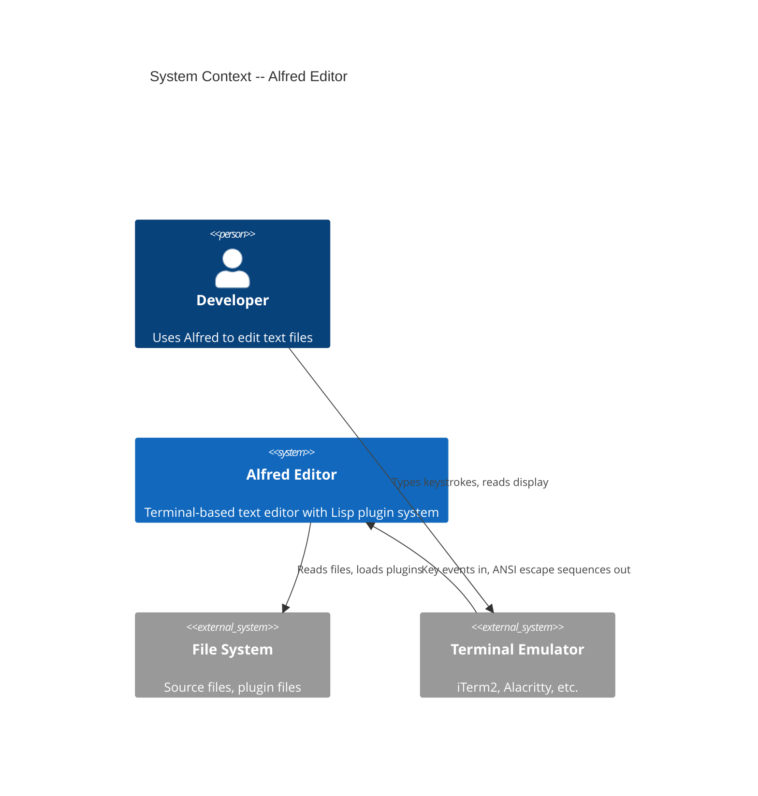
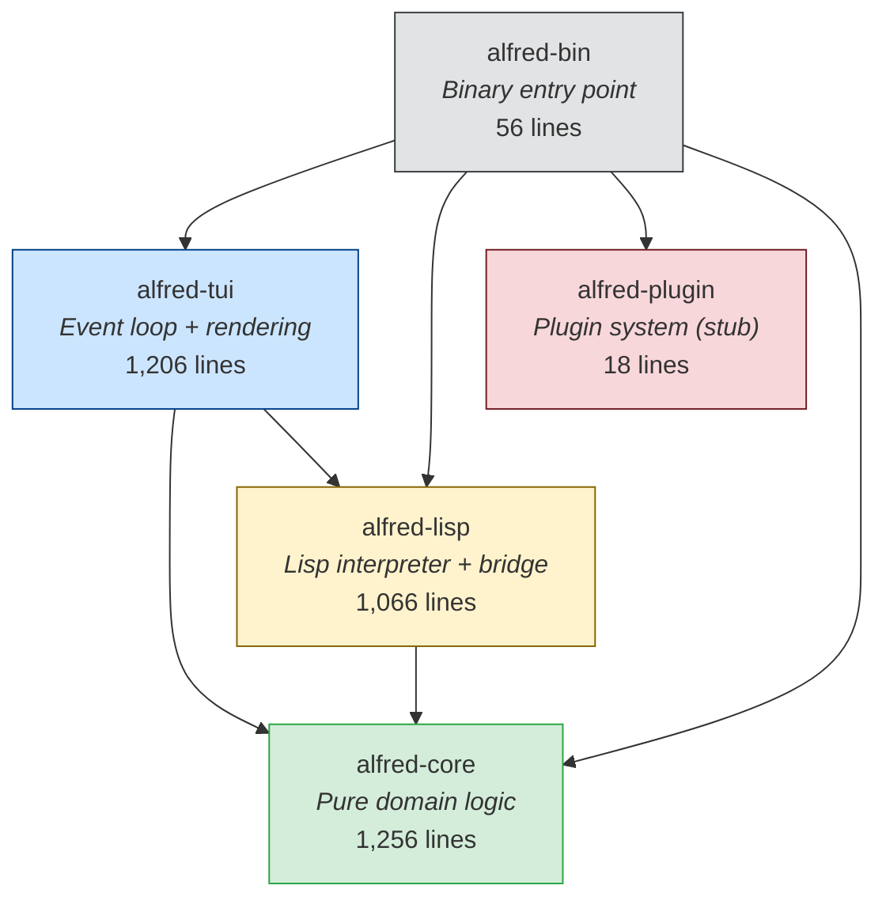
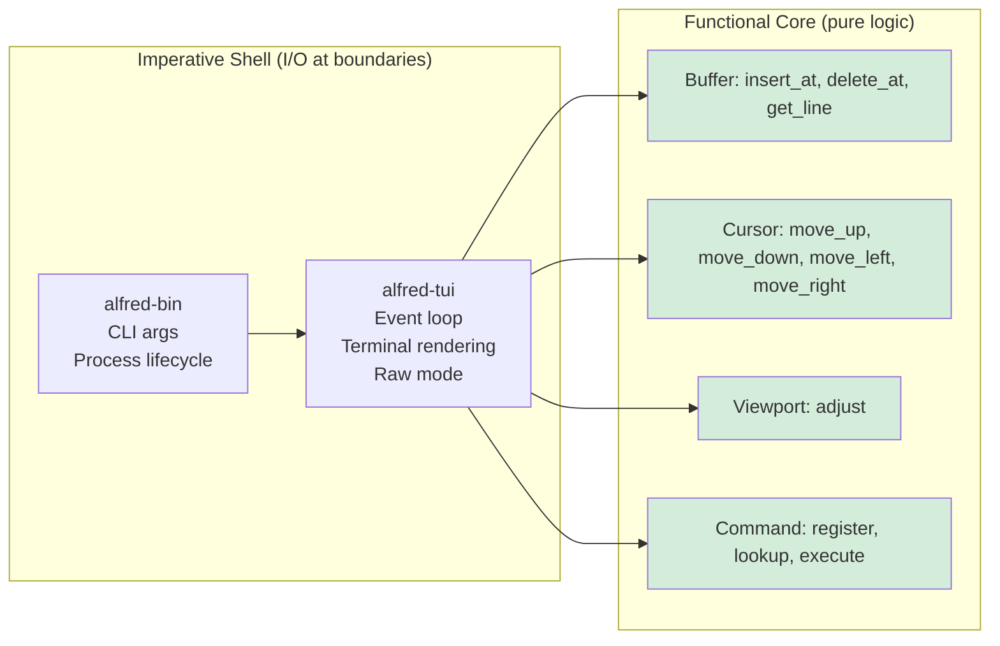
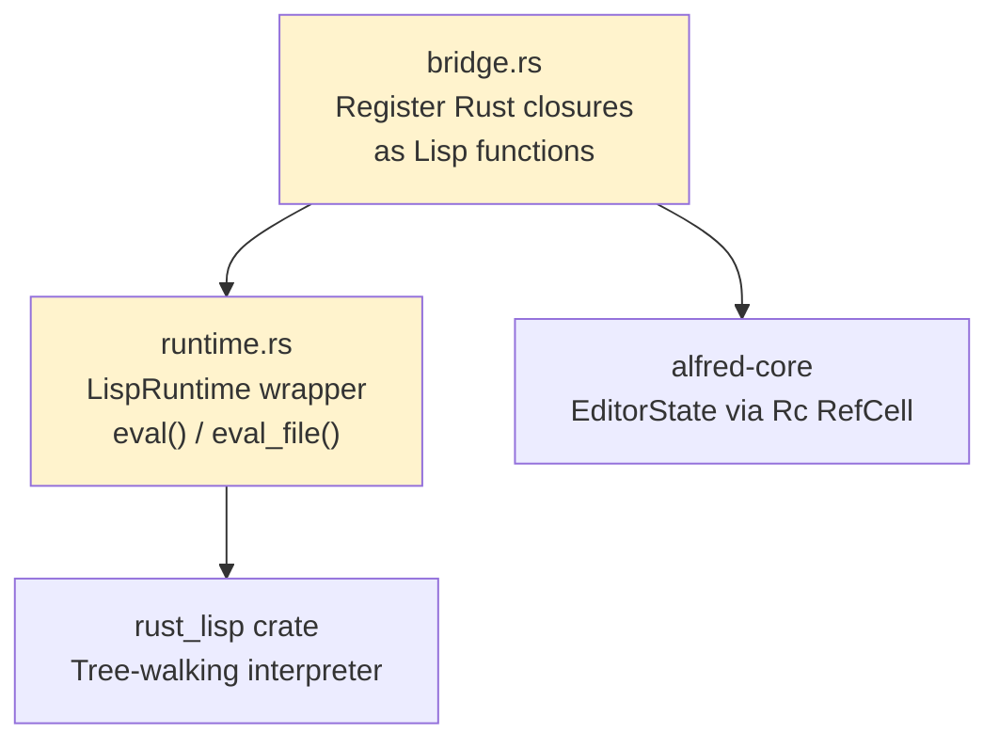
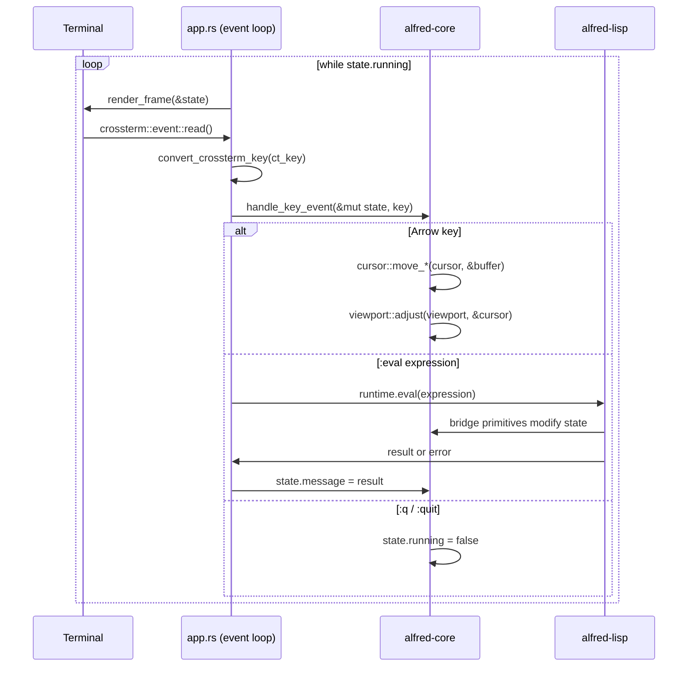
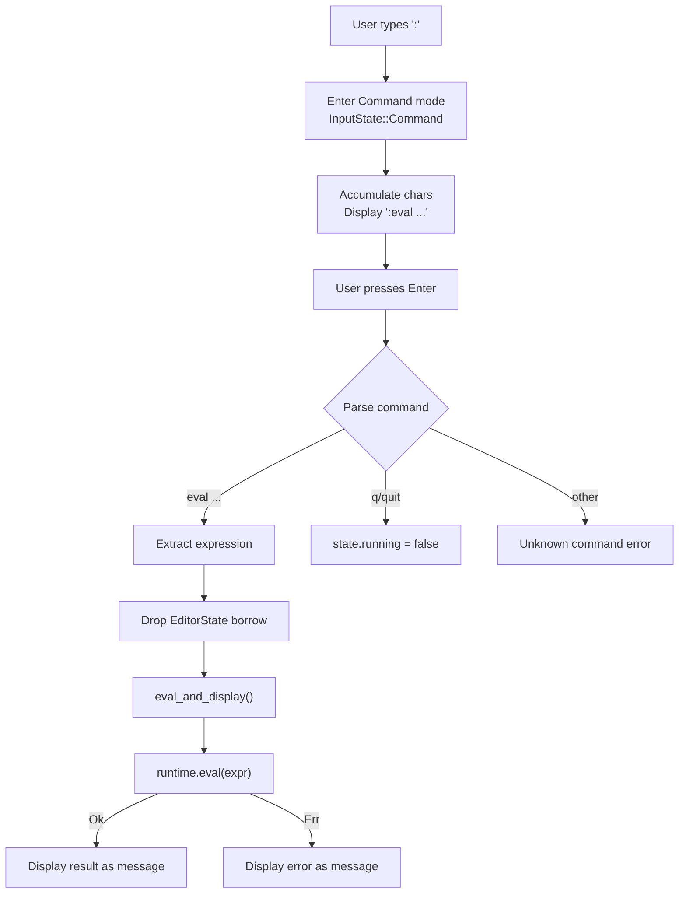
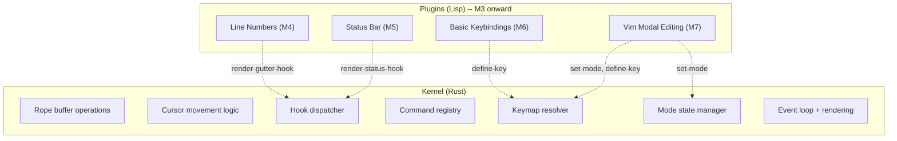
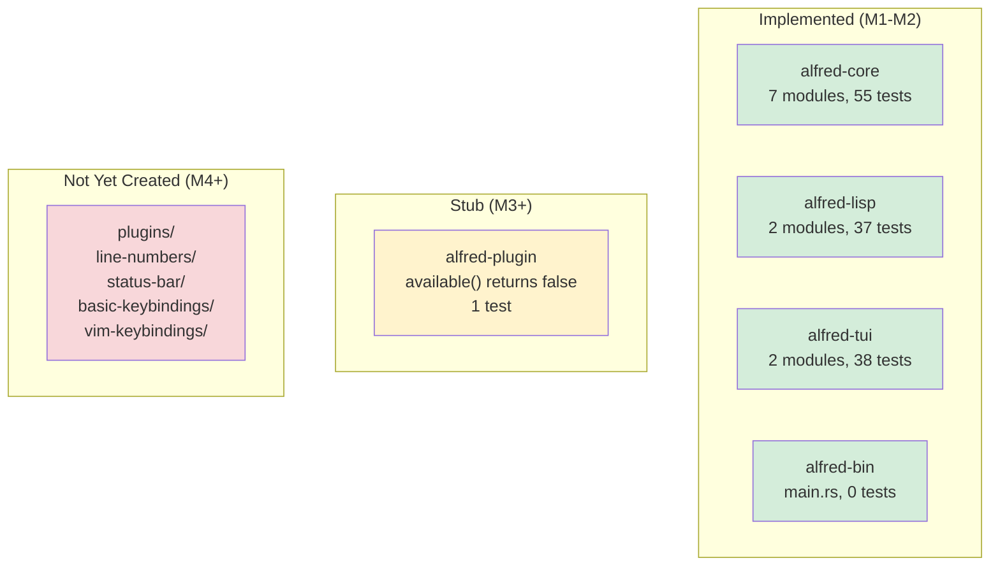

<!-- Slide 1 -->
# Alfred Editor: System Walkthrough

**An Emacs-inspired text editor in Rust with a Lisp plugin architecture**

- 5-crate Cargo workspace
- Functional core / imperative shell
- Embedded Lisp interpreter (rust_lisp)
- Terminal UI via crossterm + ratatui
- Currently at M2 completion (of 7 milestones)

<!-- Audience: All developers. Tier 1. Type: Explanation -->

<!--
Presenter notes:
This walkthrough covers the Alfred editor codebase as of March 2026.
Alfred is at milestone 2 of a 7-milestone walking skeleton that proves
a plugin-first architecture where even modal editing is a Lisp plugin.
Total codebase: ~3,700 lines of Rust across 16 source files.
131 tests with 225 assertions.
-->

---

<!-- Slide 2 -->
# What Problem Does Alfred Solve?

**Context**: Most terminal editors fall into two camps:

1. **Highly extensible but legacy** -- Emacs (Elisp from 1985, dynamic scoping until 2012)
2. **Modern but limited extensibility** -- Helix (no plugin system, most-cited limitation)

**Alfred's thesis**: Build a thin Rust kernel with everything else as Lisp plugins.

**Walking skeleton goal**: Prove that Vim-style modal editing works entirely as a Lisp plugin on top of a minimal kernel.

<!-- Audience: All. Tier 1. Type: Explanation -->

<!--
Presenter notes:
This is not about replacing Emacs or Vim. The project is a proof-of-concept
that AI agents can build architecturally sound, modular software.
The strongest proof: a complex, stateful feature (modal editing) working
entirely as a plugin.
-->

---

<!-- Slide 3 -->
# Roadmap: The Walking Skeleton (M1-M7)

| Milestone | What It Proves | Status |
|-----------|---------------|--------|
| **M1** Rust Kernel | Display file, navigate with arrows | Done |
| **M2** Lisp Integration | Evaluate Lisp that calls Rust primitives | Done |
| **M3** Plugin System | Discover, load, initialize Lisp plugins | Next |
| **M4** Line Numbers | First real Lisp plugin end-to-end | Planned |
| **M5** Status Bar | Plugin renders dynamic UI with state | Planned |
| **M6** Keybindings | Plugins intercept input, bind keys | Planned |
| **M7** Vim Mode | Full modal editing as a plugin | Planned |

Estimated total: 12-14 weeks. Sequential execution.

<!-- Audience: All. Tier 1. Type: Explanation -->

<!--
Presenter notes:
M7 is the proof point. If modal editing works as a Lisp plugin,
the architecture is validated. Everything after M7 is features, not architecture.
M4 and M5 could run in parallel but are sequential to avoid scope creep.
-->

---

<!-- Slide 4 -->
# System Context (C4 Level 1)



Single binary, single process, no network, no database.

<!-- Audience: All. Tier 1. Type: Explanation -->

---

<!-- Slide 5 -->
# Container Architecture (C4 Level 2)



<!-- Audience: All. Tier 1. Type: Explanation -->

<!--
Presenter notes:
The dependency rule is critical: ALL arrows point inward toward alfred-core.
alfred-core has ZERO dependencies on other Alfred crates. This is enforced
by Cargo at compile time -- not just a convention. alfred-core depends only
on ropey (rope data structure) and thiserror (error derivation).
-->

---

<!-- Slide 6 -->
# The Dependency Rule

**alfred-core depends on nothing else in Alfred.**

| Crate | External Dependencies | Alfred Dependencies |
|-------|----------------------|-------------------|
| alfred-core | ropey, thiserror | None |
| alfred-lisp | rust_lisp, thiserror | alfred-core |
| alfred-tui | crossterm, ratatui | alfred-core, alfred-lisp |
| alfred-plugin | (none yet) | (none yet) |
| alfred-bin | crossterm | all four crates |

**Documented** (ADR-006): Crate boundaries are an architectural enforcement mechanism. Code in alfred-core cannot accidentally import terminal I/O types.

<!-- Audience: All. Tier 1. Type: Reference -->

---

<!-- Slide 7 -->
# Architectural Pattern: Functional Core / Imperative Shell



<!-- Audience: All. Tier 1. Type: Explanation -->

<!--
Presenter notes:
ADR-005 documents this choice. The key insight: Rust's ownership model
naturally enforces the boundary. Pure functions in alfred-core take
inputs and return outputs. The event loop in alfred-tui is the only
place where mutable state lives. Testing the core requires no mocking.
-->

---

<!-- Slide 8 -->
# Decision: Why Functional Core / Imperative Shell?

**Documented** (ADR-005):

| Approach | Rejected Because |
|----------|-----------------|
| Pure FP (monadic effects) | Rust's ownership model fights persistent data structures |
| Pure OOP (deep trait hierarchies) | Dynamic dispatch (`dyn Trait`) prevents monomorphization; editor data flow is a pipeline, not an object graph |
| **Hybrid (chosen)** | Pure functions for transforms, `&mut` only at boundaries |

**Consequences**:
- alfred-core is testable without terminal, Lisp, or filesystem
- Buffer operations are tested with direct assertions, no mocking
- Developers must maintain discipline: no `println!` or file I/O in alfred-core

<!-- Audience: All. Tier 2. Type: Explanation -->

---

<!-- Slide 9 -->
# alfred-core: The Pure Domain Layer

Seven modules, zero I/O dependencies:

| Module | Responsibility | Lines |
|--------|---------------|-------|
| `buffer.rs` | Rope-based text storage (ropey wrapper) | 309 |
| `cursor.rs` | Position + pure movement functions | 318 |
| `viewport.rs` | Visible window + scroll adjustment | 230 |
| `editor_state.rs` | Top-level state aggregation | 165 |
| `key_event.rs` | Key codes + modifiers (domain types) | 162 |
| `command.rs` | Named command registry + execution | 144 |
| `error.rs` | Unified error type (thiserror) | 24 |

**55 tests** with clear Given/When/Then naming.

<!-- Audience: All. Tier 1. Type: Reference -->

---

<!-- Slide 10 -->
# Buffer: Immutable Rope Wrapper

```rust
pub struct Buffer {
    id: u64,
    rope: Rope,           // ropey::Rope -- O(log n) operations
    filename: Option<String>,
    modified: bool,
    version: u64,          // monotonically increasing
}
```

All mutations return **new Buffer instances**:

```rust
pub fn insert_at(buffer: &Buffer, line: usize, column: usize,
                 text: &str) -> Buffer { ... }

pub fn delete_at(buffer: &Buffer, line: usize, column: usize) -> Buffer { ... }
```

Free functions, not methods -- keeps the module pure.

<!-- Audience: Developers. Tier 2. Type: Explanation -->

<!--
Presenter notes:
The Buffer struct fields are private. Access is through free functions:
line_count(), get_line(), content(), insert_at(), delete_at().
The version field increments on every mutation -- this enables
future change detection for rendering optimization.
ADR implicit: chose ropey over gap buffers (O(n) distant edits)
and piece tables (no mature Rust crate).
-->

---

<!-- Slide 11 -->
# Cursor: Pure Movement Functions

```rust
pub struct Cursor {
    pub line: usize,
    pub column: usize,
}
```

Every movement is a pure function: `(Cursor, &Buffer) -> Cursor`

```rust
pub fn move_down(cursor: Cursor, buf: &Buffer) -> Cursor { ... }
pub fn move_up(cursor: Cursor, buf: &Buffer) -> Cursor { ... }
pub fn move_right(cursor: Cursor, buf: &Buffer) -> Cursor { ... }
pub fn move_left(cursor: Cursor, buf: &Buffer) -> Cursor { ... }
pub fn ensure_within_bounds(cursor: Cursor, buf: &Buffer) -> Cursor { ... }
```

Column clamping on vertical movement. Line wrapping on horizontal movement at boundaries.

<!-- Audience: Developers. Tier 2. Type: Reference -->

---

<!-- Slide 12 -->
# EditorState: The Single Mutable Container

```rust
pub struct EditorState {
    pub buffer: Buffer,
    pub cursor: Cursor,
    pub viewport: Viewport,
    pub commands: CommandRegistry,
    pub mode: EditorMode,            // Normal only (Insert in M7)
    pub active_keymaps: Vec<Keymap>, // Stub (M6)
    pub hooks: Vec<Hook>,            // Stub (M4)
    pub message: Option<String>,
    pub running: bool,
}
```

Owned by the event loop. Passed as `&mut` during command execution, as `&` during rendering.

<!-- Audience: Developers. Tier 2. Type: Reference -->

<!--
Presenter notes:
EditorState is the single aggregation point. The component-boundaries.md
doc originally stated "no Rc<RefCell>", but M2 required it for the Lisp
bridge (closures need shared access to state). This is an example of
architecture evolving to meet implementation reality.
-->

---

<!-- Slide 13 -->
# Decision: Why Single-Process Synchronous?

**Documented** (ADR-003):

**Key evidence**: Xi editor's retrospective by Raph Levien:
> "I now firmly believe that the process separation between front-end and core was not a good idea."

| Approach | Why Rejected |
|----------|-------------|
| Multi-process (Xi-style) | Author warns against it; complexity overwhelmed development |
| Async-everywhere (tokio) | Colored function problem; no operations justify async |
| Thread pool | Not needed for walking skeleton scope |
| **Single-process sync (chosen)** | Simplest model; matches 40-year Emacs precedent |

**Consequence**: Long Lisp expressions freeze the UI. Acceptable for walking skeleton.

<!-- Audience: All. Tier 2. Type: Explanation -->

---

<!-- Slide 14 -->
# alfred-lisp: The Lisp Bridge

Two modules connecting the rust_lisp interpreter to editor state:



**7 Lisp primitives** currently registered:
`buffer-insert`, `buffer-delete`, `buffer-content`, `cursor-position`, `cursor-move`, `message`, `current-mode`

<!-- Audience: All. Tier 1. Type: Explanation -->

---

<!-- Slide 15 -->
# Decision: Why rust_lisp Over Janet?

**Documented** (ADR-004):

| Factor | Janet | rust_lisp (chosen) |
|--------|-------|-------------------|
| Interop | C FFI bridge required | Native Rust closures |
| Build | Needs C compiler | `cargo build` only |
| Debugging | Cross-language FFI | Single language |
| Features | Rich (green threads, PEG) | Minimal Lisp |
| Performance | Bytecode VM | Tree-walking |
| Community | ~3.5k stars | ~300 stars |

**Key trade-off**: Janet is the better language. rust_lisp has better integration.

For a walking skeleton proving architecture, integration quality beats language features.

**Kill signal**: If eval latency exceeds 1ms, evaluate Janet.

<!-- Audience: All. Tier 2. Type: Explanation -->

---

<!-- Slide 16 -->
# The Lisp Bridge Pattern: Registered Native Closures

```rust
fn register_buffer_insert(env: Rc<RefCell<Env>>,
                          state: Rc<RefCell<EditorState>>) {
    define_native_closure(&env, "buffer-insert", move |_env, args| {
        let text = extract_string_arg(&args, "buffer-insert")?;
        let mut editor = state.borrow_mut();
        let cursor_line = editor.cursor.line;
        let cursor_column = editor.cursor.column;
        editor.buffer = buffer::insert_at(
            &editor.buffer, cursor_line, cursor_column, &text
        );
        Ok(Value::NIL)
    });
}
```

Pattern: Rust closure captures `Rc<RefCell<EditorState>>`, registered into Lisp env at startup.

<!-- Audience: Developers. Tier 2. Type: Explanation -->

<!--
Presenter notes:
All 7 primitives follow the same pattern:
1. Extract and validate arguments from Vec<Value>
2. Borrow editor state (borrow_mut for writes, borrow for reads)
3. Call pure alfred-core functions
4. Return Value::NIL or a Lisp value
Error handling: type mismatches return RuntimeError, not panics.
-->

---

<!-- Slide 17 -->
# Performance: Lisp Eval Latency

Performance baseline tests with a kill signal threshold of **1ms per call**:

| Primitive | Kill Signal | Status |
|-----------|-----------|--------|
| Arithmetic `(+ 1 2)` | < 1ms | Pass |
| `buffer-insert` | < 1ms | Pass |
| `cursor-move` | < 1ms | Pass |
| `message` | < 1ms | Pass |
| `buffer-content` | < 1ms | Pass |
| `cursor-position` | < 1ms | Pass |
| `current-mode` | < 1ms | Pass |

Measurement: median of 100 iterations after 10 warmup rounds.

**Verdict**: rust_lisp is viable for per-keystroke command dispatch.

<!-- Audience: All. Tier 2. Type: Reference -->

---

<!-- Slide 18 -->
# alfred-tui: The Imperative Shell

| File | Responsibility | Lines |
|------|---------------|-------|
| `app.rs` | Event loop, key conversion, key dispatch | 861 |
| `renderer.rs` | ratatui rendering, raw mode guard | 322 |

**app.rs is the largest file in the codebase** (861 lines, 38 tests).

It contains three distinct concerns:
1. **Pure**: `convert_crossterm_key()` -- maps crossterm events to domain KeyEvents
2. **Pure**: `handle_key_event()` -- updates EditorState from key events
3. **I/O**: `run()` -- the blocking event loop

<!-- Audience: Developers. Tier 1. Type: Explanation -->

<!--
Presenter notes:
app.rs is the top hotspot by both size and change frequency (5 commits).
It has accumulated responsibility as M2 added the :eval command path
and the Lisp runtime wiring. The pure functions within it are well-tested,
but the file itself may benefit from extraction in future milestones.
-->

---

<!-- Slide 19 -->
# Data Flow: Read-Eval-Redisplay Loop



<!-- Audience: All. Tier 1. Type: Explanation -->

---

<!-- Slide 20 -->
# The :eval Command Path (M2 Addition)



**Key design detail**: EditorState borrow is dropped before Lisp eval to avoid `RefCell` conflicts -- bridge closures also borrow the state.

<!-- Audience: Developers. Tier 2. Type: Explanation -->

---

<!-- Slide 21 -->
# Rendering: ratatui + TestBackend

```rust
pub fn render_frame<B: Backend>(terminal: &mut Terminal<B>,
                                state: &EditorState) -> io::Result<()> {
    terminal.draw(|frame| {
        let text_area = compute_text_area(area, state.message.is_some());
        let visible_lines = collect_visible_lines(state, text_area.height);
        frame.render_widget(Paragraph::new(visible_lines), text_area);
        // Message line on bottom row
        // Cursor position relative to viewport
    })?;
    Ok(())
}
```

**Key pattern**: `render_frame` is generic over `Backend`, enabling `TestBackend` in tests.

The renderer is fully tested without a real terminal.

<!-- Audience: Developers. Tier 2. Type: Explanation -->

---

<!-- Slide 22 -->
# alfred-bin: The Composition Root

```rust
fn run_editor(file_path: Option<&str>)
    -> Result<(), Box<dyn std::error::Error>>
{
    let (width, height) = crossterm::terminal::size()?;
    let state = Rc::new(RefCell::new(editor_state::new(width, height)));

    if let Some(path_str) = file_path {
        let buffer = Buffer::from_file(Path::new(path_str))?;
        state.borrow_mut().buffer = buffer;
    }

    let runtime = LispRuntime::new();
    bridge::register_core_primitives(&runtime, state.clone());
    alfred_tui::app::run(&state, &runtime)?;
    Ok(())
}
```

56 lines. Wires all crates together. No business logic.

<!-- Audience: Developers. Tier 2. Type: Reference -->

---

<!-- Slide 23 -->
# Decision: Why Adopt a Lisp Instead of Building One?

**Documented** (ADR-001):

**Context**: Building a Lisp is a project-sized effort (MAL has 11 steps from tokenizer through self-hosting).

| Approach | Assessment |
|----------|-----------|
| Build custom Lisp (MAL) | 3-4 weeks; interpreter bugs would mask architecture issues |
| Use Lua (Neovim approach) | No homoiconicity; Alfred's identity is Lisp-based |
| **Adopt existing (chosen)** | Focus on FFI bridge, not language implementation |

**Consequence**: Less control over syntax/semantics, but 3-4 weeks saved and inherited reliability.

**Migration path**: If rust_lisp proves insufficient post-skeleton, migration is isolated to `alfred-lisp` crate.

<!-- Audience: All. Tier 2. Type: Explanation -->

---

<!-- Slide 24 -->
# Decision: Why Plugin-First?

**Documented** (ADR-002):

**Evidence from editor case studies**:
- Emacs: ~70% Lisp, ~30% C. Even cursor movement is Lisp.
- Neovim: Built-in LSP client is a Lua plugin.
- Helix: No plugin system -- most-cited community limitation.

**The boundary test** -- a component belongs in the kernel if and only if:
1. It is infrastructure plugins depend on (command registry, hook system), OR
2. It requires direct hardware/OS access (terminal I/O), OR
3. It is performance-critical (rope operations, key resolution)

If none apply, it is a plugin.

<!-- Audience: All. Tier 2. Type: Explanation -->

---

<!-- Slide 25 -->
# Kernel vs Plugin Boundary (M3-M7)



<!-- Audience: All. Tier 1. Type: Explanation -->

---

<!-- Slide 26 -->
# Testing Strategy

**131 tests** across 4 crates (alfred-plugin has 1 stub test, alfred-bin has 0):

| Crate | Tests | Assertions | Avg Assert/Test |
|-------|-------|-----------|----------------|
| alfred-core | 55 | ~95 | 1.7 |
| alfred-lisp | 37 | ~65 | 1.8 |
| alfred-tui | 38 | ~60 | 1.6 |
| alfred-plugin | 1 | 1 | 1.0 |

**Testing approach**:
- Given/When/Then naming convention throughout
- Acceptance tests first, then unit tests per behavior
- `TestBackend` from ratatui enables terminal-free rendering tests
- Performance baseline tests with kill signal thresholds

<!-- Audience: All. Tier 1. Type: Reference -->

---

<!-- Slide 27 -->
# Test Quality Assessment

**Strengths**:
- Every public function has tests
- Acceptance tests cover end-to-end scenarios (key sequence -> state change)
- Pure functions tested without mocking -- direct input/output assertions
- Performance tests guard Lisp eval latency

**Areas for improvement** (Inferred):
- Average 1.7 assertions per test -- adequate but could be richer
- No property-based testing yet (CLAUDE.md prescribes it as default strategy)
- Acceptance tests in `tests/acceptance/` are all `#[ignore]` stubs
- No mutation testing output found (though CLAUDE.md specifies per-feature strategy)

<!-- Audience: All. Tier 2. Type: Explanation -->

---

<!-- Slide 28 -->
# Documentation Quality

**Exceptional for a project of this size**:

| Document Type | Count | Quality |
|---------------|-------|---------|
| ADRs | 6 | Full Context/Decision/Consequences format |
| Architecture docs | 4 | C4 diagrams, data models, boundaries, tech stack |
| Walking skeleton roadmap | 1 | 7 milestones with acceptance criteria and kill signals |
| Discovery docs | 4 | Problem validation, lean canvas, opportunity tree |
| CLAUDE.md | 1 | Development paradigm and project structure |

ADRs cover every major architectural decision. Each records alternatives considered and why they were rejected.

<!-- Audience: All. Tier 1. Type: Reference -->

---

<!-- Slide 29 -->
# Code Hotspots

Files ranked by (lines x change frequency):

| File | Lines | Commits | Hotspot Score |
|------|-------|---------|--------------|
| `alfred-tui/src/app.rs` | 861 | 5 | 4,305 |
| `alfred-lisp/src/bridge.rs` | 557 | 3 | 1,671 |
| `alfred-lisp/src/runtime.rs` | 487 | 2 | 974 |
| `alfred-tui/src/renderer.rs` | 322 | 2 | 644 |
| `alfred-core/src/cursor.rs` | 318 | 2 | 636 |

**app.rs** is the clear hotspot -- largest file and most frequently changed. It accumulated the event loop, key conversion, key dispatch, command-line mode, and Lisp eval wiring across M1 and M2.

<!-- Audience: Developers. Tier 2. Type: Reference -->

---

<!-- Slide 30 -->
# Risk: app.rs Complexity Growth

**Current state**: 861 lines with three distinct responsibilities mixed together.

**Pattern observed**: Each milestone adds to this file:
- M1: Event loop + arrow key handling
- M2: Command-line mode (`:eval`, `:q`) + Lisp runtime wiring

**Projection**: M6 (keybinding plugin) will need to replace the hardcoded key dispatch with keymap resolution -- a significant refactor of app.rs.

**Recommendation** (Inferred): Extract before M6:
- `key_conversion.rs` -- pure crossterm-to-domain mapping
- `key_dispatch.rs` -- pure key event handling
- `app.rs` -- event loop I/O only

<!-- Audience: Developers. Tier 2. Type: Explanation -->

---

<!-- Slide 31 -->
# Risk: Rc RefCell vs Design Docs

**Tension identified**:

The component-boundaries.md document states:
> "This is deliberately simple. The single-owner model avoids Rust's borrow checker complexity for shared mutable state (no `Rc<RefCell<T>>`)."

But M2 implementation **uses** `Rc<RefCell<EditorState>>` because Lisp bridge closures need shared access to editor state.

**Impact**: Low. The `Rc<RefCell>` is confined to the event loop and bridge boundary. The core domain remains pure. But the design docs should be updated to reflect this reality.

<!-- Audience: Developers. Tier 3. Type: Explanation -->

---

<!-- Slide 32 -->
# Crate Structure: What Exists vs What Is Planned



<!-- Audience: All. Tier 1. Type: Reference -->

---

<!-- Slide 33 -->
# What M3 Needs to Build

The plugin system (alfred-plugin) requires:

1. **Plugin discovery** -- scan `plugins/` directory for `init.lisp` files
2. **Metadata parsing** -- extract name, version, dependencies from Lisp source
3. **Topological sort** -- resolve plugin load order by dependencies
4. **Lifecycle management** -- init, cleanup, unload with command/hook/keymap tracking
5. **Error isolation** -- plugin load failures must not crash the editor

**New primitives needed** (per architecture doc):
- `make-keymap`, `define-key`, `set-active-keymap`
- `define-command`, `execute-command`
- `add-hook`, `remove-hook`
- `set-mode`

<!-- Audience: Developers. Tier 2. Type: Explanation -->

---

<!-- Slide 34 -->
# Design Decisions Summary

| # | Decision | Status | Rationale (short) |
|---|----------|--------|-------------------|
| ADR-001 | Adopt Lisp, don't build | Documented | Interpreter is means, not end |
| ADR-002 | Plugin-first architecture | Documented | Prove architecture, not features |
| ADR-003 | Single-process synchronous | Documented | Xi retrospective; Emacs precedent |
| ADR-004 | rust_lisp over Janet | Documented | Integration quality > language features |
| ADR-005 | Functional core / imperative shell | Documented | Pure testability; Rust ownership alignment |
| ADR-006 | 5-crate workspace | Documented | Compile-time boundary enforcement |
| (impl) | `Rc<RefCell>` for Lisp bridge | Inferred | Bridge closures need shared state access |

<!-- Audience: All. Tier 1. Type: Reference -->

---

<!-- Slide 35 -->
# Tech Stack At a Glance

| Layer | Technology | Why This One |
|-------|-----------|-------------|
| Language | Rust (stable) | Safety + performance; Helix/Zed validate for editors |
| Text buffer | ropey 1.x | O(log n) all ops; used by Helix in production |
| Terminal I/O | crossterm 0.28 | Cross-platform; default ratatui backend |
| TUI framework | ratatui 0.29 | Immediate-mode; diff-based rendering |
| Lisp | rust_lisp 0.18 | Native Rust; no FFI boundary |
| Error handling | thiserror 1.x | Derive macro for error enums |

All dependencies are MIT-licensed open source. No proprietary dependencies.

<!-- Audience: All. Tier 1. Type: Reference -->

---

<!-- Slide 36 -->
# Getting Started

```bash
# Clone and build
git clone <repo-url>
cd alfred
cargo build

# Run with a file
cargo run --bin alfred -- path/to/file.txt

# Run without a file (empty buffer)
cargo run --bin alfred

# Inside the editor
# Arrow keys: navigate
# :q Enter:  quit
# :eval (+ 1 2) Enter: evaluate Lisp
# :eval (message "hello") Enter: set message

# Run all tests
cargo test

# Run a specific crate's tests
cargo test -p alfred-core
cargo test -p alfred-lisp
```

<!-- Audience: All. Tier 1. Type: How-To -->

---

<!-- Slide 37 -->
# Key Risks and Mitigations

| Risk | Severity | Mitigation |
|------|----------|-----------|
| app.rs grows into god-file | Medium | Extract before M6 keybinding refactor |
| rust_lisp maintenance stalls | Medium | Simple enough to fork; migration path to Janet exists |
| Plugin API insufficient for modal editing | High | M7 is the definitive test; kill signal defined |
| `Rc<RefCell>` borrow panics at runtime | Low | Confined to event loop boundary; tested paths |
| Property-based testing not implemented | Low | Prescribed in CLAUDE.md but not yet adopted |

<!-- Audience: All. Tier 2. Type: Reference -->

---

<!-- Slide 38 -->
# Summary

**Alfred is a well-architected proof-of-concept** at the midpoint of its walking skeleton:

- **Clean separation**: Pure core (1,256 lines, 55 tests) with no I/O dependencies
- **Documented decisions**: 6 ADRs with full context/decision/consequences
- **Working Lisp bridge**: 7 primitives, all under 1ms latency threshold
- **Test discipline**: 131 tests, Given/When/Then naming, TestBackend for rendering

**What remains** (M3-M7): The hard part -- proving that keybindings, line numbers, status bar, and modal editing all work as Lisp plugins on this foundation.

**M7 completion = architecture validated.**

<!-- Audience: All. Tier 1. Type: Explanation -->

<!--
Presenter notes:
The strongest indicator of this project's quality is the decision trail.
Every major choice has an ADR with alternatives considered and rejected.
The code follows the documented architecture faithfully, with the small
exception of Rc<RefCell> in the Lisp bridge path. The test suite is
thorough for the implemented scope. The main risk going forward is
whether the plugin API will be sufficient for complex features like
modal editing -- that's exactly what M7 is designed to test.
-->
