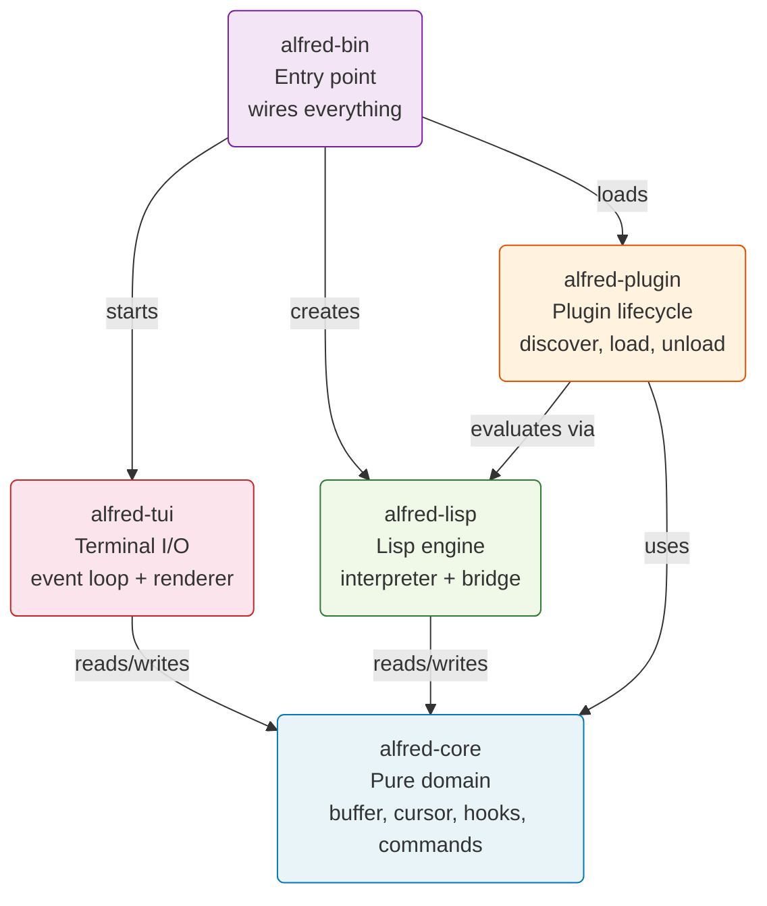
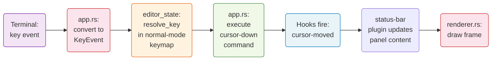
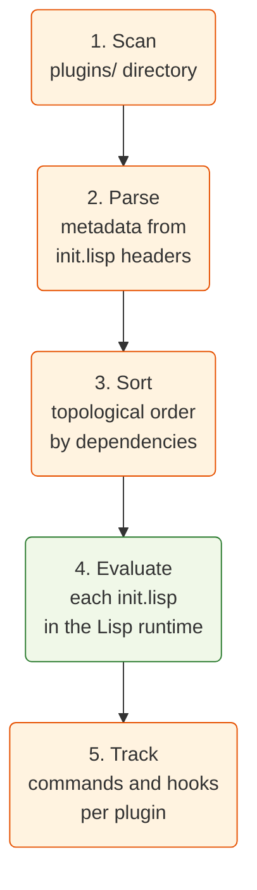
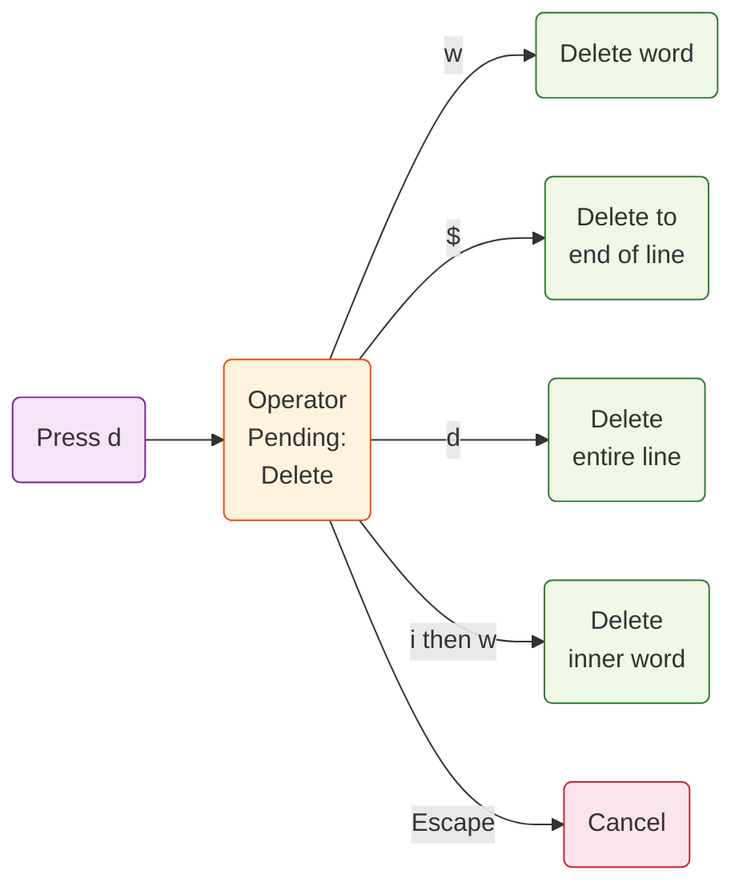
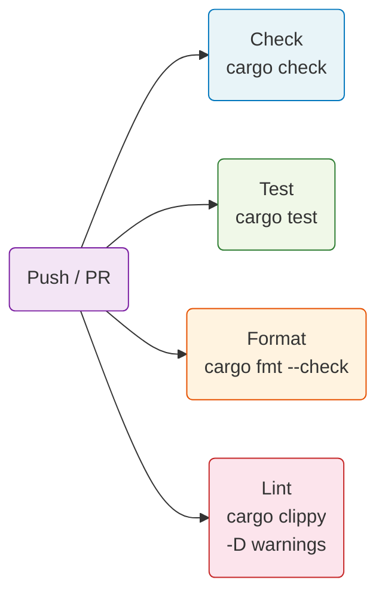

# Alfred -- Full System Walkthrough

### A plugin-first terminal text editor built in Rust

Everything beyond core text editing is a Lisp plugin.

**~566 unit tests | ~66 E2E tests | ~110 Vim commands | 5 crates | 7 plugins**

<!--
Presenter notes:
This walkthrough covers the full system: architecture, plugin system,
Lisp engine, Vim keybindings, themes, file operations, testing, and all
six Architecture Decision Records. Allow approximately 60-90 minutes.
-->

---

<!-- Part 1: WHY -->

# Part 1: Why Alfred Exists

### The Motivation

Most editors fall into two camps:

**Camp A -- Hardcoded.** Everything is built into the binary. Fast, but changing behavior means recompiling. Example: Helix. Its most-cited limitation? No plugin system.

**Camp B -- Bolted-on.** The plugin system is an afterthought. Core features bypass it. Plugins are second-class citizens. Many editors live here.

**Alfred aims for Camp C -- Plugin-first.** The kernel provides only raw primitives. Every user-visible feature is a plugin. This is the Emacs philosophy taken to its logical conclusion.

<!--
Presenter notes:
Alfred is also a proof that AI agents can build architecturally sound
software. Every feature was built incrementally with clear boundaries.
-->

---

# Goals

Alfred was built to answer specific questions:

| Question | How Alfred answers it |
|----------|----------------------|
| Can Vim-style modal editing work as a plugin? | Yes. 128 lines of Lisp define all keybindings and mode switching |
| Can a thin kernel support complex features? | Yes. The kernel has no concept of "normal mode" or "status bar" |
| Can compile-time boundaries enforce architecture? | Yes. Cargo crate boundaries prevent the core from importing terminal I/O |
| Can functional-core / imperative-shell work for an editor? | Yes. Domain logic is pure functions. I/O lives at the boundary |
| Can you test an editor without mocks? | Yes. ~566 unit tests, zero mock tautology |

<!--
Presenter notes:
Each goal maps to an ADR. The project is deliberate about documenting
decisions with context, alternatives considered, and consequences.
-->

---

# Design Philosophy

Three principles guide every decision:

**1. Plugin-first.** If a feature can be a plugin, it must be a plugin. The kernel grows only when a primitive is genuinely missing.

**2. Functional core, imperative shell.** Domain logic (buffer operations, keymap resolution, theme parsing) is pure -- no I/O, no side effects. Terminal I/O lives at the boundary in `alfred-tui`.

**3. Types before components.** Data types and domain models are designed first. Algebraic data types (enums with variants) model the domain. Components are composed from these types.

Think of it as: define the nouns (types), then define the verbs (pure functions), then wire them together at the boundary (imperative shell).

<!--
Presenter notes:
ADR-005 documents the paradigm choice. The three alternatives were pure FP
(fights Rust's ownership model), pure OOP (too much indirection), and the
chosen hybrid approach.
-->

---

<!-- Part 2: ARCHITECTURE -->

# Part 2: The Five Crates



Each crate has one job. Dependencies only point inward.

<!--
Presenter notes:
alfred-core depends only on ropey (rope data structure) and thiserror.
It has zero dependencies on crossterm, ratatui, or rust_lisp. This is
enforced by Cargo -- not by convention.
-->

---

# What Each Crate Contains

| Crate | Modules | Key types | I/O? |
|-------|---------|-----------|------|
| **alfred-core** | buffer, cursor, viewport, editor_state, command, hook, panel, theme, key_event, text_object, rainbow_csv, error | Buffer, Cursor, Viewport, EditorState, CommandRegistry, HookRegistry, PanelRegistry, Theme | No |
| **alfred-lisp** | runtime, bridge | LispRuntime, LispValue, LispError | File reads only |
| **alfred-plugin** | discovery, registry, metadata, error | PluginMetadata, PluginRegistry, LoadedPlugin, PluginError | File system scan |
| **alfred-tui** | app, renderer | InputState, Operator | Yes -- terminal I/O |
| **alfred-bin** | main | (none -- wiring only) | Yes -- startup |

**Notice:** The largest crate (`alfred-core`) has no I/O. That is the functional core.

<!--
Presenter notes:
EditorState is the single mutable container. It aggregates buffer, cursor,
viewport, commands, hooks, panels, mode, keymaps, registers, marks, macros,
undo stack, theme, and more. Everything flows through it.
-->

---

# Functional Core vs Imperative Shell

**What do these terms mean?**

A *pure function* always gives the same output for the same input and changes nothing outside itself. Like a calculator: 2 + 3 is always 5, and pressing the button does not turn off the lights.

An *imperative shell* is code that talks to the outside world: reading keyboard input, drawing to the screen, saving files.

| Functional core (`alfred-core`) | Imperative shell (`alfred-tui`) |
|---------------------------------|---------------------------------|
| `cursor::move_down(cursor, buffer)` returns a new cursor | `crossterm::event::read()` waits for a keypress |
| `viewport::adjust(viewport, cursor)` returns a new viewport | `terminal.draw(...)` paints pixels on screen |
| `command::execute(state, "undo")` modifies state | `std::fs::write(path, content)` saves to disk |

**Why this matters:** Pure functions are trivially testable. Pass input, check output. No setup, no teardown, no mocks. That is why Alfred has 566 unit tests with zero mock tautology.

<!--
Presenter notes:
The viewport::adjust function is a perfect example. It takes a Viewport
and a Cursor, returns a new Viewport. The test just creates values and
asserts the result. No terminal needed, no rendering, no setup.
-->

---

# Data Flow: Keypress to Screen

Here is exactly what happens when you press `j` (move cursor down) in normal mode:



1. crossterm delivers the raw key event
2. `convert_crossterm_key` maps it to an `alfred-core` KeyEvent
3. `resolve_key` walks the active keymaps and finds `"cursor-down"`
4. The built-in `cursor-down` command calls `cursor::move_down`
5. Hooks fire -- the status-bar plugin updates its panel content
6. The renderer draws the frame with the new cursor position and status bar

<!--
Presenter notes:
This is synchronous. No async, no channels, no message passing.
The entire cycle runs on the main thread before the next key is read.
ADR-003 documents this decision.
-->

---

# Dependency Rules

```
alfred-bin depends on: alfred-tui, alfred-plugin, alfred-lisp, alfred-core
alfred-tui depends on: alfred-core, crossterm, ratatui
alfred-plugin depends on: alfred-core, alfred-lisp
alfred-lisp depends on: alfred-core, rust_lisp
alfred-core depends on: ropey, thiserror (ONLY)
```

**Three rules enforced by the compiler:**

1. `alfred-core` never imports from any other Alfred crate
2. `alfred-tui` never imports from `alfred-lisp` or `alfred-plugin`
3. Only `alfred-bin` depends on all four other crates (it is the composition root)

**Why?** If the core imported the terminal library, you could not test buffer operations without a terminal. If the TUI imported the Lisp engine, rendering would be coupled to the extension language. Clean boundaries make each piece testable and replaceable independently.

<!--
Presenter notes:
ADR-006 documents this decision. The alternative of a single crate with
modules was rejected because module-level visibility is weaker than
crate-level boundaries. The compiler cannot prevent buffer.rs from
importing crossterm in a single-crate project.
-->

---

<!-- Part 3: PLUGIN SYSTEM -->

# Part 3: What Is a Plugin?

A plugin is a directory under `plugins/` containing an `init.lisp` file.

```
plugins/
  status-bar/
    init.lisp       <-- evaluated at startup
  line-numbers/
    init.lisp
  vim-keybindings/
    init.lisp
  default-theme/
    init.lisp
  rainbow-csv/
    init.lisp
  word-count/
    init.lisp
  test-plugin/
    init.lisp
```

Every `init.lisp` starts with metadata comments:
```lisp
;;; name: status-bar
;;; version: 3.0.0
;;; description: Status bar showing filename, position, mode
;;; depends: default-theme
```

The `depends` field is optional. When present, the plugin system sorts plugins so dependencies load first (topological sort using Kahn's algorithm).

<!--
Presenter notes:
Disabling a plugin is as simple as renaming its directory to end in
.disabled -- the discovery scanner skips those directories.
-->

---

# Plugin Lifecycle



**Error handling:** If a plugin fails to load (bad Lisp syntax, undefined function), the error is collected as a message -- not a crash. Other plugins continue loading. The message bar shows any errors on startup.

**Unloading:** Each plugin tracks which commands and hooks it registered. Unloading a plugin removes those commands and hooks cleanly without affecting other plugins.

<!--
Presenter notes:
The topological sort detects circular dependencies and reports them as
errors. It also detects missing dependencies (plugin A depends on
plugin B, but B does not exist).
-->

---

# The Event Model

Plugins interact with the editor through three mechanisms:

| Mechanism | Direction | Example |
|-----------|-----------|---------|
| **Commands** | Plugin defines, user invokes | `(define-command "hello" (lambda () (message "Hi!")))` |
| **Hooks** | Kernel fires, plugin listens | `(add-hook "cursor-moved" update-status)` |
| **Keymaps** | Plugin defines, kernel resolves | `(define-key "normal-mode" "Char:j" "cursor-down")` |

**Commands** are named actions. Any plugin can register one. Users invoke them via keybindings or `:command-name`.

**Hooks** are broadcast events. The kernel fires them at key moments. Any number of plugins can listen. Current hooks: `cursor-moved`, `buffer-changed`, `mode-changed`.

**Keymaps** map key events to command names. Each mode has its own keymap. The kernel resolves keys by walking the active keymaps in order.

<!--
Presenter notes:
This is a classic event-driven architecture. Commands are the command
pattern. Hooks are the observer pattern. Keymaps are a lookup table
from KeyEvent to command name string.
-->

---

# The Panel System

Panels are generic named screen regions. The kernel does not know what a "status bar" or "gutter" is. It only knows:

- A panel has a **name**, **position** (top/bottom/left/right), and **size**
- A panel has **content** (single string for top/bottom, per-line map for left/right)
- A panel has optional **foreground and background colors**

**Creating a panel from Lisp:**
```lisp
(define-panel "status" "bottom" 1)            ;; 1 row, bottom of screen
(set-panel-style "status" "#cdd6f4" "#313244") ;; light text, dark background
(set-panel-content "status" " NORMAL | main.rs")
```

**The renderer** iterates all panels, computes layout (subtract panel sizes from the text area), and draws each panel generically. Adding a new panel position (e.g., a top toolbar) is just `(define-panel "toolbar" "top" 1)`.

<!--
Presenter notes:
The panel system replaced earlier direct gutter/status-bar support.
It generalizes screen layout so any plugin can claim screen real estate
without kernel changes.
-->

---

# Creating a Word Count Plugin

Let us build a plugin from scratch. Goal: a `:word-count` command that shows stats in the message bar.

**Step 1.** Create `plugins/word-count/init.lisp`

**Step 2.** Add metadata:
```lisp
;;; name: word-count
;;; version: 1.0.0
;;; description: Displays word count, line count, and character count
```

**Step 3.** Write the logic:
```lisp
(define count-words
  (lambda ()
    (length
      (filter
        (lambda (w) (> (str-length w) 0))
        (str-split (buffer-content) " ")))))

(define-command "word-count"
  (lambda ()
    (message
      (str-concat
        (list "Lines: " (to-string (buffer-line-count))
              " | Words: " (to-string (count-words))
              " | Chars: " (to-string (str-length (buffer-content))))))))
```

**Step 4.** Restart Alfred. Type `:word-count` and press Enter.

<!--
Presenter notes:
No Rust code changed. No recompilation. The plugin uses existing
primitives: buffer-content, buffer-line-count, str-split, filter,
length, str-concat, to-string, message.
-->

---

# How the Status Bar Plugin Works

The `status-bar` plugin (33 lines) demonstrates the full pattern:

```lisp
;; 1. Create a bottom panel
(define-panel "status" "bottom" 1)
(set-panel-style "status" "#cdd6f4" "#313244")

;; 2. Build status text from editor state
(define build-status
  (lambda ()
    (str-concat
      (list " " (buffer-filename)
            "  Ln " (to-string (+ (nth 0 (cursor-position)) 1))
            ", Col " (to-string (+ (nth 1 (cursor-position)) 1))
            (if (buffer-modified?) "  [+]" " ")
            " " (str-upper (current-mode)) " "))))

;; 3. Update on every change
(define update-status (lambda () (set-panel-content "status" (build-status))))
(add-hook "cursor-moved" update-status)
(add-hook "buffer-changed" update-status)
(add-hook "mode-changed" update-status)

;; 4. Initial render
(update-status)
```

This is a reactive pattern: state changes trigger hooks, hooks update panel content, the renderer draws the panel. The kernel does not know what the status bar shows.

<!--
Presenter notes:
The status bar hooks into three events: cursor-moved, buffer-changed,
and mode-changed. Every time any of these fires, it rebuilds the status
string from live editor state and sets the panel content.
-->

---

<!-- Part 4: LISP ENGINE -->

# Part 4: What Is Alfred Lisp?

Alfred Lisp is a small dialect based on the `rust_lisp` interpreter. It is not Emacs Lisp or Common Lisp. It is simpler -- just enough for editor extensions.

**What it has:** Numbers, strings, booleans, lists, symbols, `define`, `lambda`, `if`, `let`, `quote`, closures, tail calls, standard arithmetic, and comparison operators.

**What Alfred adds:** ~50 bridge primitives that connect Lisp to the editor kernel. These are Rust closures registered as native functions in the Lisp environment.

**How it runs:** The Lisp runtime wraps `rust_lisp` in a clean `eval(source) -> Result<LispValue, LispError>` API. Plugin files are loaded via `eval_file(path)`. Every expression is evaluated synchronously on the main thread.

**Performance:** Tree-walking interpreter. Under 1ms per primitive call (validated by performance benchmark tests with a kill-signal threshold).

<!--
Presenter notes:
ADR-001 decided to adopt an existing interpreter rather than build one.
ADR-004 chose rust_lisp over Janet. The key tradeoff: Janet is a better
language, but rust_lisp provides better Rust integration (no C FFI).
-->

---

# Bridge Primitives by Category

| Category | Primitives | What they do |
|----------|-----------|-------------|
| **Buffer** | `buffer-insert`, `buffer-delete`, `buffer-content`, `buffer-get-line`, `buffer-filename`, `buffer-modified?`, `buffer-line-count`, `save-buffer` | Read and modify the text buffer |
| **Cursor** | `cursor-position`, `cursor-move` | Query and move the cursor |
| **Mode** | `current-mode`, `set-mode` | Query and switch editing modes |
| **Commands** | `define-command` | Register named commands callable via `:name` |
| **Keymaps** | `make-keymap`, `define-key`, `set-active-keymap` | Create key-to-command mappings |
| **Hooks** | `add-hook`, `dispatch-hook`, `remove-hook` | Subscribe to editor events |
| **Theme** | `set-theme-color`, `get-theme-color`, `define-theme`, `load-theme` | Configure colors |

<!--
Presenter notes:
Each primitive is a Rust closure that captures Rc<RefCell<EditorState>>.
When Lisp calls (buffer-insert "hello"), the closure borrows the editor
state, calls buffer::insert_char_at_cursor, and returns Value::NIL.
-->

---

# Standard Library Primitives

Beyond the editor bridge, Alfred Lisp includes string and list manipulation:

| Category | Functions |
|----------|----------|
| **Strings** | `str-split`, `str-join`, `str-concat`, `str-length`, `str-contains`, `str-replace`, `str-substring`, `str-trim`, `str-upper`, `str-lower`, `str-starts-with`, `str-ends-with`, `str-index-of`, `str`, `to-string`, `parse-int` |
| **Lists** | `length`, `nth`, `first`, `rest`, `cons`, `append`, `reverse`, `range`, `map`, `filter`, `reduce`, `for-each` |
| **Type checks** | `list?`, `string?`, `number?`, `nil?` |
| **Rendering** | `set-status-bar`, `set-gutter-line`, `set-gutter-width`, `viewport-top-line`, `viewport-height` |
| **Panels** | `define-panel`, `remove-panel`, `set-panel-content`, `set-panel-line`, `set-panel-style`, `set-panel-size` |
| **Display** | `message`, `set-line-style`, `clear-line-styles`, `set-cursor-shape`, `get-cursor-shape`, `set-tab-width`, `get-tab-width` |

These are pure functions implemented in Rust with no captured editor state (except the rendering and panel groups).

<!--
Presenter notes:
The string and list primitives are needed because rust_lisp's built-in
library is minimal. Alfred adds what plugins actually need: string
splitting for CSV parsing, list mapping for gutter rendering, etc.
-->

---

# Example: Rainbow CSV in Pure Lisp

```lisp
;;; name: rainbow-csv
;;; description: Colorizes CSV columns with rainbow colors

(define csv-colors
  '("#ff6b6b" "#4ecdc4" "#45b7d1" "#96ceb4"
    "#ffeaa7" "#dda0dd" "#98d8c8" "#f7dc6f"))

(define build-field-styles
  (lambda (fields col field-idx)
    (if (nil? fields) '()
      (cons
        (list col (+ col (str-length (first fields)))
              (get-csv-color field-idx))
        (build-field-styles (rest fields)
          (+ col (str-length (first fields)) 1)
          (+ field-idx 1))))))

(define-command "rainbow-csv"
  (lambda ()
    (clear-line-styles)
    (for-each colorize-csv-line (range 0 (buffer-line-count)))
    (message "Rainbow CSV applied")))
```

This plugin splits each line by commas, computes column boundaries, and sets per-character color styles. The renderer reads `line_styles` from EditorState and applies them during rendering. All in Lisp -- no Rust changes.

<!--
Presenter notes:
The recursive build-field-styles function is a classic functional pattern:
process the head of the list, then recurse on the tail. Each field gets
a color from the cycling palette (8 colors, modulo index).
-->

---

<!-- Part 5: VIM KEYBINDINGS -->

# Part 5: Modes Explained

If you have never used Vim or a modal editor, here is the key concept:

**Most editors have one mode.** You press a key, it types that letter. Always.

**Alfred has three modes.** The same key does different things depending on which mode you are in. Think of it like gears in a car:

| Mode | Analogy | What keys do |
|------|---------|-------------|
| **Normal** | Steering mode | Keys are commands: `j` moves down, `d` starts a delete, `:` opens command line |
| **Insert** | Typing mode | Keys type letters into the document. Press `Escape` to return to Normal |
| **Visual** | Selection mode | Movement keys extend a selection. Then `d` deletes it, `y` copies it |

**How it works under the hood:** Each mode has its own keymap. When you switch modes, the active keymap changes. The same key event (`j`) maps to `"cursor-down"` in normal mode and to "type the letter j" in insert mode.

<!--
Presenter notes:
The vim-keybindings plugin defines three keymaps: normal-mode,
insert-mode, and visual-mode. Mode switching is done via
(set-mode "normal") which triggers the mode-changed hook and
switches the active keymap.
-->

---

# Keymap Resolution

When a key is pressed, the kernel walks the active keymaps in order:

```
Active keymaps: ["normal-mode"]

Key: Char('j') with no modifiers

1. Look up in "normal-mode" keymap
2. Found: "cursor-down"
3. Execute the "cursor-down" command
```

**The keymap is just a HashMap.** Each entry maps a `KeyEvent` (key code + modifiers) to a command name string:

```lisp
(define-key "normal-mode" "Char:j" "cursor-down")
(define-key "normal-mode" "Char:d" "enter-operator-delete")
(define-key "normal-mode" "Char::" "enter-command-mode")
(define-key "normal-mode" "Ctrl:r" "redo")
```

The key format is `"Type:value"` for character keys and modifier keys, or just the name for special keys (`"Escape"`, `"Enter"`, `"Backspace"`, `"Up"`, etc.).

<!--
Presenter notes:
The resolve_key function in editor_state.rs iterates active_keymaps
(a Vec<String>) and checks each keymap HashMap for the key. First
match wins. This allows stacking keymaps for priority.
-->

---

# Operator-Pending Mode

When you press `d` (delete operator), Alfred does not delete anything yet. It enters **operator-pending mode** and waits for a motion or text object to define the range.



The `InputState` enum in `app.rs` tracks this:
- `Normal` -- regular key dispatch
- `OperatorPending(Delete)` -- waiting for a motion after `d`
- `TextObject(Delete, Inner)` -- waiting for a text object type after `di`

This state machine is in Rust (the imperative shell), not in Lisp, because it involves multi-key sequences that span multiple event loop iterations.

<!--
Presenter notes:
The same state machine handles Change (c) and Yank (y) operators.
The Operator enum has three variants: Delete, Change, Yank. After
the motion executes, the operator is applied to the resulting range.
-->

---

# Text Objects

Text objects are *things* you can operate on. They answer the question "what chunk of text?"

| Text object | Inner (`i`) | Around (`a`) |
|-------------|-------------|-------------|
| **Word** | `iw` -- the word itself | `aw` -- the word plus surrounding space |
| **Double quotes** | `i"` -- text between quotes | `a"` -- text including the quotes |
| **Single quotes** | `i'` -- text between quotes | `a'` -- text including the quotes |
| **Parentheses** | `i(` -- text inside parens | `a(` -- text including the parens |
| **Braces** | `i{` -- text inside braces | `a{` -- text including the braces |
| **Brackets** | `i[` -- text inside brackets | `a[` -- text including the brackets |

**Example:** With the cursor on `hello` in `say("hello")`, pressing `ci"` does: change-inside-quotes. It deletes `hello`, leaves the quotes, and enters insert mode. You type the replacement.

Text object functions in `text_object.rs` are pure: they take a cursor and buffer, return an `Option<(Cursor, Cursor)>` range. Multi-line bracket matching is supported.

<!--
Presenter notes:
The text_object module contains around 300 lines of pure functions.
Every function takes (Cursor, &Buffer) and returns Option<(Cursor, Cursor)>.
They are tested with table-driven tests covering edge cases like empty
buffers, nested brackets, and cursor-on-delimiter positions.
-->

---

# Visual Mode

Visual mode lets you see what you are selecting before you act on it.

| Key | What it does |
|-----|-------------|
| `v` | Enter character-wise visual mode. Selection starts at cursor |
| `V` | Enter line-wise visual mode. Selection covers entire lines |
| Movement keys | Extend the selection (same keys as normal mode) |
| `d` | Delete the selection |
| `y` | Yank (copy) the selection |
| `c` | Change the selection (delete + insert mode) |
| `Escape` | Cancel and return to normal mode |

**Under the hood:** `selection_start` stores where the selection began. The current cursor is the other end. The renderer highlights everything between these two positions. When you press `d`, the text between the anchors is deleted.

Line-wise visual mode (`V`) expands the selection to full lines before operating. This is tracked by the `visual_line_mode` boolean on EditorState.

<!--
Presenter notes:
Visual mode uses a separate keymap (visual-mode) that has the same
navigation keys as normal-mode but different operator keys. The d/y/c
keys in visual mode are mapped to visual-delete, visual-yank,
visual-change commands that operate on the selection rather than
entering operator-pending mode.
-->

---

<!-- Part 6: THEMES AND APPEARANCE -->

# Part 6: The Color System

Colors are managed through a theme -- a mapping from slot names to color values.

| Slot name | What it colors | Default value |
|-----------|---------------|---------------|
| `text-fg` | Buffer text foreground | Terminal default |
| `text-bg` | Buffer text background | Terminal default |
| `gutter-fg` | Line numbers foreground | `#6c7086` (gray) |
| `gutter-bg` | Line numbers background | Terminal default |
| `status-bar-fg` | Status bar text | `#cdd6f4` (light) |
| `status-bar-bg` | Status bar background | `#313244` (dark) |
| `message-fg` | Message line foreground | Terminal default |
| `message-bg` | Message line background | Terminal default |

The `default-theme` plugin sets all these. You can override any in your `~/.config/alfred/init.lisp`:
```lisp
(set-theme-color "status-bar-bg" "#1e1e2e")
```

**ThemeColor** is an enum: either `Rgb(u8, u8, u8)` or `Named(NamedColor)`. The core stores these pure values. Conversion to terminal-specific colors happens only in the renderer.

<!--
Presenter notes:
The theme system supports named themes via define-theme and load-theme.
You can define multiple themes and switch between them. The parse_color
function handles both hex (#rrggbb) and named colors (red, dark-gray, etc.).
-->

---

# Cursor Shapes

Alfred changes the terminal cursor shape based on the current mode:

| Mode | Default shape | What it looks like |
|------|--------------|-------------------|
| Normal | `block` | A solid rectangle covering the character |
| Insert | `bar` | A thin vertical line between characters |

The vim-keybindings plugin sets this:
```lisp
(set-cursor-shape "normal" "block")
(set-cursor-shape "insert" "bar")
```

You can customize it to use blinking variants:
```lisp
(set-cursor-shape "insert" "blinking-bar")
(set-cursor-shape "normal" "steady-block")
```

Available shapes: `default`, `block`, `steady-block`, `blinking-block`, `bar`, `steady-bar`, `blinking-bar`, `underline`, `steady-underline`, `blinking-underline`.

The shape is resolved per-mode via `cursor_shape_for_mode()` -- a pure lookup in the `cursor_shapes` HashMap on EditorState.

<!--
Presenter notes:
The renderer converts the shape name string to a crossterm SetCursorStyle
command. This conversion happens at the boundary, keeping the core
free of terminal-specific types.
-->

---

<!-- Part 7: FILE OPERATIONS -->

# Part 7: Save, Open, Quit

All file operations go through the command-line interface (triggered by `:`):

| Command | What it does | Error handling |
|---------|-------------|----------------|
| `:w` | Save to current file path | Error if no filename set |
| `:w path` | Save to specified path | Error if write fails |
| `:wq` | Save and quit | Error if save fails (does not quit) |
| `:q` | Quit | Warns if unsaved changes |
| `:q!` | Force quit | Discards unsaved changes |
| `:e path` | Open a different file | Error if file not found |

**The save path:** `save-buffer` primitive writes the rope content to disk. The buffer tracks its file path (set on load or on first `:w path`). After saving, the `modified` flag is cleared.

**The quit path:** The `running` flag on EditorState is set to `false`. The event loop checks this flag and exits cleanly, restoring the terminal to normal mode.

<!--
Presenter notes:
The buffer uses ropey::Rope for efficient text storage. Rope cloning
is O(1) due to structural sharing, which makes undo snapshots cheap.
The Buffer struct tracks id, rope, filename, file_path, modified flag,
and a monotonic version counter.
-->

---

# Unsaved Changes Protection

When you type `:q` with unsaved changes:

1. The command handler checks `buffer.is_modified()`
2. If true, it sets `state.message = Some("No write since last change (use :q! to force quit)")`
3. The editor does NOT quit
4. The message appears in the message bar at the bottom of the screen

To actually quit, you must either:
- Save first (`:wq` or `:w` then `:q`)
- Force quit (`:q!`)

The `modified` flag is set to `true` whenever the buffer content changes (any insert or delete operation). It is set to `false` after a successful save.

<!--
Presenter notes:
Search and replace commands (`:s/old/new/g`, `:%s/old/new/g`) also
modify the buffer and set the modified flag. Global commands
(`:g/pattern/d`, `:v/pattern/d`) work similarly.
-->

---

<!-- Part 8: TESTING -->

# Part 8: Unit Testing Strategy

**The key insight:** Because the core is pure functions, unit tests need no setup or mocking.

```rust
// Testing viewport adjustment -- pure function, no terminal needed
#[test]
fn cursor_below_viewport_causes_scroll_down() {
    let viewport = viewport::new(0, 24, 80);
    let cursor = Cursor { line: 24, column: 0 };
    let adjusted = viewport::adjust(viewport, &cursor);
    assert_eq!(adjusted.top_line, 1);
}
```

**Test naming convention:** `given_X_when_Y_then_Z` for acceptance tests. Shorter names for unit tests.

**Test organization:** Tests live in the same file as the code they test (`#[cfg(test)] mod tests`). This keeps tests close to the implementation and makes them easy to find.

| Crate | Test count | What they test |
|-------|-----------|----------------|
| alfred-core | ~350 | Buffer ops, cursor movement, viewport, commands, hooks, panels, theme, text objects |
| alfred-lisp | ~100 | Runtime eval, bridge primitives, string/list functions |
| alfred-plugin | ~80 | Discovery, registry, load/unload, dependency ordering |
| alfred-tui | ~30 | Key conversion, key handling, command execution |
| alfred-bin | ~6 | Config file path, config loading |

<!--
Presenter notes:
Property-based testing is the default strategy per CLAUDE.md, though
the current test suite uses mostly example-based tests with table-driven
patterns for combinatorial cases (text objects, cursor movements).
-->

---

# E2E Testing in Docker

End-to-end tests run Alfred as a real process inside a Docker container:

```python
def test_insert_text_and_save(self):
    """Type text in insert mode, save, verify file content."""
    path = create_temp_file("")
    child = spawn_alfred(path)

    send_keys(child, "i")           # Enter insert mode
    send_keys(child, "Hello world") # Type text
    send_escape(child)              # Back to normal mode
    send_colon_command(child, "wq") # Save and quit
    child.wait()

    assert read_file(path) == "Hello world\n"
```

**Why Docker?** Alfred uses the alternate screen buffer. You cannot read screen content from outside. Instead, tests send real keystrokes via pexpect (a Python library that drives a PTY) and verify outcomes by reading the saved file.

**66 tests** cover: basic editing, Vim motions, visual mode, search, text objects, undo/redo, macros, marks, registers, ex commands, and plugin loading.

<!--
Presenter notes:
The tests run via `make e2e` which executes `tests/e2e/run_tests.sh`.
This builds a Docker image with Alfred, Python, and pexpect, then
runs pytest inside the container. Tests use generous timeouts (10s)
to handle startup and plugin loading.
-->

---

# CI Pipeline

GitHub Actions runs four parallel jobs on every push and pull request:



**Pre-commit hook** runs the same checks locally before every commit: format, lint, test.

**Clippy warnings are errors.** The `-D warnings` flag means any clippy warning fails the build. This keeps the codebase clean.

**E2E tests** are not in CI (they require Docker-in-Docker). They run locally via `make e2e`.

<!--
Presenter notes:
The CI uses rust-cache for faster builds. The four jobs run in parallel
on ubuntu-latest. The pre-commit hook (scripts/pre-commit) calls the
same Makefile targets as CI for consistency.
-->

---

<!-- Part 9: DESIGN DECISIONS -->

# Part 9: ADR-001 and ADR-004 -- Choosing Lisp

**ADR-001: Adopt an existing Lisp interpreter, do not build one.**

Building a Lisp interpreter (the MAL approach has 11 steps) would take 3-4 weeks and produce interpreter bugs that mask architecture issues. The goal is proving the plugin architecture, not building a language.

**ADR-004: Choose rust_lisp over Janet.**

| | Janet | rust_lisp |
|-|-------|-----------|
| Language quality | Better (bytecode VM, green threads, larger community) | Adequate (tree-walking, minimal features) |
| Rust integration | Requires C FFI bridge | Native Rust closures |
| Build complexity | Needs C compiler | `cargo build` just works |
| Migration risk | High coupling through FFI | Isolated in `alfred-lisp` crate |

**The decision:** rust_lisp wins on integration quality. Janet is the better language, but the FFI boundary would introduce a category of bugs (memory management, type marshalling) that obscure architecture issues. If rust_lisp proves insufficient later, migration is isolated to one crate.

<!--
Presenter notes:
A Lua alternative was also rejected. Alfred's identity is Emacs-inspired
with Lisp as the extension language. Lua does not provide homoiconicity
or macros. Neovim chose Lua because Vimscript was already there;
Alfred starts fresh.
-->

---

# ADR-002 and ADR-003 -- Architecture Choices

**ADR-002: Plugin-first architecture.**

Three options were considered: full-featured kernel, balanced split, or thin kernel with everything as plugins. Alfred chose the thin kernel.

Why? If keybindings are in Rust, the plugin system is untested for its most important use case. Every feature in the kernel is a missed opportunity to validate the plugin API. The walking skeleton's purpose is to push the boundary toward plugins as far as possible.

**ADR-003: Single-process synchronous execution.**

The Xi editor (multi-process, async-everywhere) famously failed. Its author wrote: "I now firmly believe that the process separation was not a good idea." Emacs has been single-threaded for 40+ years.

Alfred chose the simplest model: one process, one thread, synchronous. No async runtime, no channels, no mutexes. This is sufficient for the current scope and matches the proven Emacs approach.

<!--
Presenter notes:
ADR-003 explicitly notes that async can be added later for specific
needs (LSP, syntax highlighting). But adding it prematurely introduces
synchronization complexity without benefit.
-->

---

# ADR-005 and ADR-006 -- Code Structure

**ADR-005: Functional core, imperative shell.**

Pure FP fights Rust's ownership model. Pure OOP adds too much indirection. The hybrid approach gives the best of both: pure functions for domain logic (testable without mocks), imperative code for I/O (straightforward to write).

Concrete impact: `alfred-core` has ~350 unit tests. Almost none use mocks. You create test data, call a function, assert the result.

**ADR-006: Five crates, not one and not ten.**

One crate cannot enforce the "core has no I/O" rule at compile time. Ten crates create circular dependency pressure (keymaps, hooks, and commands are tightly related). Five crates hit the sweet spot: one crate per distinct concern.

The key constraint: `alfred-core` must have zero dependencies on other Alfred crates. All dependencies point inward. The Rust compiler enforces this -- adding a wrong import fails the build.

<!--
Presenter notes:
The alternative of a single crate with modules was explicitly rejected.
Module-level visibility (pub(crate)) is weaker than crate-level
boundaries. Nothing prevents buffer.rs from importing crossterm types
in a single-crate project.
-->

---

<!-- APPENDIX A -->

# Appendix A: Supported Vim Commands (1/2)

### Movement and Navigation

| Command | Description | | Command | Description |
|---------|-------------|-|---------|-------------|
| `h j k l` | Character movement | | `w b e` | Word movement |
| `0 $ ^` | Line start/end/first-non-blank | | `gg G` | Document start/end |
| `H M L` | Screen top/middle/bottom | | `Ctrl-d Ctrl-u` | Half-page scroll |
| `f{c} F{c}` | Find char forward/backward | | `t{c} T{c}` | Till char forward/backward |
| `; ,` | Repeat/reverse find | | `%` | Match bracket |
| `/pattern` | Search forward | | `n N` | Next/prev match |
| Arrow keys | Movement (all modes) | | `Ctrl-o Ctrl-i` | Jump back/forward |

### Operators and Editing

| Command | Description | | Command | Description |
|---------|-------------|-|---------|-------------|
| `d{motion}` | Delete range | | `c{motion}` | Change range |
| `y{motion}` | Yank range | | `dd cc yy` | Operate on line |
| `D C` | Delete/change to end | | `x X` | Delete char at/before cursor |
| `p P` | Paste after/before | | `J` | Join lines |
| `u Ctrl-r` | Undo/redo | | `.` | Repeat last change |
| `r{c}` | Replace character | | `s S` | Substitute char/line |
| `~ > <` | Toggle case, indent | | `Ctrl-a Ctrl-x` | Increment/decrement number |

<!--
Presenter notes:
This is approximately 110 commands. The comprehensive Vim research
document identifies 150+ normal mode commands. The gap is primarily
g-prefix commands, z-prefix commands, and count multipliers.
-->

---

# Appendix A: Supported Vim Commands (2/2)

### Mode Switching

| Command | Description | | Command | Description |
|---------|-------------|-|---------|-------------|
| `i` | Insert before cursor | | `I` | Insert at line start |
| `a` | Insert after cursor | | `A` | Insert at line end |
| `o` | Open line below | | `O` | Open line above |
| `v` | Visual character-wise | | `V` | Visual line-wise |
| `Escape` | Return to Normal | | | |

### Ex Commands

| Command | Description | | Command | Description |
|---------|-------------|-|---------|-------------|
| `:w` | Save | | `:wq` | Save and quit |
| `:q` | Quit | | `:q!` | Force quit |
| `:e path` | Open file | | `:s/o/n/g` | Replace on line |
| `:%s/o/n/g` | Replace in file | | `:g/pat/d` | Delete matching lines |
| `:v/pat/d` | Delete non-matching | | `:eval (expr)` | Evaluate Lisp |
| `:rainbow-csv` | Colorize CSV | | `:hello` | Test plugin greeting |
| `:word-count` | Show word count | | | |

---

<!-- APPENDIX B -->

# Appendix B: Not Yet Implemented

| Feature | Tier | Complexity | Notes |
|---------|------|-----------|-------|
| Count prefix (`3dw`, `5j`) | Core | Medium | Multiplies operator/motion |
| Block visual mode (`Ctrl-V`) | Core | Medium | Column-wise selection |
| `g` prefix commands (`gj`, `gk`, `g~`, `gu`, `gU`) | Core | Medium | Screen-line movement, case operators |
| `z` prefix commands (`zz`, `zt`, `zb`) | Core | Low | Scroll cursor to screen position |
| Syntax highlighting | Plugin | High | Tree-sitter or regex-based |
| LSP integration | New crate | High | Language intelligence |
| Multiple buffers / splits | Core + Plugin | High | Window management |
| System clipboard | Core | Low | `"+y`, `"+p` integration |
| File browser | Plugin | Medium | `:Explore` equivalent |
| Auto-indent | Plugin | Medium | Language-aware indentation |
| Word wrap display | Core | Medium | Soft wrap long lines |

<!--
Presenter notes:
The architecture supports all of these. Syntax highlighting would use
set-line-style (already used by rainbow-csv). LSP would be a new crate.
Multiple buffers would require EditorState to manage a Vec<Buffer>.
-->

---

<!-- APPENDIX C -->

# Appendix C: Lisp Primitives Reference (1/2)

### Buffer Primitives
| Primitive | Arguments | Returns |
|-----------|----------|---------|
| `buffer-insert` | `text` (string) | NIL -- inserts at cursor |
| `buffer-delete` | (none) | NIL -- deletes char at cursor |
| `buffer-content` | (none) | String -- entire buffer text |
| `buffer-get-line` | `line-num` (int) | String -- line content |
| `buffer-filename` | (none) | String -- filename or "" |
| `buffer-modified?` | (none) | Boolean -- T if modified |
| `buffer-line-count` | (none) | Int -- number of lines |
| `save-buffer` | `[path]` (optional string) | NIL -- saves to disk |

### Cursor and Mode Primitives
| Primitive | Arguments | Returns |
|-----------|----------|---------|
| `cursor-position` | (none) | List -- (line column) |
| `cursor-move` | `direction`, `count` | NIL -- moves cursor |
| `current-mode` | (none) | String -- mode name |
| `set-mode` | `name` (string) | NIL -- switches mode + keymap |

### Command and Hook Primitives
| Primitive | Arguments | Returns |
|-----------|----------|---------|
| `define-command` | `name`, `lambda` | NIL -- registers command |
| `add-hook` | `hook-name`, `callback` | NIL -- subscribes to event |
| `remove-hook` | `hook-name`, `hook-id` | NIL -- unsubscribes |
| `dispatch-hook` | `hook-name`, `args...` | List -- callback results |

---

# Appendix C: Lisp Primitives Reference (2/2)

### Keymap Primitives
| Primitive | Arguments | Returns |
|-----------|----------|---------|
| `make-keymap` | `name` | NIL -- creates empty keymap |
| `define-key` | `keymap`, `key-spec`, `command` | NIL -- binds key to command |
| `set-active-keymap` | `name` | NIL -- activates keymap |

### Theme and Display Primitives
| Primitive | Arguments | Returns |
|-----------|----------|---------|
| `set-theme-color` | `slot`, `color` | NIL -- sets theme color |
| `get-theme-color` | `slot` | String -- color value |
| `define-theme` | `name`, `pairs...` | NIL -- creates named theme |
| `load-theme` | `name` | NIL -- activates named theme |
| `set-cursor-shape` | `mode`, `shape` | NIL -- sets cursor shape |
| `message` | `text` | NIL -- sets message bar |
| `set-line-style` | `line`, `start`, `end`, `color` | NIL -- sets per-char color |
| `clear-line-styles` | (none) | NIL -- removes all line styles |

### Panel Primitives
| Primitive | Arguments | Returns |
|-----------|----------|---------|
| `define-panel` | `name`, `position`, `size` | NIL -- creates panel |
| `set-panel-content` | `name`, `text` | NIL -- sets panel text |
| `set-panel-line` | `name`, `row`, `text` | NIL -- sets line text |
| `set-panel-style` | `name`, `fg`, `bg` | NIL -- sets colors |
| `set-panel-size` | `name`, `size` | NIL -- resizes panel |

---

<!-- APPENDIX D -->

# Appendix D: How To Create a Plugin (1/2)

### Step-by-step guide

**1. Create the directory and file:**
```bash
mkdir plugins/my-plugin
touch plugins/my-plugin/init.lisp
```

**2. Add metadata header** (name is required, others are optional):
```lisp
;;; name: my-plugin
;;; version: 0.1.0
;;; description: What this plugin does
;;; depends: other-plugin
```

**3. Choose your pattern.** Most plugins use one of these:

| Pattern | When to use | Example plugins |
|---------|------------|-----------------|
| Command | User-invoked actions | word-count, rainbow-csv, test-plugin |
| Hook listener | Reactive updates | status-bar, line-numbers |
| Keymap | New keybindings | vim-keybindings |
| Theme | Colors and appearance | default-theme |

<!--
Presenter notes:
Plugins can combine patterns. The vim-keybindings plugin creates keymaps
AND defines commands. The status-bar plugin creates a panel AND listens
to hooks. There is no restriction on mixing patterns.
-->

---

# Appendix D: How To Create a Plugin (2/2)

### Complete example: a "timestamp" plugin

This plugin adds a `:timestamp` command that inserts the current date at the cursor.

```lisp
;;; name: timestamp
;;; version: 0.1.0
;;; description: Insert a timestamp at the cursor position

;; Define a command that inserts a placeholder timestamp
;; (Alfred Lisp does not have a date function yet,
;;  so we use a static string as demonstration)
(define-command "timestamp"
  (lambda ()
    (buffer-insert "[2026-03-24]")
    (message "Timestamp inserted")))
```

### Testing your plugin

1. Save the file in `plugins/timestamp/init.lisp`
2. Start Alfred: `alfred myfile.txt`
3. Type `:timestamp` and press Enter
4. The text `[2026-03-24]` appears at the cursor position

### Debugging

If your plugin has an error, Alfred shows the error in the message bar at startup:
```
Plugin errors: init error for plugin timestamp: Runtime error: undefined symbol
```
The error tells you which plugin failed and why. Other plugins still load normally.

---

# End of Walkthrough

### Quick reference for new developers

| I want to... | Look at... |
|-------------|-----------|
| Understand the architecture | This walkthrough, Part 2 |
| See how a plugin works | `plugins/status-bar/init.lisp` (33 lines) |
| See the full keybinding setup | `plugins/vim-keybindings/init.lisp` (128 lines) |
| Understand the Lisp bridge | `crates/alfred-lisp/src/bridge.rs` |
| Read the domain logic | `crates/alfred-core/src/` (buffer, cursor, viewport, etc.) |
| See the event loop | `crates/alfred-tui/src/app.rs` |
| Understand the renderer | `crates/alfred-tui/src/renderer.rs` |
| Read the startup wiring | `crates/alfred-bin/src/main.rs` |
| Check design decisions | `docs/adrs/adr-001` through `adr-006` |
| Run tests | `make test` (unit), `make e2e` (E2E) |

**One rule to remember:** Dependencies point inward. `alfred-core` is the center. Everything else depends on it, never the reverse.
