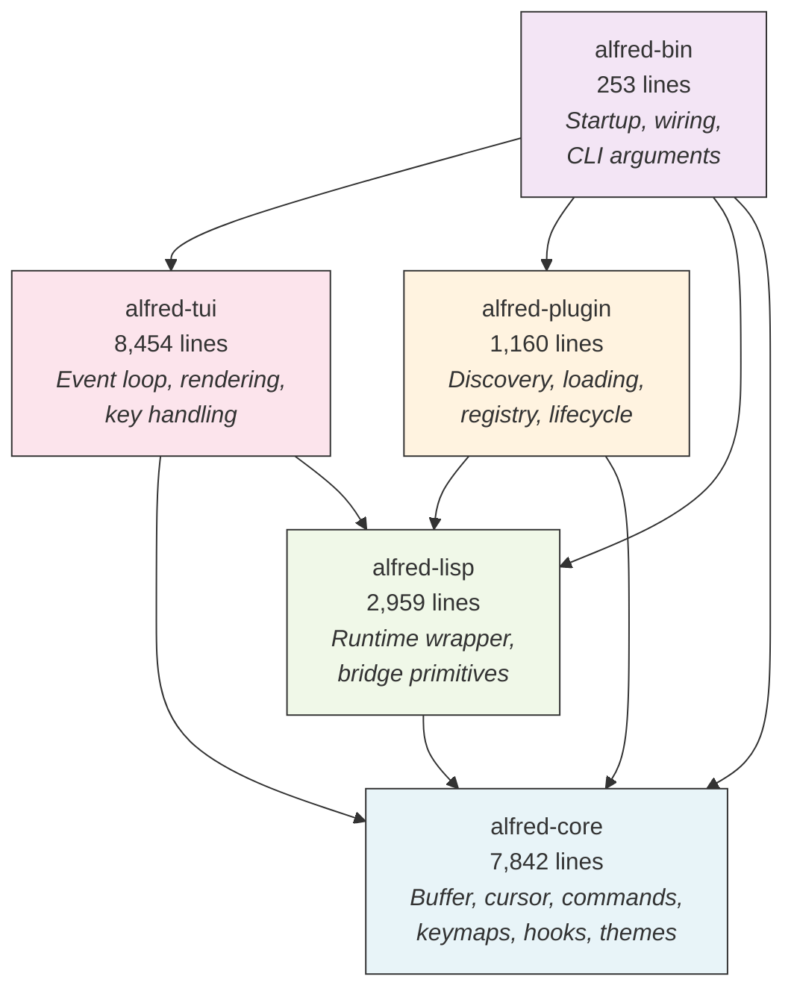
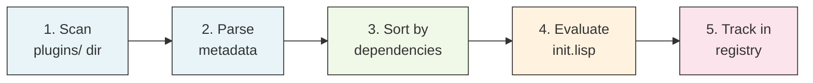
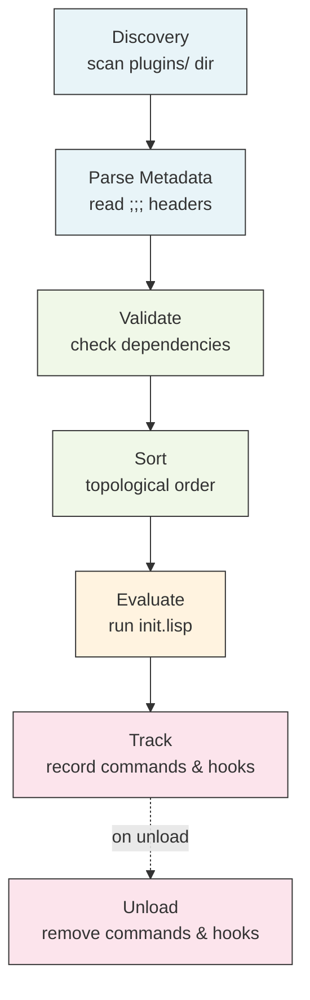
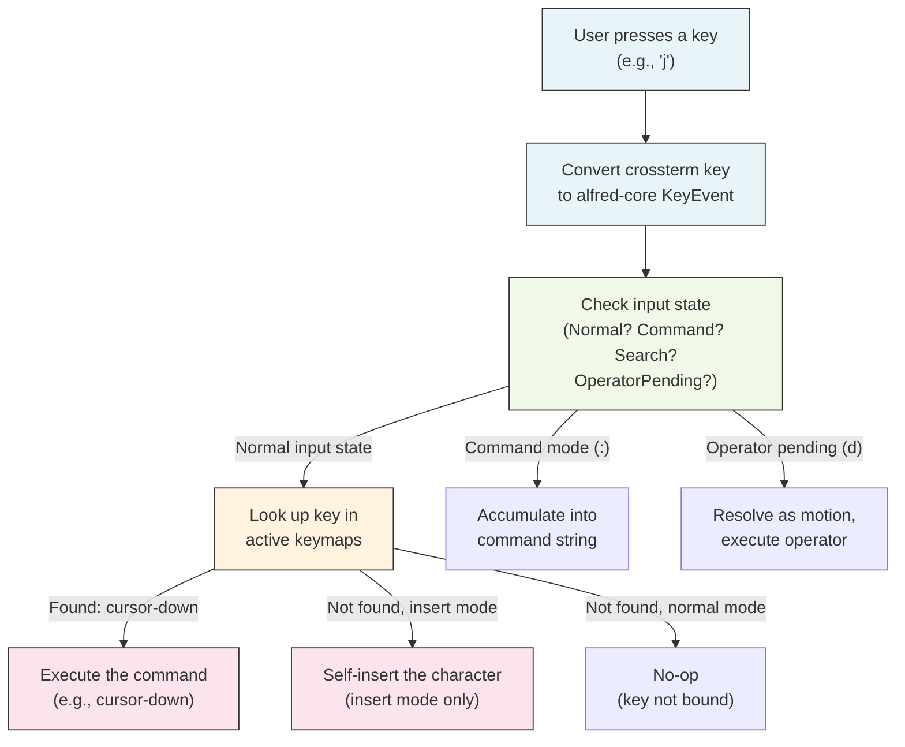
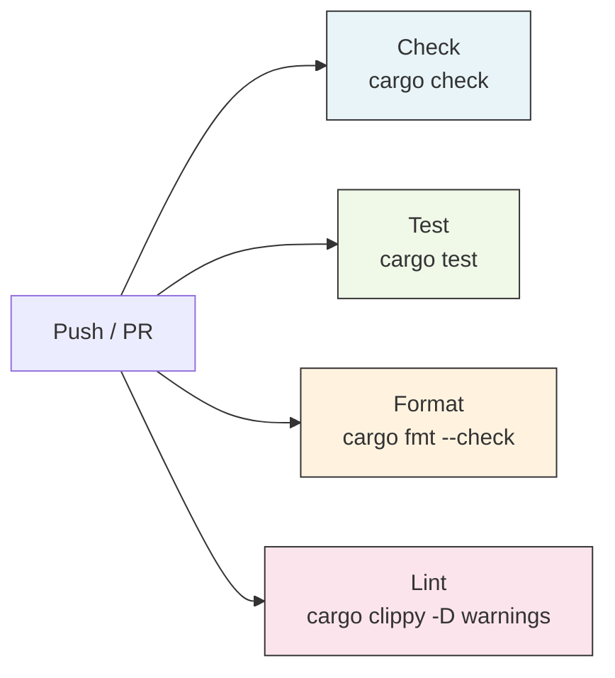

# Alfred: System Walkthrough

A deep dive into the architecture, code, and design decisions of the Alfred text editor.

**This deck is for:** Developers joining the project who need to understand how Alfred works, why it was built this way, and how to contribute.

**No assumed knowledge of:** Rust, Lisp, terminal editors, or vim.

**Structure:**
1. Why -- the motivation and goals
2. Architecture -- the five crates and how they connect
3. The Plugin System -- how plugins are discovered, loaded, and work
4. The Lisp Engine -- how Rust and Lisp talk to each other
5. Vim Keybindings -- how the keymap system resolves keys
6. Themes, Files, and Testing
7. Design Decisions -- the reasoning behind every major choice
8. Appendices -- complete command reference, Lisp primitive reference, plugin tutorial

---

<!-- Part 1: WHY -->

# Part 1: Why Alfred Exists

---

# The Motivation

**Question:** Can AI agents build software that is architecturally sound, not just functional?

Most AI-generated code works but lacks structure. Alfred is designed to prove the opposite: that an AI agent, guided by a clear methodology, can produce software with:

- Documented architecture decisions (6 ADRs)
- Clean boundaries between components (5 crates enforced by Rust's compiler)
- Comprehensive testing (183 unit tests, E2E tests)
- A real plugin system used by real features
- Code that a human developer can read, understand, and extend

**The editor is the vehicle. The architecture is the point.**

---

# The Goals

1. **Plugin-first architecture:** Everything beyond storing text and moving the cursor is a plugin. Keybindings, line numbers, status bar, and color theme are all Lisp files.

2. **Functional core / imperative shell:** Pure logic in the center, side effects at the edges. This makes the core easy to test and reason about.

3. **Emacs-inspired extensibility:** Like Emacs, where most of the editor is written in Lisp. Unlike Emacs, Alfred uses Rust for the engine (for safety and speed).

4. **Vim-compatible editing:** Users get a familiar editing experience with modal editing, operator-motion composition, and common commands.

5. **Single-process simplicity:** One process, one thread, synchronous execution. The same model Emacs has used successfully for 40+ years.

---

<!-- Part 2: ARCHITECTURE -->

# Part 2: Architecture

---

# The Five Crates

Alfred is a Cargo workspace (Rust's term for a multi-package project) with five crates:



**The key rule:** All arrows point toward `alfred-core`. The core never depends on any other Alfred crate. This is enforced by Rust's compiler -- if you accidentally import `crossterm` in `alfred-core`, the build fails.

---

# alfred-core: The Pure Heart

`alfred-core` is where all the editing logic lives. It has **zero knowledge** of the terminal, Lisp, or plugins.

**Modules:**

| Module | Purpose | Key Types |
|--------|---------|-----------|
| `buffer.rs` | Text storage using the ropey rope data structure. Insert, delete, search, replace. | `Buffer` |
| `cursor.rs` | Cursor position and all movement functions (up, down, left, right, word-forward, etc.) | `Cursor` |
| `editor_state.rs` | The "god struct" -- aggregates buffer, cursor, viewport, commands, mode, keymaps, hooks, registers, undo stack, and more. | `EditorState` |
| `command.rs` | Named command registry. Commands can be native (Rust functions) or dynamic (Lisp closures). | `CommandRegistry`, `CommandHandler` |
| `key_event.rs` | Keyboard input representation: key code + modifiers (Ctrl, Alt, Shift). | `KeyEvent`, `KeyCode`, `Modifiers` |
| `hook.rs` | Extension points that plugins use to inject behavior (e.g., the "render-gutter" hook). | `HookRegistry`, `HookId` |
| `viewport.rs` | The visible window into the buffer. Pure scrolling logic. | `Viewport` |
| `theme.rs` | Color parsing and theme storage. Hex colors, named ANSI colors. | `ThemeColor`, `Theme` |
| `text_object.rs` | Vim text objects (`iw`, `aw`, `i"`, `a(`, etc.) -- compute start/end ranges. | `TextObjectModifier` |
| `error.rs` | A unified error type for all core operations. | `AlfredError` |

**External dependencies:** Only `ropey` (text storage) and `thiserror` (error formatting). Nothing else.

---

# alfred-core: Pure Functions in Practice

Every function in `alfred-core` is **pure** -- it takes inputs and returns outputs without side effects.

**Example: Moving the cursor down**

```rust
/// Moves the cursor down by one line.
/// If already on the last line, the cursor stays unchanged.
pub fn move_down(cursor: Cursor, buf: &Buffer) -> Cursor {
    let last_line = last_line_index(buf);
    let new_line = if cursor.line < last_line {
        cursor.line + 1
    } else {
        cursor.line
    };
    clamp_column_to_line(new_line, cursor.column, buf)
}
```

Notice: no `&mut self`. No side effects. Takes a `Cursor` and a `&Buffer`, returns a new `Cursor`. The old cursor is unchanged.

**Why this matters:** To test this function, you just call it with inputs and check the output. No mocking, no setup, no teardown. This is why `alfred-core` has the most tests.

---

# alfred-core: EditorState (The "God Struct")

`EditorState` is the single mutable container passed through the event loop. It aggregates everything:

```rust
pub struct EditorState {
    pub buffer: Buffer,              // The text being edited
    pub cursor: Cursor,              // Current cursor position
    pub viewport: Viewport,          // Visible window into buffer
    pub commands: CommandRegistry,   // Named command lookup table
    pub mode: String,                // "normal", "insert", or "visual"
    pub keymaps: HashMap<String, Keymap>,   // Key -> command mappings
    pub active_keymaps: Vec<String>,        // Which keymaps are active
    pub hooks: HookRegistry,         // Extension points for plugins
    pub registers: HashMap<char, RegisterEntry>,  // Yank/delete registers
    pub undo_stack: Vec<UndoSnapshot>,  // Undo history
    pub redo_stack: Vec<UndoSnapshot>,  // Redo history
    pub theme: Theme,                // Color settings
    pub marks: HashMap<char, Cursor>,   // Named cursor positions
    pub macro_registers: HashMap<char, Vec<KeyEvent>>,  // Recorded macros
    // ... and more (search, jump list, change list, etc.)
}
```

**Why one big struct?** Because it is passed by `&mut` reference to every command handler. This avoids complex ownership graphs. Undo is cheap because ropey's Rope uses structural sharing (cloning a Rope is O(1)).

---

# alfred-lisp: The Lisp Bridge

`alfred-lisp` wraps the `rust_lisp` interpreter and provides the "bridge" -- Rust functions callable from Lisp.

**Two modules:**

| Module | Purpose |
|--------|---------|
| `runtime.rs` | Wraps `rust_lisp` into a clean `LispRuntime` with `eval(source)` and `eval_file(path)` APIs |
| `bridge.rs` | Registers all Rust closures as Lisp functions: `buffer-insert`, `cursor-move`, `define-command`, etc. |

**How the bridge works:**

```
Lisp code:  (buffer-insert "hello")
               |
               v
rust_lisp evaluates the expression, finds "buffer-insert" is a NativeClosure
               |
               v
The closure (registered in bridge.rs) runs:
  1. Borrows EditorState via Rc<RefCell<EditorState>>
  2. Calls buffer::insert_at(&editor.buffer, line, col, "hello")
  3. Returns Value::NIL to Lisp
```

**Key design choice:** `EditorState` is wrapped in `Rc<RefCell<...>>` (Rust's reference-counted shared mutable container). This lets both the Rust event loop and the Lisp bridge access the same state.

---

# alfred-plugin: Discovery and Loading

`alfred-plugin` handles the full plugin lifecycle:



**Step 1 -- Scan:** Read the `plugins/` directory. Each subdirectory is a potential plugin. Skip directories ending in `.disabled`.

**Step 2 -- Parse:** Read `init.lisp` header comments for metadata:
```lisp
;;; name: my-plugin
;;; version: 0.1.0
;;; description: Does something useful
;;; depends: other-plugin
```

**Step 3 -- Sort:** Topological sort using Kahn's algorithm. If plugin B depends on plugin A, A loads first. Circular dependencies are detected and reported as errors.

**Step 4 -- Load:** Evaluate `init.lisp` in the Lisp runtime. If evaluation fails, the error is collected (not a crash), and the plugin is not registered.

**Step 5 -- Track:** The `PluginRegistry` records which commands and hooks each plugin registered. On unload, these are cleaned up.

---

# alfred-tui: The Imperative Shell

`alfred-tui` is where side effects live. It reads the keyboard, draws the screen, and runs the main event loop.

**Two modules:**

| Module | Lines | Purpose |
|--------|-------|---------|
| `app.rs` | 7,449 | Event loop, key conversion, key handling, colon commands, operator-pending logic |
| `renderer.rs` | 1,005 | Drawing buffer content, gutter, status bar, message line, cursor positioning |

**External dependencies:** `crossterm` (terminal raw mode, key events) and `ratatui` (immediate-mode TUI rendering).

**The event loop (simplified):**
```
loop {
    1. Compute gutter content (dispatch "render-gutter" hook)
    2. Compute status bar content (dispatch "render-status" hook)
    3. Render the frame to the terminal
    4. Read the next key event from crossterm
    5. Convert crossterm key to alfred-core KeyEvent
    6. Handle the key event (resolve keymap, update state)
    7. If a deferred action was returned, execute it
       (eval Lisp, execute command, save file, etc.)
}
```

---

# alfred-bin: The Composition Root

`alfred-bin` is the binary entry point -- just 253 lines. It wires everything together:

```rust
fn run_editor(file_path: Option<&str>) -> Result<()> {
    // 1. Query terminal size
    let (width, height) = crossterm::terminal::size()?;

    // 2. Create EditorState in Rc<RefCell<>> for shared access
    let state = Rc::new(RefCell::new(editor_state::new(width, height)));

    // 3. Load file into buffer (if path provided)
    if let Some(path_str) = file_path {
        state.borrow_mut().buffer = Buffer::from_file(path)?;
    }

    // 4. Register built-in commands (cursor movement, etc.)
    editor_state::register_builtin_commands(&mut state.borrow_mut());

    // 5. Create Lisp runtime and register ALL bridge primitives
    let runtime = LispRuntime::new();
    bridge::register_core_primitives(&runtime, state.clone());
    bridge::register_define_command(&runtime, state.clone());
    bridge::register_hook_primitives(&runtime, state.clone());
    bridge::register_keymap_primitives(&runtime, state.clone());
    bridge::register_theme_primitives(&runtime, state.clone());

    // 6. Discover and load plugins from plugins/ directory
    let errors = load_plugins(&runtime);

    // 7. Load user config (~/.config/alfred/init.lisp)
    load_user_config(&runtime, &config_path);

    // 8. Run the event loop
    alfred_tui::app::run(&state, &runtime)?;
    Ok(())
}
```

---

<!-- Part 3: THE PLUGIN SYSTEM -->

# Part 3: The Plugin System

---

# What Is a Plugin?

A plugin is a folder inside `plugins/` containing an `init.lisp` file. That is it.

When Alfred starts, it scans `plugins/`, reads each `init.lisp`, and evaluates it. The Lisp code can:

- **Define commands** -- Register new named commands that can be bound to keys
- **Create keymaps** -- Build key-to-command lookup tables
- **Set hooks** -- Attach callbacks to extension points (e.g., "run this when rendering the gutter")
- **Set theme colors** -- Configure the editor's color scheme
- **Call bridge primitives** -- Insert text, move the cursor, show messages

**Currently shipped plugins:**

| Plugin | What it does | Lines of Lisp |
|--------|-------------|---------------|
| `vim-keybindings` | Defines all vim normal, insert, and visual mode keybindings | 128 |
| `line-numbers` | Enables line number display in the gutter | 9 |
| `status-bar` | Enables the status bar showing filename, position, mode | 9 |
| `default-theme` | Sets the color scheme (gutter, status bar, message) | 12 |
| `test-plugin` | Registers a "hello" command (example/test) | 5 |

---

# Plugin Metadata Format

Every `init.lisp` starts with header comments that declare metadata:

```lisp
;;; name: my-plugin
;;; version: 0.1.0
;;; description: A short description of what this plugin does
;;; depends: other-plugin, another-plugin
```

**Required fields:** `name` (must be unique)
**Optional fields:** `version` (defaults to "0.0.0"), `description` (defaults to ""), `depends` (comma-separated list of plugin names)

**How parsing works:** The discovery module reads each line. Lines starting with `;;; ` are parsed as `key: value` pairs. Everything after the metadata comments is the Lisp code that gets evaluated.

**Disabling a plugin:** Rename the folder to end with `.disabled` (e.g., `vim-keybindings.disabled/`). The scanner skips it.

---

# How to Create a New Plugin: Word Count Example

**Goal:** Create a plugin that adds a `:wc` command showing the word count.

**Step 1:** Create the plugin folder:
```bash
mkdir plugins/word-count
```

**Step 2:** Create `plugins/word-count/init.lisp`:
```lisp
;;; name: word-count
;;; version: 0.1.0
;;; description: Adds a word-count command

(define-command "word-count"
  (lambda ()
    (define text (buffer-content))
    (define words (length (filter
      (lambda (s) (> (length s) 0))
      (split text " "))))
    (message (+ "Word count: " (to-string words)))))
```

**Step 3:** Restart Alfred. The plugin is discovered, loaded, and the `word-count` command is available.

**Step 4:** Run it with `:word-count` and press Enter. The message line shows the word count.

That is all. No compilation. No configuration file. No registration step. Just a folder with an `init.lisp`.

---

# Plugin Lifecycle: Load, Track, Unload



**Tracking:** When a plugin calls `define-command`, the command name is associated with that plugin in the registry. Same for hooks.

**Unloading:** When a plugin is unloaded, all its tracked commands are removed from the `CommandRegistry` and its tracked hooks are cleared. Other plugins are unaffected.

**Error handling:** If `init.lisp` fails (syntax error, undefined function, etc.), the plugin is NOT added to the registry. The error message is collected and shown in the editor's message line. Other plugins continue loading normally.

---

<!-- Part 4: THE LISP ENGINE -->

# Part 4: The Lisp Engine

---

# What Is rust_lisp?

`rust_lisp` is a small Lisp interpreter written in Rust. Alfred chose it over alternatives (Janet, custom Lisp) for two reasons:

1. **No C FFI:** Unlike Janet (written in C), rust_lisp is pure Rust. Registering a Rust function as a Lisp callable is just `env.define(name, Value::NativeClosure(closure))`. No C-compatible wrappers needed.

2. **Build simplicity:** `cargo build` handles everything. No C compiler, no bindgen, no platform-specific build issues.

**What rust_lisp provides:**
- Basic types: integers, strings, booleans, lists, symbols
- Lambda functions and closures
- `define` for variable binding
- Arithmetic, string concatenation, comparisons
- List operations (`car`, `cdr`, `cons`, `map`, `filter`)
- `if`, `cond`, `begin` control flow

**What it does NOT provide:** modules, green threads, regex, file I/O, networking. For Alfred's scope, this is fine -- plugins only need to call bridge primitives.

---

# Bridge Primitives: The Complete API

The bridge registers Rust closures as Lisp functions. Here is the complete list:

### Buffer Operations
| Lisp Function | What It Does | Example |
|--------------|-------------|---------|
| `(buffer-insert text)` | Insert text at cursor position | `(buffer-insert "hello")` |
| `(buffer-delete)` | Delete one character at cursor | `(buffer-delete)` |
| `(buffer-content)` | Return entire buffer as a string | `(define txt (buffer-content))` |
| `(buffer-filename)` | Return filename or empty string | `(buffer-filename)` |
| `(buffer-modified?)` | Return `T` if modified, `F` otherwise | `(buffer-modified?)` |
| `(save-buffer)` | Save to current file path | `(save-buffer)` |
| `(save-buffer "path")` | Save to explicit path | `(save-buffer "/tmp/out.txt")` |

### Cursor and Mode
| Lisp Function | What It Does | Example |
|--------------|-------------|---------|
| `(cursor-position)` | Return `(line column)` as a list | `(cursor-position)` |
| `(cursor-move direction [count])` | Move cursor by direction | `(cursor-move ':down 3)` |
| `(current-mode)` | Return mode name as string | `(current-mode)` |
| `(set-mode name)` | Switch editor mode and keymap | `(set-mode "insert")` |

---

# Bridge Primitives (continued)

### Commands
| Lisp Function | What It Does | Example |
|--------------|-------------|---------|
| `(define-command "name" fn)` | Register a Lisp function as a named command | `(define-command "hello" (lambda () (message "Hi!")))` |

### Keymaps
| Lisp Function | What It Does | Example |
|--------------|-------------|---------|
| `(make-keymap "name")` | Create a named keymap | `(make-keymap "my-mode")` |
| `(define-key "keymap" "key" "cmd")` | Bind a key to a command | `(define-key "my-mode" "Char:x" "hello")` |
| `(set-active-keymap "name")` | Activate a keymap | `(set-active-keymap "my-mode")` |

### Hooks
| Lisp Function | What It Does | Example |
|--------------|-------------|---------|
| `(add-hook "name" fn)` | Register a callback for a named hook | `(add-hook "render-gutter" (lambda (s e t) s))` |
| `(dispatch-hook "name" args...)` | Call all callbacks for a hook | `(dispatch-hook "on-save" "file.txt")` |
| `(remove-hook "name" id)` | Remove a callback by its ID | `(remove-hook "on-save" 3)` |

### Theme and Cursor Shape
| Lisp Function | What It Does | Example |
|--------------|-------------|---------|
| `(set-theme-color "slot" "color")` | Set a theme color slot | `(set-theme-color "status-bar-bg" "#313244")` |
| `(set-cursor-shape "mode" "shape")` | Set cursor shape for a mode | `(set-cursor-shape "normal" "block")` |
| `(get-cursor-shape "mode")` | Get cursor shape for a mode | `(get-cursor-shape "insert")` |
| `(message text)` | Display a message in the message line | `(message "File saved!")` |

---

<!-- Part 5: VIM KEYBINDINGS -->

# Part 5: Vim Keybindings

---

# How Vim Modes Work in Alfred

Alfred has three modes, just like vim:

**Normal mode** (default): Keys are commands. `h` moves left, `d` starts a delete operation, `:` opens the command line.

**Insert mode** (press `i`): Keys are typed as text. Press `Escape` to go back to normal mode.

**Visual mode** (press `v` or `V`): Select text by moving the cursor. Then apply an operator (`d` to delete, `y` to yank, `c` to change).

**How mode switching works:**
1. In normal mode, pressing `i` is bound to the command `enter-insert-mode`
2. That command calls `(set-mode "insert")` which does two things:
   - Sets `state.mode = "insert"`
   - Switches `state.active_keymaps` to `["insert-mode"]`
3. Now key resolution uses the insert-mode keymap (where Escape maps to `enter-normal-mode`, Backspace maps to `delete-backward`, and everything else is "self-insert")

---

# How Keys Are Resolved

When you press a key, this is what happens:



**Key resolution iterates through active keymaps** in order. The first keymap that has a binding for the key wins. This allows layered keymaps (e.g., a mode-specific keymap on top of a global keymap).

---

# Operator-Pending Mode

This is the heart of vim's composability. When you press `d` (delete), Alfred enters **operator-pending mode**. The next key is interpreted as a motion:

| You type | What happens |
|----------|-------------|
| `dw` | Delete from cursor to start of next word |
| `d$` | Delete from cursor to end of line |
| `dd` | Delete entire line (operator doubled = line-wise) |
| `dj` | Delete current line and the line below (line-wise motion) |
| `diw` | Delete inner word (text object) |
| `da"` | Delete around double-quotes (text object) |

**How it works internally:**
1. `d` is bound to `enter-operator-delete` in the keymap
2. `handle_key_event` returns `InputState::OperatorPending(Operator::Delete)`
3. The next key press is resolved through the keymap to get a motion command name
4. `execute_motion()` computes the target cursor position and motion kind (char-wise or line-wise)
5. `execute_delete_with_motion()` deletes the text between cursor and target
6. State returns to `InputState::Normal`

**Text objects** add another layer: after `d`, pressing `i` or `a` enters `TextObject` state, then the next key selects the object type (`w` for word, `"` for quotes, `(` for parentheses, etc.).

---

# Visual Mode

Visual mode lets you select text and then apply an operator.

**Character-wise visual mode (`v`):**
- Sets `state.selection_start = Some(state.cursor)` and `state.visual_line_mode = false`
- As you move the cursor, the selection extends from `selection_start` to `cursor`
- Pressing `d` deletes the selection, `y` yanks it, `c` changes it
- Pressing `Escape` cancels and returns to normal mode

**Line-wise visual mode (`V`):**
- Same as character-wise, but `state.visual_line_mode = true`
- Operators expand the selection to full lines before acting
- Useful for deleting, yanking, or indenting multiple lines

**Keybindings in visual mode** are defined in the `visual-mode` keymap. Navigation keys (`h`, `j`, `k`, `l`, `w`, `b`, etc.) work the same as normal mode. Operator keys (`d`, `y`, `c`) act on the selection instead of waiting for a motion.

---

# Count Prefix: Repeating Commands

In normal mode, digit keys (`1`-`9`) start a count prefix. Subsequent digits (`0`-`9`) are appended.

**Examples:**
- `5j` = move down 5 lines
- `3dw` = delete 3 words
- `10x` = delete 10 characters

**How it works:**
1. `handle_key_event` checks if the key is a digit in normal mode
2. If starting or continuing a count, it accumulates into `pending_count` and returns without executing a command
3. When a non-digit key arrives, the accumulated count is passed back to the event loop
4. The event loop executes the command `repeat` times (defaulting to 1 if no count)

**Special case:** `0` alone (no pending count) maps to `cursor-line-start` (move to column 0), not a count. `10` starts count at 1, then appends 0.

---

<!-- Part 6: THEMES, FILES, TESTING -->

# Part 6: The Theme System

---

# How Colors Work

The theme system is plugin-driven. Colors are stored in a `HashMap<String, ThemeColor>` on `EditorState`.

**Color slots** follow a naming convention: `component-property` (e.g., `status-bar-bg`, `gutter-fg`):

| Slot | What it colors |
|------|---------------|
| `text-fg` / `text-bg` | Buffer text foreground/background |
| `gutter-fg` / `gutter-bg` | Line number gutter |
| `status-bar-fg` / `status-bar-bg` | Status bar |
| `message-fg` / `message-bg` | Message line at the bottom |

**Color formats supported:**
- Hex RGB: `"#ff5733"` (parsed into `ThemeColor::Rgb(255, 87, 51)`)
- Named ANSI colors: `"red"`, `"blue"`, `"dark-gray"`, `"light-cyan"`, etc.
- `"default"` = use the terminal's default color

**The conversion boundary:** `ThemeColor` is a pure domain type in `alfred-core`. Conversion to `ratatui::Color` (a rendering library type) happens in `alfred-tui/renderer.rs`. The core never knows about ratatui.

**Cursor shapes** are also configured per mode via Lisp: `(set-cursor-shape "normal" "block")` and `(set-cursor-shape "insert" "bar")`.

---

# Part 7: File Operations

---

# Save, Open, Quit

**Saving:**
- `:w` saves to the buffer's existing file path
- `:w /path/to/file` saves to an explicit path
- `:wq` saves and quits
- The `save_to_file()` function in `buffer.rs` writes the content and returns a new Buffer with `modified = false`

**Opening:**
- `:e filename` opens a file into the buffer
- `Buffer::from_file(path)` reads the file using `std::fs::read_to_string()` and wraps it in a ropey Rope
- The cursor resets to (0, 0) and the viewport resets

**Quitting:**
- `:q` quits if the buffer is not modified. If modified, it shows "Unsaved changes! Use :q! to force quit"
- `:q!` quits without saving, even with unsaved changes
- The event loop checks `state.running` and breaks when it becomes `false`

**Other colon commands:**
- `:eval (+ 1 2)` evaluates a Lisp expression and shows the result
- `:s/old/new/g` search-and-replace on the current line
- `:%s/old/new/g` search-and-replace on the entire buffer
- `:g/pattern/d` delete all lines matching a pattern
- `:v/pattern/d` delete all lines NOT matching a pattern

---

# Part 8: Testing

---

# Testing Strategy

**183 unit tests** across all crates. All pass in under 1 second.

**Test naming convention:** `given_X_when_Y_then_Z` (behavior-driven style)

**Testing by crate:**

| Crate | Test Count | Strategy |
|-------|-----------|----------|
| `alfred-core` | ~80 | Table-driven tests for pure functions. Each movement/buffer function has 3-8 test cases covering boundary conditions. |
| `alfred-lisp` | ~15 | Runtime eval tests (arithmetic, strings, variables, errors). Performance baseline tests (under 1ms per eval call). |
| `alfred-plugin` | ~20 | Discovery and registry tests using `tempfile` for isolated filesystem. Dependency ordering tests. |
| `alfred-tui` | ~65 | Key conversion tests. `handle_key_event` tests for every input state (normal, command, search, operator-pending, text object, visual, etc.). |
| `alfred-bin` | ~3 | Config file path computation, user config loading. |

**E2E tests** (in `tests/e2e/test_alfred.py`):
- Use `pexpect` to spawn Alfred in a real PTY
- Send keystrokes, wait for exit, check file content
- Cover: startup, insert mode, navigation, arrow keys, operator-pending, visual mode, marks, macros, undo, search-and-replace, and more
- Run in Docker for consistency

---

# CI Pipeline and Pre-Commit

**GitHub Actions CI** runs on every push to `main` and every pull request:



All four jobs run in parallel on `ubuntu-latest`. Rust toolchain caching is enabled for speed.

**Pre-commit hook** (`scripts/pre-commit`):
```bash
make format    # Check code formatting
make lint      # Run clippy linter with -D warnings (warnings = errors)
make test      # Run all 183 tests
```

Install with: `make dev_install` (sets up the hook automatically).

---

<!-- Part 9: DESIGN DECISIONS -->

# Part 9: Design Decisions

---

# ADR-001: Adopt an Existing Lisp Interpreter

**Context:** Alfred needs a Lisp extension language. Should we build one from scratch or adopt an existing one?

**Decision:** Adopt an existing Lisp interpreter. Do not build a custom one.

**Why:** Building a Lisp interpreter is a project-sized effort (the MAL process has 11 steps, from tokenizer to self-hosting). Interpreter bugs would obscure plugin architecture issues. The goal is to prove the plugin architecture, not to build a programming language.

**Consequences:**
- Saved an estimated 3-4 weeks of interpreter development
- Inherited reliability from a proven interpreter
- Less control over language syntax and semantics
- Must work within the adopted interpreter's constraints

---

# ADR-002: Plugin-First Architecture

**Context:** How much functionality lives in Rust vs. Lisp? Three options: (1) full-featured kernel with optional plugins, (2) balanced split, (3) thin kernel where everything is a plugin.

**Decision:** Thin kernel. Everything beyond core primitives is a plugin.

**Why:** The project's goal is proving AI can build architecturally sound software. The strongest proof is a system where even modal editing works entirely as a plugin. This forces the plugin API to be good enough for real features.

**Evidence from editor case studies:**
- Emacs: ~70% Lisp, ~30% C. Even cursor movement commands are Lisp.
- Helix: No plugin system. Most-cited limitation by the community.

**Consequences:**
- The plugin API is battle-tested by the walking skeleton itself
- Clean kernel boundary -- the kernel is small and focused
- More Lisp code needed for basic features
- Performance-sensitive operations run through the interpreter

---

# ADR-003: Single-Process Synchronous Execution

**Context:** Should Alfred use multi-process, async, or single-threaded architecture?

**Decision:** Single-process, synchronous. No async runtime, no threads, no IPC.

**Why:** The strongest evidence is the Xi editor post-mortem. Xi's author wrote: "I now firmly believe that the process separation between front-end and core was not a good idea." Xi's async-everywhere approach made basic features exponentially harder. Emacs has been single-threaded for 40+ years and remains the most extensible editor.

**Consequences:**
- Simplest possible execution model
- No synchronization bugs (no mutexes, no channels)
- Long-running Lisp expressions freeze the UI (acceptable for this scope)
- Will need evolution when async capabilities are added

---

# ADR-004: rust_lisp Over Janet

**Context:** Two Lisp interpreters were candidates: Janet (C-based, more features) and rust_lisp (Rust-native, simpler).

**Decision:** rust_lisp. Integration quality over language features.

**Why:** Janet requires C FFI (foreign function interface) -- every Rust function exposed to Lisp needs a C-compatible wrapper. This adds build complexity, cross-language debugging, and type marshalling overhead. rust_lisp lets you register Rust closures directly with `Value::NativeClosure(closure)`. For a walking skeleton where the goal is proving the architecture, integration friction matters more than language features.

**Migration path:** If rust_lisp proves insufficient, migration is isolated to the `alfred-lisp` crate. All other crates are unaffected due to the dependency inversion boundary.

---

# ADR-005: Functional Core / Imperative Shell

**Context:** Rust is multi-paradigm. How should the code be structured?

**Decision:** Pure functional core in `alfred-core`, imperative shell in `alfred-tui` and `alfred-bin`.

**Why:** The editor domain naturally splits: buffer transformations and key resolution are pure math (input -> output, no side effects). Terminal I/O and Lisp state are inherently effectful. Keeping the split explicit makes the core trivially testable.

**Alternatives rejected:**
- Pure FP: Rust's ownership model fights persistent data structures and monadic patterns
- OOP with deep trait hierarchies: Dynamic dispatch prevents monomorphization, and the data flow is naturally a pipeline, not an object graph

---

# ADR-006: 5-Crate Cargo Workspace

**Context:** How should the code be organized? One crate? Many crates?

**Decision:** Five crates, one per distinct concern.

**Why:** Rust's Cargo workspaces enforce visibility at the crate level. Code in `alfred-core` physically cannot import `crossterm` or `ratatui` -- the build will fail. This makes the architectural boundary compiler-enforced, not convention-enforced.

**Why not more crates?** Over-decomposition. Splitting keymaps, hooks, and commands into separate crates creates circular dependency pressure. Five crates hit the sweet spot: one per concern (core, Lisp, plugins, UI, binary).

**Why not one crate?** Module-level visibility (`pub(crate)`) is weaker. Nothing would prevent the buffer module from importing terminal types. For a project showcasing architecture quality, this is insufficient.

---

<!-- APPENDICES -->

# Appendix A: Supported Vim Commands

---

# Normal Mode: Movement Commands

| Key | Command | Description |
|-----|---------|-------------|
| `h` / Left arrow | `cursor-left` | Move left one character |
| `l` / Right arrow | `cursor-right` | Move right one character |
| `j` / Down arrow | `cursor-down` | Move down one line |
| `k` / Up arrow | `cursor-up` | Move up one line |
| `w` | `cursor-word-forward` | Move to start of next word |
| `b` | `cursor-word-backward` | Move to start of previous word |
| `e` | `cursor-word-end` | Move to end of current word |
| `0` | `cursor-line-start` | Move to first column |
| `$` | `cursor-line-end` | Move to last character on line |
| `^` | `cursor-first-non-blank` | Move to first non-space character |
| `gg` | `cursor-document-start` | Move to first line |
| `G` | `cursor-document-end` | Move to last line |
| `H` | `cursor-screen-top` | Move to top of visible screen |
| `M` | `cursor-screen-middle` | Move to middle of visible screen |
| `L` | `cursor-screen-bottom` | Move to bottom of visible screen |
| `f{char}` | `enter-char-find-forward` | Move forward to character |
| `F{char}` | `enter-char-find-backward` | Move backward to character |
| `t{char}` | `enter-char-til-forward` | Move forward to before character |
| `T{char}` | `enter-char-til-backward` | Move backward to after character |
| `;` | `repeat-char-find` | Repeat last f/F/t/T |
| `,` | `reverse-char-find` | Reverse last f/F/t/T |
| `%` | `match-bracket` | Jump to matching bracket |

---

# Normal Mode: Editing Commands

| Key | Command | Description |
|-----|---------|-------------|
| `i` | `enter-insert-mode` | Enter insert mode at cursor |
| `I` | `insert-at-line-start` | Enter insert mode at first non-blank |
| `a` | `insert-after-cursor` | Enter insert mode after cursor |
| `A` | `insert-at-line-end` | Enter insert mode at end of line |
| `o` | `open-line-below` | Open new line below, enter insert mode |
| `O` | `open-line-above` | Open new line above, enter insert mode |
| `x` | `delete-char-at-cursor` | Delete character at cursor |
| `X` | `delete-char-before` | Delete character before cursor |
| `r{char}` | `enter-replace-char` | Replace character under cursor |
| `s` | `substitute-char` | Delete character and enter insert mode |
| `S` | `substitute-line` | Clear line and enter insert mode |
| `D` | `delete-to-end` | Delete from cursor to end of line |
| `C` | `change-to-end` | Delete to end of line, enter insert mode |
| `J` | `join-lines` | Join current line with next line |
| `~` | `toggle-case` | Toggle case of character under cursor |
| `Ctrl+a` | `increment-number` | Increment number under cursor |
| `Ctrl+x` | `decrement-number` | Decrement number under cursor |
| `u` | `undo` | Undo last change |
| `Ctrl+r` | `redo` | Redo last undone change |
| `.` | `repeat-last-change` | Repeat last buffer-mutating command |
| `>` | `indent-line` | Indent current line |
| `<` | `unindent-line` | Unindent current line |

---

# Normal Mode: Operators, Visual, Scrolling, and More

### Operators (followed by a motion or text object)
| Key | Description |
|-----|-------------|
| `d{motion}` | Delete text in motion range (e.g., `dw`, `d$`, `dj`) |
| `c{motion}` | Change text in motion range (delete + insert mode) |
| `y{motion}` | Yank (copy) text in motion range |
| `dd` / `cc` / `yy` | Line-wise: delete, change, or yank entire line |

### Text Objects (used after an operator)
| Key | Description |
|-----|-------------|
| `iw` / `aw` | Inner / around word |
| `i"` / `a"` | Inner / around double quotes |
| `i'` / `a'` | Inner / around single quotes |
| `i(` / `a(` | Inner / around parentheses |
| `i[` / `a[` | Inner / around brackets |
| `i{` / `a{` | Inner / around braces |

### Registers, Marks, Macros
| Key | Description |
|-----|-------------|
| `"x` | Select register `x` for next yank/delete/paste |
| `p` / `P` | Paste after / before cursor |
| `m{a-z}` | Set mark at cursor position |
| `'{a-z}` | Jump to mark |
| `q{a-z}` / `q` | Start / stop macro recording |
| `@{a-z}` / `@@` | Play macro / repeat last macro |

---

# Normal Mode: Scrolling, Search, and Command Line

### Scrolling
| Key | Description |
|-----|-------------|
| `Ctrl+d` | Scroll half page down |
| `Ctrl+u` | Scroll half page up |

### Search
| Key | Description |
|-----|-------------|
| `/pattern` | Search forward for pattern |
| `n` | Repeat search in same direction |
| `N` | Repeat search in opposite direction |

### Jump List
| Key | Description |
|-----|-------------|
| `Ctrl+o` | Jump back in jump list |
| `Ctrl+i` | Jump forward in jump list |

### Visual Mode
| Key | Description |
|-----|-------------|
| `v` | Enter character-wise visual mode |
| `V` | Enter line-wise visual mode |
| `Escape` | Exit visual mode |

### Command Line
| Command | Description |
|---------|-------------|
| `:w` | Save file |
| `:w path` | Save to path |
| `:q` | Quit (fails if unsaved) |
| `:q!` | Force quit |
| `:wq` | Save and quit |
| `:e path` | Open file |
| `:eval expr` | Evaluate Lisp expression |
| `:s/old/new/[g]` | Substitute on current line |
| `:%s/old/new/[g]` | Substitute in entire buffer |
| `:g/pattern/d` | Delete lines matching pattern |
| `:v/pattern/d` | Delete lines NOT matching pattern |

---

# Appendix B: Not Yet Implemented

---

# Tier 1: High Priority (Daily Editing)

| Command | Description | Category |
|---------|-------------|----------|
| `W` / `B` / `E` | WORD motions (whitespace-delimited) | Movement |
| `:{n}` | Jump to line number | Command |
| `Ctrl+f` / `Ctrl+b` | Full page scroll | Scrolling |
| `?pattern` | Backward search | Search |
| `*` / `#` | Search word under cursor forward/backward | Search |
| `.` with insert text | Repeat last change including typed text | Editing |
| `g_` | Last non-blank character | Movement |
| `+` / `-` | First char of next/previous line | Movement |
| `{` / `}` | Move to previous/next blank line | Movement |

# Tier 2: Medium Priority (Power User)

| Command | Description | Category |
|---------|-------------|----------|
| `zt` / `zz` / `zb` | Scroll line to top/middle/bottom | Scrolling |
| `gU{motion}` / `gu{motion}` | Uppercase/lowercase with motion | Operator |
| `g~{motion}` | Toggle case with motion | Operator |
| `>>` / `<<` with motion | Indent/unindent with count | Operator |
| `=` | Auto-indent | Operator |
| `Ctrl+e` / `Ctrl+y` | Scroll one line without moving cursor | Scrolling |

---

# Tier 3: Low Priority (Advanced)

| Command | Description | Category |
|---------|-------------|----------|
| `Ctrl+w` commands | Window splitting and navigation | Windows |
| Tab commands | Tab page management | Tabs |
| `Ctrl+n` / `Ctrl+p` | Completion | Insert mode |
| `gi` | Go to last insert position | Movement |
| `gv` | Reselect last visual selection | Visual |
| `gf` | Go to file under cursor | Navigation |
| `g;` / `g,` | Change list navigation | Navigation |
| `[{` / `]}` | Navigate to enclosing braces | Movement |

---

# Appendix C: Lisp Primitives Reference

---

# Complete Lisp Primitives

### Buffer Primitives
```lisp
(buffer-insert "text")        ;; Insert text at cursor position
(buffer-delete)               ;; Delete one char at cursor
(buffer-content)              ;; Returns entire buffer as string
(buffer-filename)             ;; Returns filename or ""
(buffer-modified?)            ;; Returns T or F
(save-buffer)                 ;; Save to buffer's file path
(save-buffer "/path/to/file") ;; Save to explicit path
```

### Cursor and Mode Primitives
```lisp
(cursor-position)             ;; Returns (line column) list
(cursor-move ':up 1)          ;; Move cursor (directions: :up :down :left :right)
(cursor-move ':down 5)        ;; Move down 5 lines
(current-mode)                ;; Returns "normal", "insert", or "visual"
(set-mode "insert")           ;; Switch mode and active keymap
```

### UI Primitives
```lisp
(message "Hello!")            ;; Display in message line
(set-theme-color "slot" "color")  ;; Set a theme color
(set-cursor-shape "mode" "shape") ;; Set cursor shape for mode
(get-cursor-shape "mode")         ;; Get cursor shape for mode
```

---

# Complete Lisp Primitives (continued)

### Command Primitives
```lisp
(define-command "name" (lambda () (message "executed!")))
;; Registers a Lisp function as a named editor command.
;; The command can then be bound to keys or called via :name
```

### Keymap Primitives
```lisp
(make-keymap "my-keymap")
;; Creates a new empty keymap

(define-key "my-keymap" "Char:x" "my-command")
;; Binds key 'x' to command "my-command" in the keymap
;; Key spec formats: "Char:x", "Ctrl:q", "Up", "Down",
;;   "Escape", "Enter", "Backspace", "Tab", "DoubleQuote"

(set-active-keymap "my-keymap")
;; Makes this keymap the active one for key resolution
```

### Hook Primitives
```lisp
(add-hook "hook-name" (lambda (arg1 arg2) "result"))
;; Returns a hook ID (integer) for later removal

(dispatch-hook "hook-name" "arg1" "arg2")
;; Calls all registered callbacks, returns list of results

(remove-hook "hook-name" 42)
;; Removes the callback with the given hook ID
```

---

# Appendix D: How to Create a Plugin

---

# Step-by-Step Plugin Tutorial

**Goal:** Create a plugin that adds a `:timestamp` command which inserts the current date and time at the cursor position.

**Step 1 -- Create the plugin folder:**
```bash
mkdir plugins/timestamp
```

**Step 2 -- Create `plugins/timestamp/init.lisp`:**
```lisp
;;; name: timestamp
;;; version: 0.1.0
;;; description: Inserts a timestamp at the cursor position

(define-command "timestamp"
  (lambda ()
    (buffer-insert "[TIMESTAMP]")
    (message "Timestamp inserted")))
```

Note: `rust_lisp` does not have a built-in date function, so this example inserts a placeholder. A real implementation would use a bridge primitive for the current time.

**Step 3 -- Restart Alfred.** The plugin is discovered automatically.

**Step 4 -- Use it:** Type `:timestamp` and press Enter. The text `[TIMESTAMP]` is inserted and the message line shows "Timestamp inserted".

---

# Plugin Anatomy: What Can init.lisp Do?

A plugin's `init.lisp` can use any of these actions:

**1. Define commands:**
```lisp
(define-command "my-cmd" (lambda () (message "Hello!")))
```

**2. Create and populate keymaps:**
```lisp
(make-keymap "my-mode")
(define-key "my-mode" "Char:x" "my-cmd")
```

**3. Register hooks:**
```lisp
(add-hook "render-gutter" (lambda (start end total) start))
```

**4. Set theme colors:**
```lisp
(set-theme-color "status-bar-bg" "#1e1e2e")
```

**5. Use control flow and variables:**
```lisp
(define greeting "Hello, Alfred!")
(define-command "greet" (lambda () (message greeting)))
```

**6. Declare dependencies on other plugins:**
```lisp
;;; depends: default-theme
```

**Important:** Plugins execute at startup. Their commands and hooks remain active for the entire editor session.

---

# Plugin Tips and Best Practices

**Naming:** Use kebab-case for plugin names (`my-cool-plugin`), command names (`do-something`), and hook names (`on-save`).

**Error handling:** If your `init.lisp` has a bug (undefined variable, syntax error), Alfred will still start. The error message appears in the message line. Fix the plugin and restart.

**Testing:** You can test Lisp code interactively using `:eval` from within Alfred:
```
:eval (+ 1 2)           ;; Shows "3" in message line
:eval (buffer-content)   ;; Shows buffer text
:eval (cursor-position)  ;; Shows "(line column)"
```

**Dependencies:** If your plugin depends on another, declare it in the header. Alfred will ensure the dependency loads first.

**Disabling:** Rename the plugin folder to add `.disabled` suffix:
```bash
mv plugins/my-plugin plugins/my-plugin.disabled
```

---

# End of Walkthrough

**Files produced:**
- `docs/walkthrough/alfred-overview.md` -- Quick overview (15 slides)
- `docs/walkthrough/alfred-walkthrough.md` -- Full walkthrough (this deck, 39 slides)

**Key takeaways:**
1. Alfred is five crates with clear boundaries, all enforced by Rust's compiler
2. The core is pure functions -- easy to test, easy to reason about
3. Every user-facing feature is a Lisp plugin, not hardcoded Rust
4. The bridge connects Lisp to Rust through shared mutable state (`Rc<RefCell<EditorState>>`)
5. Six documented ADRs explain every major architectural choice

**Where to go next:**
- Read the ADRs: `docs/adrs/adr-001-*.md` through `adr-006-*.md`
- Browse the plugins: `plugins/vim-keybindings/init.lisp` is the most interesting
- Run the tests: `make test`
- Try it: `make install && alfred myfile.txt`
